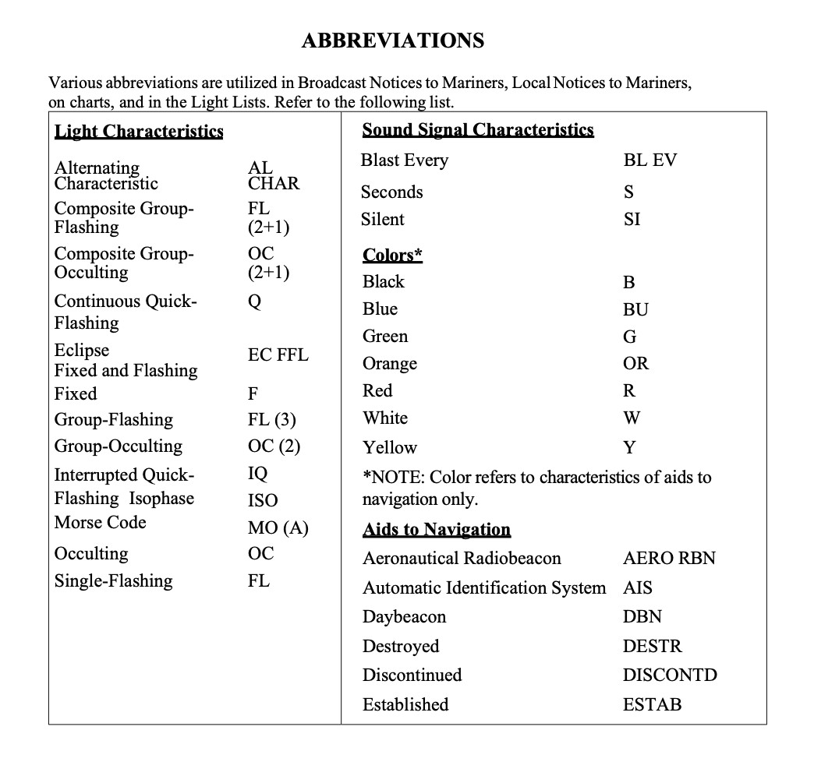

```{r load-packages, include = F}
## Load frequently used packages for blog posts
packages <- c(
      'devtools', #for session info
      'ggthemes', #for plots
      'tidyverse',
      'blogdown'
)
lapply(packages, function(x) {
  if (!requireNamespace(x)) install.packages(x)
  library(x, character.only = TRUE)
})
```

```{r set-chunk-options, include = F}
## Do not break chunk line
## Do not use spaces or periods "." or underscores "_"
## set options for knitr
knitr::opts_chunk$set(
  comment = '',
  fig.width = 6,
  fig.asp = .8,
  fig.align="center",
  message=F,
  error=F,
  warning=F,
  tidy=T,
  comment='',
  cache=T,
  dev='svg',
  echo=F
)
```

```{r set-ggplot-theme-defaults, include = F}
#from ggthemes
library(ggplot2); theme_set(ggthemes::theme_fivethirtyeight())
```

```{r define-color-palette, include = F, eval = T}
# color blind friendly palette from http://www.cookbook-r.com/Graphs/Colors_(ggplot2)/
cbPalette <- c("#E69F00", "#56B4E9", "#009E73", "#F0E442", "#0072B2", "#D55E00", "#CC79A7", "#000000")
```


```{r write-package-bib, echo = F}
# write packages used to bib in current directory
knitr::write_bib(.packages(), "./packages.bib")
```

```{r load-data, cache=T, include = F}
input <- "https://dl.dropbox.com/s/0h5wsn9j4qv896j/2021-03-01-uscg-dist-9-light-list-full.csv?dl=0"
df <- as_tibble(data.table::fread(input = input))
```

## Overview

### Background

The full set of navigational aids from the U.S. Coast Guard's Light List for District 9 is `r nrow(df)` observations. District 9 is comprised of the Great Lakes and the St. Lawrence River above the St. Regis River.  A large portion of the observations contain missing values. The precise percentage of missing values in the "characteristic" variable was 
`r paste(round((length(which(is.na(df$characteristic) == T)) / nrow(df)) * 100, 2), "%", sep = "")`.  The "characteristic" variable is a field that actually has three other variables within it.  Each cell contains 3 parts:  a description of the kind of light, like "flashing"; a color, very often red or green; and a period of time over which a light cycles, like "4s".  Examples include `Fl R 4s`, `Iso G 6s` and `Fl (2+1)G 6s`.

### Abbreviations

The reference manual for the light lists describes the characteristic column as " Light characteristic for lighted aids to navigation."[@unitedstatescoastguardWeeklyLightLists2021] The list also includes abbreviations and definitions for the light list.

```{r uscg-abbreviations, out.width="90%", fig.cap="**Source**: U.S. Coast Guard Light List."}

```

### Definitions

**Alternating**- A light showing different colors alternately.

**Fixed**- A light showing continously and steadily.

**Isophase**- A light in which all duration of light and darkness are equal.

**Flashing**- A light in which the total duration of light in a period is shorter than the total duration of darkness and the appearances of light are usually of equal duration.

**Morse**- A light in which appearances of light of two clearly different durations (dots and dashes) are grouped to represent a character or characters in the Morse code.

**Occulting**- A light in which the total duration of light in a period is longer than the total duration of darkness and the intervals of darkness are usually of equal duration.

**Quick**- A light in which flashes are produced at a rate of 60 flashes per minute.

```{r clean-data, include = F}
df.l <- dplyr::select(df, characteristic)
my.l <- str_split(df.l$characteristic, pattern = " ")
df.l$light <- unlist(lapply(my.l, "[[", 1))
df.l$color <- unlist(lapply(my.l, "[", 2))
df.l$time <- unlist(lapply(my.l, "[", 3))
df.l$color <- gsub("\\([^()]*\\)", "", df.l$color)
```

```{r convert-var-categorial, include = F}
df.l <- df.l[which(is.na(df.l$characteristic) != T), ]
df.l$time[which(is.na(df.l$time) == T)] <- "0s"
df.l <- df.l[-which(df.l$time == "W"), ]
df.l$light <- fct_lump(df.l$light, n = 5)
df.l$color <- fct_lump(df.l$color, n= 4)
df.l$time <- fct_lump(df.l$time, n= 8)
df.m <- 
  df.l %>% 
  select(light, color, time) %>%
  na.omit() %>%
  group_by(light, color, time) %>%
  count() %>%
  arrange(light, color, time)
```

## Methodology

The variable `characteristic` was selected from the full data frame.  It was further split into three parts using `stringr::str_split(df$characteristic, " ")`.[@R-stringr]  The resulting list was extracted by element in three parts:  light, color and time.  The new variables were converted into factor/categorical data using the `forcats`[@R-forcats] package.  The dataframe then grouped the categorical values together and tallied the number within each group. [@R-dplyr] The `treeplot` [@R-treemap] package generated a plot showing the frequency of color, light and time were plotted.

### Color

```{r plot-color-variable}
# library
library(treemap)
# basic treemap
p <- treemap(df.m,
             title = "Color Frequency",
            index=c("color"),
            vSize="n",
            type="index",
            palette = cbPalette,
            bg.labels=c("white"),
            align.labels=list(
              c("center", "center"), 
              c("right", "bottom")
            )  
          )   
```

### Light

```{r plot-light-variable}
# library
library(treemap)
# basic treemap
p <- treemap(df.m,
            index=c("light"),
            vSize="n",
            title = "Light Frequency",
            type="index",
            palette = cbPalette,
            bg.labels=c("white"),
            align.labels=list(
              c("center", "center"), 
              c("right", "bottom")
            )  
          )   
```

### Time

```{r plot-time-variable}
# library
library(treemap)
# basic treemap
p <- treemap(df.m,
            index=c("time"),
            vSize="n",
            type="index",
            title = "Time Frequency",
            palette = cbPalette,
            bg.labels=c("white"),
            align.labels=list(
              c("center", "center"), 
              c("right", "bottom")
            )  
          )   
```

## Conclusion

The variable `characteristic` contains additional important information about navigational aids with lights.  When separated, the variables tells the kind of light, its color and the time for the light to cycle.  While there are a wide variety of lights, the most common light is `Fl R 4s` or a flashing red light that flashes every four seconds.  553 lights have that characteristic.  The second most common light was `Fl G 4s` or a flashing green light that flashes every four seconds.  538 lights were described in that way. There were additional ways to overlap the variables in a single treemap;however,  it made the diagrams difficult to interpret.  Hopefully, review of this post helps others to understand navigational charts and provides a basic understanding of what lights are commonly encountered on the Great Lakes.  Be safe!

## Acknowledgements

This blog post was made possible thanks to:

-  [Flowing Data](https://flowingdata.com)
-  [R Graph Gallery](https://www.r-graph-gallery.com)


## References

<div id="refs"></div>

## Appendix--Light Characteristics by Group

```{r table-light-characteristics}
DT::datatable(df.m)
```


## Disclaimer

The views, analysis and conclusions presented within this paper represent the author’s alone and not of any other person, organization or government entity. While I have made every reasonable effort to ensure that the information in this article was correct, it will nonetheless contain errors, inaccuracies and inconsistencies. It is a working paper subject to revision without notice as additional information becomes available. Any liability is disclaimd as to any party for any loss, damage, or disruption caused by errors or omissions, whether such errors or omissions result from negligence, accident, or any other cause. The author(s) received no financial support for the research, authorship, and/or publication of this article.

## Reproducibility

```{r reproducibility, echo = FALSE}
## Reproducibility info
options(width = 120)
session_info()
```
