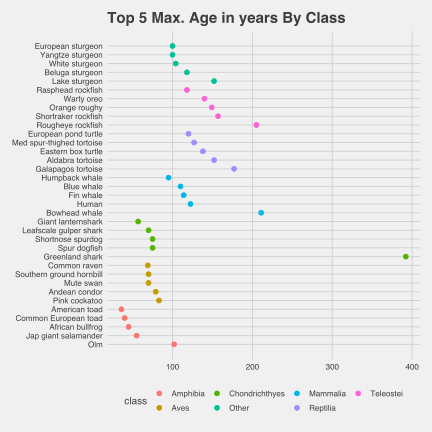

```{r load-packages, include = F}
## Load frequently used packages for blog posts
packages <- c(
      'devtools', #for session info
      'ggthemes', #for plots
      'blogdown',
      'magrittr',
      'tidyverse',
      'kableExtra'
)
lapply(packages, function(x) {
  if (!requireNamespace(x)) install.packages(x)
  library(x, character.only = TRUE)
})
```

```{r set-chunk-options, include = F}
## Do not break chunk line
## Do not use spaces or periods "." or underscores "_"
## set options for knitr
knitr::opts_chunk$set(
  comment = '',
  fig.width = 6,
  fig.asp = .8,
  fig.align="center",
  message=F,
  error=F,
  warning=F,
  tidy=T,
  comment='',
  cache=T,
  dev='svg',
  echo=F
)
```

```{r set-ggplot-theme-defaults, include = F}
#from ggthemes
library(ggplot2); theme_set(ggthemes::theme_fivethirtyeight())
```

```{r define-color-palette, include = F, eval = T}
# color blind friendly palette from http://www.cookbook-r.com/Graphs/Colors_(ggplot2)/
cbPalette <- c("#E69F00", "#56B4E9", "#009E73", "#F0E442", "#0072B2", "#D55E00", "#CC79A7", "#000000")
```

```{r write-package-bib, echo = F}
# write packages used to bib in current directory
knitr::write_bib(.packages(), "./packages.bib")
```


```{r load-animal-dataset, include=F}
input <- "https://dl.dropbox.com/s/bx590mirqidtbl0/2021-03-27-anage_data_full.txt?dl=0"
df <- data.table::fread(input = input)
colnames(df) <- tolower(gsub(" ", "_", colnames(df)))
colnames(df) <- gsub("\\(|\\)", "", colnames(df))
```

# [Overview](#overview)

The post examines the maximum age of different species using [AnAge: Database of Animal Ageing and Longevity](https://genomics.senescence.info/species/index.html). Examples of the maximum age of some common species include:

```{r table-common-species, fig.align="center"}
df %>% select(genus, species, common_name, maximum_longevity_yrs) %>% filter(common_name %in% c("Human", "Domestic dog", "Domestic cat", "Green parakeet", "Golden hamster", "Greenland shark", "Bowhead whale")) %>% arrange(-maximum_longevity_yrs) %>%
  kableExtra::kbl()
```


# [Background](#background)

"Taxonomy" is the scientific study of naming and classifying organisms based on shared characteristics.  Organisms are grouped by taxa and then grouped by taxonomic rank.  In descending order of heirarchy, the ranks are domain, kingdom, phylum, class, order, family, genus, and species.  These taxonomic classifications are used in the Animal Ageing and Longevity database.

"Maximum lifespan potential" or MLSP is a common term used in the study of ageing. It is used to describe physiologically attainable lifespan by a given species" and is "generally equivalent to the lifespan of the oldest observed specimen of any particular species."[@speakmanCorrelationsPhysiologyLifespan2005] There is a wide variation in MSLP among species even when restricted to the same class. Among the class "mammalia," shrews have a MLSP of 12-15 months where whales have a MLSP of two hundred years. Understanding the physiological, biochemical and molecular differences between, for example, the shrew and the whale can yield insight into the process of ageing.[@speakmanCorrelationsPhysiologyLifespan2005]

Human Ageing Genomic Resources (HAGR) is a collection of databases and tools for studying the biology and genetics of ageing.[@magalhaesHAGRHumanAgeing2005] There are six different databases, and only one is the subject of this post.  "AnAge" database compiles biological data by species like maximum age and its emphasis is on vertabrates.[@magalhaesDatabaseVertebrateLongevity2009] As of 2009, AnAge incorporated data from over 800 sources, from traditional books and journal articles to personal communications with the authors.[@magalhaesDatabaseVertebrateLongevity2009] There are 4000+ observations and 31 variables.

The quantitative data in AnAge, in particular the records from which  maximum lifespan is taken, must meet predefined criteria in order to be included.  Records based on a single or few observations are normally excluded.[@magalhaesDatabaseVertebrateLongevity2009] For maximum lifespan value, the database includes the highest reported value and in some taxa tends to come from animals in captivity. [@magalhaesDatabaseVertebrateLongevity2009].  One weakness in the dataset is small sample sizes in some taxa.  The database has at least since 2009 identified observations as "huge", "large", "medium" and "small".  Humans were the only one classified as "huge." [@magalhaesDatabaseVertebrateLongevity2009]

Two factors associated with longevity are metabolism and developmental schedules.  One study found, "after correcting for body mass and phylogeny, basal metabolic rate does not correlate with longevity in eutherians or birds."  [@demagalhaesAnalysisRelationshipMetabolism2007]  Although basal metabolic rate actually had a negative correlation with longevity for marsupials. [@demagalhaesAnalysisRelationshipMetabolism2007].  This study did confirm another finding that age to maturity "is typically proportional to adult life span."[@demagalhaesAnalysisRelationshipMetabolism2007]

# [Data and model](#data)

## Missingness

Review of the imported data reveals that many fields have missing data.  The first nine variables are an identifier and descriptive fields. The variable that is the subject of this post `maximum_longevity_yrs` is missing 10.48% of its values.

```{r table-missing-values, out.width="100%", fig.cap="Plot showing the percentage  of missing values.  Note the `maximum_longevity_yrs` value."}
get_pct_nas_by_col <- function(x){
x %>% 
    is.na() %>% 
    sum() %>% 
    divide_by(length(x)) %>% 
    multiply_by(100) %>% 
    round(2)
}
df.missing <- sort(apply(df, 2, get_pct_nas_by_col))
df.missing <- tibble(variables = names(df.missing),
       pct_missing = df.missing)
df.missing$rank <- 1:31
p <- ggplot(df.missing, aes(x = pct_missing, y = rank))
p <- p + geom_point()
p <- p + scale_y_continuous(breaks = 1:31,
                            labels = df.missing$variables)
mly <-dplyr::filter(df.missing, variables == "maximum_longevity_yrs")
p <- p + geom_point(x = mly$pct_missing, y= mly$rank, data = mly,
                        color = cbPalette[2])

p <- p + scale_x_continuous(labels = c("0%", "25%", "50%", "75%", "100%"))
p <- p + ggtitle("Pct. Missing Values by Variable")
p <- p + ggthemes::theme_fivethirtyeight(base_size = 10)
p
```

## Outliers

```{r boxplot-data-wrangle}
#wrangle
df.1 <- df %>% 
  dplyr::filter(kingdom == "Animalia") %>%
  dplyr::filter(phylum == "Chordata") %>%
  dplyr::filter(data_quality %in% c("acceptable", "high"))
df.1$class <- forcats::fct_lump(df.1$class, n = 6)
```

The dataset was filtered on three conditions: kingdom was limited to `Animalia`, phylum was limited to `Chordata` and data quality was limited to `acceptable` or `high`.  The final number of observations was 3683 observations out of the original 4219. Finally, the classes were narrowed to `r length(levels(df.1$class))`, using the `forcats` package.[@R-forcats].

```{r boxplot-outliers,  out.width="100%", fig.cap="Note the extreme outliers among the different animal classes."}
#plot
p <- ggplot(df.1, aes(x = class, y = maximum_longevity_yrs,
                      group = class,
                      color = class))
p <- p + geom_boxplot()
p <- p + ggtitle("Maximum Longevity in Years by Class")
p <- p + scale_y_continuous(name = "years")
p <- p + scale_x_discrete(name = "")
p <- p + ggthemes::theme_fivethirtyeight(base_size = 10)
p
```


```{r plot-max-age, include=F}
df.2 <- 
  df.1 %>% 
  dplyr::select(class, common_name, maximum_longevity_yrs) %>%
  dplyr::arrange(-maximum_longevity_yrs, class) %>%
  dplyr::group_by(class) %>%
  dplyr::slice_head(n = 5) 
df.2$rank <- 1:35
df.2$class <- forcats::fct_reorder(df.2$class, df.2$maximum_longevity_yrs, .fun = median)
df.2$common_name <- gsub("iterranean", "", df.2$common_name)
df.2$common_name <- gsub("anese", "", df.2$common_name)
filename <- "animal_aging.svg"
svg(filename = filename,
     width = 6, height = 6, pointsize = 10,
     antialias = "default")
p <- ggplot(df.2, aes(x = rank, y = maximum_longevity_yrs, group = class, colour = class))
p <- p + scale_x_continuous(breaks = c(1:35), 
                            labels = df.2$common_name)
p <- p + geom_point(size = 2)
p <- p + coord_flip()
p <- p + ggtitle("Top 5 Max. Age in years By Class")
p <- p + ggthemes::theme_fivethirtyeight(base_size = 10)
p
dev.off()
```


# [Results](#results)

Overall, the top 10 species for maximum longevity were as follows:

```{r top-longevity-overall}
  df.1 %>% 
  dplyr::select(genus, species, common_name, maximum_longevity_yrs) %>%
  dplyr::arrange(-maximum_longevity_yrs) %>%
  dplyr::slice_head(n = 10) %>%
  kableExtra::kbl()
```

The top five in maximum longevity by class were included in the chart below.  After creating an "other" category, there were seven groups.  The Greenland shark is certainly distinguished in the length of its lifespan.

```{r insert-plot, out.width="100%"}

```

# [Conclusion](#conclusion)

The descriptive analysis of species and maximum longevity yields a diverse and interesting list of species.  Much work regarding life expectancy has been done and comparisons among different species hold the promise of unlocking the secrets to ageing.  Finding relevant correlates could improve prediction accuracy and target specific species for further study.

# [Acknowledgements](#acknowledge)

While cited in the bibliography, the author additionally thanks and acknowledges the important work of the [Human Ageing Genomic Resources (HAGR)](https://genomics.senescence.info/about.html).

# [References](#reference)

<div id="refs"></div>

# [Disclaimer](#disclaimer)

The views, analysis and conclusions presented within this paper represent the author’s alone and not of any other person, organization or government entity. While I have made every reasonable effort to ensure that the information in this article was correct, it will nonetheless contain errors, inaccuracies and inconsistencies. It is a working paper subject to revision without notice as additional information becomes available. Any liability is disclaimed as to any party for any loss, damage, or disruption caused by errors or omissions, whether such errors or omissions result from negligence, accident, or any other cause. The author(s) received no financial support for the research, authorship, and/or publication of this article.

# [Reproducibility](#reproduce)

```{r reproducibility, echo = FALSE}
# system & package info
options(width = 120)
session_info()
```
