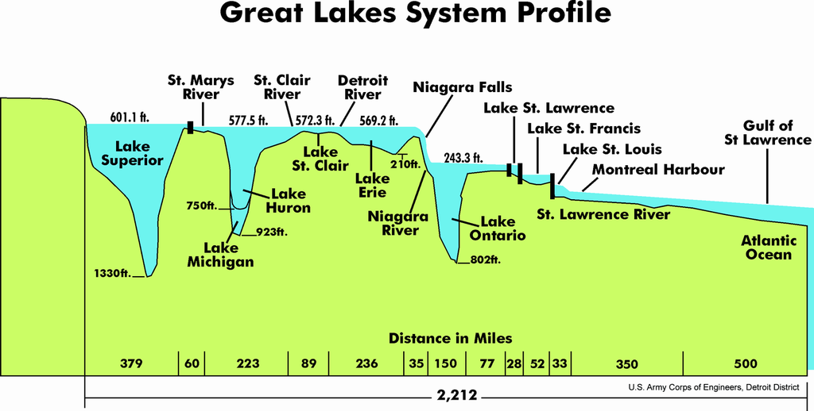
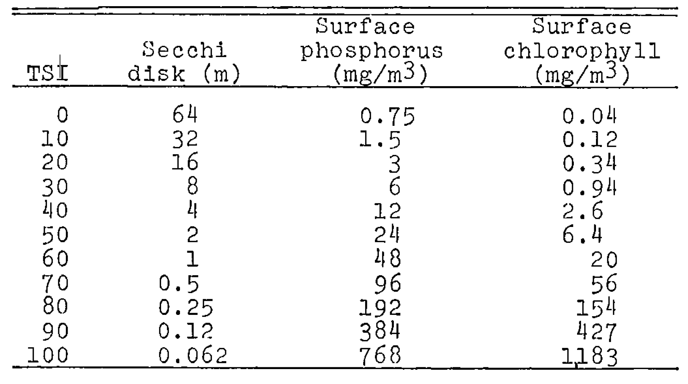

```{r load-packages, include = F}
## Load frequently used packages for blog posts
packages <- c(
      'devtools', #for session info
      'ggthemes', #for plots
      'blogdown',
      'dplyr',
      'forcats',
      'shiny',
      'kableExtra'
)
lapply(packages, function(x) {
  if (!requireNamespace(x)) install.packages(x)
  library(x, character.only = TRUE)
})
```

```{r set-chunk-options, include = F}
## Do not break chunk line
## Do not use spaces or periods "." or underscores "_"
## set options for knitr
knitr::opts_chunk$set(
  comment = '',
  fig.width = 6,
  fig.asp = .8,
  fig.align="center",
  message=F,
  error=F,
  warning=F,
  tidy=T,
  comment='',
  cache=T,
  dev='svg',
  echo=F
)
```

```{r set-ggplot-theme-defaults, include = F}
#from ggthemes
library(ggplot2); theme_set(ggthemes::theme_fivethirtyeight())
```

```{r define-color-palette, include = F, eval = T}
# color blind friendly palette from http://www.cookbook-r.com/Graphs/Colors_(ggplot2)/
cbPalette <- c("#E69F00", "#56B4E9", "#009E73", "#F0E442", "#0072B2", "#D55E00", "#CC79A7", "#000000")
```

```{r write-package-bib, echo = F}
# write packages used to bib in current directory
knitr::write_bib(.packages(), "./packages.bib")
```

```{r load-fishing-data, include = F, cache = F}
input <- "/Users/robwiederstein/Dropbox/public/datasets/glfc-great-lakes-comm-fish-catch-1867-2015.csv"
df <- data.table::fread(input = input)
```

# [Overview](#overview)

The Great Lakes Fishery Commission (GLFC) published data on the commercial fish catch in the Great Lakes from 1867 to 2015.[@baldwinCommercialFishProduction2018] Commercial catch records are an important indicator of the health of the fishing stocks and the lake ecology in general. Each lake is unique and its features impact what fish are present, their composition over time and the overall volume of commercial fish catch.


```{r comm-fishing-app-shiny, out.width="100%"}
knitr::include_app("https://rob-wiederstein.shinyapps.io/fish-app/", height = "800px")
```


# [Background](#background)

## General

The Great Lakes are comprised of, moving west to east: Superior, Michigan, Huron, Saint Claire, Erie and Ontario. According to the National Oceanic and Atmospheric Administration (NOAA), the Great Lakes contain 95% of the country's surface fresh water supply, have a surface area of 94,000 square miles, and are encircled by 9,000 miles of shoreline.  Also known as the "Laurentian Great Lakes," they "comprise the largest surface freshwater system in the world." [@taylorChangingFaceGreat2019] Niagra Falls acted as a natural barrier separating Lake Ontario from the rest of the Great Lakes and preventing the westward migration of invasive species.


```{r lake-profile, out.width="100%", fig.cap = "Based on surface area, Lake Superior is the least productive in commercial fishing, while Lake Erie with its shallow bottom and southern orientation, is the most productive of the Great Lakes."}

```


## Lake Productivity

Lakes are classfied by their "trophic" state--their ability to sustain aquatic life. Oligotrophic lakes are nutrient poor, clear, and deep with little detritus on the bottom.  There are few fish and, when present, they are of small size.  In contrast, eutrophic lakes are nutrient rich, turbid, shallow, with high algae concentrations and organic matter on the bottom. The lake sustains large quantities of  fish. Lakes that are in the middle are referred to as mesotrophic.


Many have attempted to estimate lake productivity using different measures and there are competing viewpoints on the appropriate methods. A widely used measure is the trophic state index for lakes, first conceived and proposed by Robert M. Carlson in 1977.[@carlsonTrophicStateIndex1977] The Trophic State Index (TSI) is computed from commonly accepted measures like nutrient concentrations (i.e. phosphorous), biomass concentrations (i.e. clorophyll), and water clarity (secchi disk readings). Like the Richter Score for earthquakes, the index permits the trophic condition of a lake to be easily explained to a layperson with a TSI score of 0 to 100. [@carlsonTrophicStateIndex1977]

```{r trophic-state-index-table, out.width="90%", fig.cap="Note how phosphorous and chlorophyll concentrations increase as water clarity decreases.[@carlsonTrophicStateIndex1977]"}

```


Lakes with high TSI scores are highly productive whereas lakes with low TSI scores are not.  "The overwhelming evidence from" many, many studies "is that, as lakes become more eutrophic,"--whether measured by TSI scores or other means--"the standing crops, productivity, and yields of fish increase."[@bachmannRelationsTrophicState2011] This conclusion has also been expanded to include species considered to be sports fish as well.[@bachmannRelationsTrophicState2011] However, in one large Florida study, only 75% of the variance in fish production could be explained by trophic state and the author described its use  as a predictor as "imprecise." [@bachmannRelationsTrophicState2011]

"As freshwater bodies, the Great Lakes are less productive than the oceans if climate is held constant." [@zieglerEnvironmentCultureGreat2014] "Middle-latitude freshwater lakes are by no means nutrient poor, but they typically rank low in primary productivity compared with oceanic and tropical environments." [@zieglerEnvironmentCultureGreat2014]  

When measured by the amount of microscopic plant productivity, Lake Erie is the most productive, followed by Lake Ontario, Lake Michigan, Lake Huron, and finally Lake Superior. [@hallMethodsAssessingAquatic1975]  "Of the five Laurentian Great Lakes, Superior and Huron and to a lesser extent Michigan are still relatively unproductive, whereas Ontario and Erie, particularly Erie's western basin, are rich in nutrients and support a dense plant life. [@hallMethodsAssessingAquatic1975] "In contrast, daily productivity in Lake Erie may be as much as 45 times greater than that of Lake Superior." 

## Fisheries

"The United States and Canadian Great Lakes fisheries are experiencing a long-term decline."[@zieglerEnvironmentCultureGreat2014]"In the 1800s, fish harvests in the Great Lakes were greater than they are today, and the long record suggests that the industry has experienced a continued pattern of fluctuations in harvests, species abundance, and demand for the product." [@zieglerEnvironmentCultureGreat2014]
"Annual harvests in U.S. waters dropped from around 23,000 metric tons per year in 1980 to 9,000 metric tons per year in 2011." [@zieglerEnvironmentCultureGreat2014]  "Historically, the Great Lakes system supported abundant populations of commercially-important fish species such as Lake Trout , Atlantic Salmon, Lake Whitefish, deepwater ciscoes (e.g. Bloater),  Walleye, and Yellow Perch. [@taylorChangingFaceGreat2019]

## Economic Impact

 At the national level when marine waters are included,  commercial fishing contributes over 5.2 billion to the economy and supports approximately 1.2 million jobs,  while recreational fishing contributes over 122 billion to the economy and supports 440,000 jobs." [@taylorChangingFaceGreat2019] The "Great Lakes commercial fisheries, while locally and regionally of great importance,
continue to decline, and today they contribute less than 1 percent of the billions of dollars a year to the regional economy that are attributed to recreational fisheries.[@taylorChangingFaceGreat2019] Great Lakes commercial fishing is a fraction of recreational fishing and tourism, contributing less than one percent to the regional economy.[@zieglerEnvironmentCultureGreat2014] 

 The commercial fishing industry has been buffeted by environmental changes over the last eighty years, "beginning with the sea lamprey invasion of the 1940s." [@zieglerEnvironmentCultureGreat2014] Since then, a variety of factors have impacted commercial fishing like overfishing, pollution, invasive species, technology and regulation.

# Notable Species

The species below are routinely mentioned in the literature and history regarding the health of Great Lakes fish stocks.

## Sea lampreys

"Of all the problems the Great Lakes fishery has faced over the years, none has been more vexing than that of the sea lamprey". [@zieglerEnvironmentCultureGreat2014]  Sea lampreys are an invasive species to the Great Lakes migrating from the Atlantic Ocean.  They attach to their host with their circular rows of teeth and survive on the fluids of their host.  Lampreys could be found in Lake Ontario and moved westward when the Welland Canal bypassed Niagra Falls.  They devastated the fishing stocks of the Great Lakes, gradually moving westward from Lake Ontario in the 1850s. The primary control method is through chemicals collectively known as lampricides.  The chemicals target lamprey larvae in the tributaries surrounding the Great Lakes.  According to the Great Lakes Fishery Commission [website](http://www.glfc.org/control.php), about 200 areas are targeted for lampricide treatment.

The sea lamprey never has become well established in Lake Erie.[@zieglerEnvironmentCultureGreat2014].  The lake trout (Salvelinus namaycush), probably the most prized fish of the Great Lakes, was its [the lamprey's] favorite target," though they attack other prize sports fish too. [@zieglerEnvironmentCultureGreat2014]

## Lake Whitefish

"One of the Great Lakes' most productive species had been the lake whitefish (Coregonus clupeaformis) until overfishing and poor recruitment led to a collapse of the whitefish harvest in the 1890s." [@zieglerEnvironmentCultureGreat2014]

## Alewife

Alewife "is best known for its invasion of the Great Lakes via the Welland Canal. Its population surged between the 1950s and 1980s to the detriment of many native species of fish. In an effort to control them biologically, Pacific salmon were introduced, only partially successfully."  [Wikpedia](https://en.wikipedia.org/wiki/Alewife_(fish)) Treated differently than the lamprey, it "became a commercial species, with thousands of tons sold to pet food processors and as bait to the Atlantic Coast lobster industry." [@zieglerEnvironmentCultureGreat2014] The "alewife abundance grew to shocking proportions by the mid-1960s, when billions of the small fish washed up on the shores of Lake Michigan where they fouled swimming beaches."[@zieglerEnvironmentCultureGreat2014]

## Salmon

"Pacific salmonine species, introduced after lamprey control had begun, proved to be eager consumers of the alewife." [@zieglerEnvironmentCultureGreat2014]  "Beginning in 1964, shipments of Coho Salmon eggs (>1 million) and Chinook Salmon eggs (>3 million) were sent to Michigan from hatcheries in Oregon and Washington." [@taylorChangingFaceGreat2019] "Today, Coho Salmon, Chinook Salmon, and Steelhead are considered the most socioeconomically valuable fishes in the Great Lakes basin." [@taylorChangingFaceGreat2019] "The three Pacific species were not introduced for the commercial fishery, but rather as a means for stimulating sport fishing."
[@zieglerEnvironmentCultureGreat2014] Alewife population declined and salmon populations soon followed.  Control of alewife led to a booming walleye population. [@zieglerEnvironmentCultureGreat2014]

## Mussels & Round Goby

Zebra and quagga mussels entered the Great Lakes in the 1980s, having originated from lakes in Russia, and likely carried by ocean going ships. The goby (Neogobius melanostomus), a round, soft-bodied fish, also seem to have entered the Great Lakes in ocean-going ships and feeds on  mussels and fish eggs.

# [Data and model](#data)

From the GLFC [website](http://www.glfc.org/great-lakes-databases.php), "records of commercial fish production in the Great Lakes were collected as early as 1867 in Canada and 1879 in the United States." However, the information was not consolidated until the establishment of the International Board of Inquiry for the Great Lakes Fisheries in 1940. After a multi decade lapse, the GLFC republished the 1867 to 1940 fishing data again in 1962 along with the data from 1940 to 1962. The GLFC has continued to act as a collector and repository of the information with the most recent data available from 2015.

In the GLFC ["Notes on Statistics"](http://www.glfc.org/commercial/COMMERCIAL%20FISH%20PRODUCTION_Notes%20on%20Statistics.pdf) two passages are significant in interpreting the data.  The first was regarding weight.  "Production amounts in each jurisdiction in a lake were rounded to the nearest thousand pounds after sums were calculated. (The sum of rounded amounts from the various jurisdictions will not necessarily correspond to the rounded total for the entire lake.) A blank indicates no catch report. A lake total for the species in question is not computed when the lack of a catch report is assumed attributable to zero catch."

The second significant passage in the "Notes on Statistics" was on the species field.  "Confusion as to fish names and the combining of catches of species that are in the same market category or that resemble each other introduced considerable uncertainty into the statistics for many of the early years."  In the data, the species are listed alphabetically by their common name, rather than their phylogenetic order.

The most problematic portion of this dataset was the `species` field.  Upon import of the dataset, there were 55 number of unique values.  Some of the text fields were exceptionally long which makes them difficult to use in code. Long variable names often present awkward spacing in charts and graphs.  Ultimately, the variables were shortened and narrowed to 34 unique names, but the distillation was the result of the author's subjective judgment.

There were common patterns in the `species` field.  First, there were misspellings.  `amercian` was changed to `american`.  Second, singular were changed to plural.  For example, `chub` was changed to `chubs`. Third, names were shortened. `chinook`, `coho`, and `pacific` were shortened to just `salmon`. Fourth, there were substantive changes too.  `blue pike` was changed to `walleye`, because of some controversy over its appropriate taxonomy.  The complete list of changes is in the [Appendix](#appendixspecies-grouping).


# [Results](#results)

The data were filtered to the latest year available and the total commercial catch was determined by lake and species.  The largest catch was rainbow smelt from Lake Erie. Six of the top 10 catches by weight were from Lake Erie.  Lake whitefish was the largest catch for both Lake Superior and Lake Huron.  Lakes Ontario and Michigan did not make the top 10 list.

```{r table-comm-fish-production}
df %>% 
  dplyr::filter(year == max(year)) %>%
  select(year, lake, species, kg) %>%
  mutate(kg = round(kg, 2)) %>%
  arrange(-kg) %>%
  slice_head(n = 10) %>%
  kableExtra::kbl() %>%
  kableExtra::kable_styling(position = "center")
```


In order to make fair comparisons between the lakes, a measure of yield was derived.  Fish production was scaled to lake size in surface area. When considering the size of a lake, Lake Erie led the other lakes in terms of fish catch in kilograms per square kilometer.

```{r plot-lake-production, fig.cap="Fish production in pounds per square mile.", fig.width=7}
df.1 <- 
  df %>%
  #na.omit() %>%
  group_by(year, lake) %>%
  summarize(total = sum(kg, na.rm = T))
df.sa <- tibble(lake = c("Erie",
                         "Huron",
                         "Michigan",
                         "Ontario",
                         "Saint Clair",
                         "Superior"
                         ),
                sa_km = c(25655,
                          59565,
                          57753,
                          19009,
                          1100,
                          82097)
)
df.1 <- dplyr::left_join(df.1, df.sa, by = "lake")
df.1$kg <- df.1$total * .45359237
df.1$kg_per_km_sq <- round((df.1$kg / df.1$sa_km), 2)
#df.1$lake <- stringr::str_sub(df.1$lake, start = 1, end = 5)
df.1$lake <- factor(df.1$lake, levels = c("Erie", "Michigan", "Saint Clair", "Huron",  "Ontario", "Superior"))
library(ggplot2)
p <- ggplot(df.1, aes(year, kg_per_km_sq, color = lake))
p <- p + geom_line(lwd = 1)
# p <- p + scale_y_continuous(name = "",
#                             breaks = c(0, 2000, 4000, 6000),
#                             labels = c("0", "2k", "4k", "6k")
#                             )
p <- p + scale_x_continuous(name = "")
p <- p + facet_grid(rows = vars(lake))
p <- p + labs(title = "Great Lakes Commercial Fish Catch",
              subtitle = expression(~kg/km^2),
              caption = "Great Lakes Fishery Commission--2018"
              )
p <- p + ggthemes::theme_fivethirtyeight()
p <-  p + theme(legend.position = "none",
                plot.subtitle = element_text(size = 16)
                )
p
```

# [Conclusion](#conclusion)

Commerical fishing is a challenging business.  Fish populations have changed over time and the composition of the fish has changed as well. Invasive species like the Sea Lamprey and the Alewife have decimated native species and caused commercial fisherman to change tactics and expectations.  In some cases, they have abandoned the market completely.

The dataset confirms several propositions in the academic literature; namely, that commercial fish catches have declined over time.  Additionally, Lake Erie because of its unique features continues to be the most productive of the Great Lakes when measured by commercial fish catch in kilograms per square kilometer.

Several realtively new invasive species will continue to alter the historic balance of the Great Lakes fish as well. New challenges from dreissenid mussels and the round gobi will require commercial fisherman to remain vigilant and flexible in the dynamic ecology of the Great Lakes.

# [Acknowledgements](#acknowledge)

This blog post was made possible thanks to:

-   [Great Lakes Fishery Commission][1]
-   [International Association of Great Lakes Research][2]
-   [Great Lakes Science Center][3]
-   [United States Geologic Survey][4]
-   [World Lake Database][5]
-   [NOAA - Fisheries][6]
-   [NOAA - Great Lakes Env'l Research Lab][7]
-   [GLATOS][8]
-   [History of state-licensed Great Lakes commercial fishing][9]

[1]:http://www.glfc.org
[2]:http://iaglr.org
[3]:https://www.usgs.gov/centers/glsc
[4]:https://www.usgs.gov
[5]:https://wldb.ilec.or.jp
[6]:https://www.fisheries.noaa.gov
[7]:https://www.glerl.noaa.gov
[8]:https://glatos.glos.us
[9]:http://169.62.82.226/dnr/0,4570,7-350-79136_79236_80538_80541-424724--,00.html


# [Appendix--Species Grouping]{#appendix}

```{r species-grouping, echo = T, eval=F, include=T}
#clean species field
                df$species <- tolower(df$species)
                #american eel
                df$species <- gsub("amercian", "american", df$species)
                # bullhead and channel cats
                df$species <- gsub("bullhead$", "bullheads", df$species)
                df$species <- gsub(" and bullheads", "", df$species)
                #chubs
                df$species <- gsub("chub$", "chubs", df$species)
                #crappies
                df$species <- gsub("crappies", "crappie", df$species)
                df$species <- gsub(" and crappie", "", df$species)
                #drum
                df$species <- gsub("freshwater ", "", df$species)
                #lake trout
                df$species <- gsub(" - siscowet", "", df$species)
                #walleye aka blue pike was actually a walleye
                df$species <- gsub(" and blue pike", "", df$species)
                df$species <- gsub("blue pike", "walleye", df$species)
                #lake sturgeon
                df$species <- gsub("lake sturgeon", "sturgeon", df$species)
                #salmon
                df$species <- gsub("chinook |coho |pacific ", "", df$species)
                #cisco and chubs
                df$species <- gsub(" and chubs", "", df$species)
                #channel catfish
                df$species <- gsub("channel ", "", df$species)
                #northern pike
                df$species <- gsub("northern ", "", df$species)
```

# [References](#reference)

<div id="refs"></div>

# [Disclaimer](#disclaimer)

The views, analysis and conclusions presented within this paper represent the author’s alone and not of any other person, organization or government entity. While I have made every reasonable effort to ensure that the information in this article was correct, it will nonetheless contain errors, inaccuracies and inconsistencies. It is a working paper subject to revision without notice as additional information becomes available. Any liability is disclaimed as to any party for any loss, damage, or disruption caused by errors or omissions, whether such errors or omissions result from negligence, accident, or any other cause. The author(s) received no financial support for the research, authorship, and/or publication of this article.

# [Reproducibility](#reproduce)

```{r reproducibility, echo = FALSE}
# system & package info
options(width = 120)
session_info()
```
