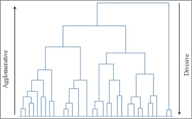

```{r load-packages, include = F}
## Load frequently used packages for blog posts
packages <- c(
      'devtools', #for session info
      'ggthemes', #for plots
      'blogdown',
      'magrittr',
      'dplyr',
      'factoextra',
      'clustertend',
      'gridExtra',
      'cluster',
      'clValid',
      'kableExtra'
      
)
lapply(packages, function(x) {
  if (!requireNamespace(x)) install.packages(x)
  library(x, character.only = TRUE)
})
```

```{r set-chunk-options, include = F}
## Do not break chunk line
## Do not use spaces or periods "." or underscores "_"
## set options for knitr
knitr::opts_chunk$set(
  comment = '',
  fig.width = 6,
  fig.asp = .8,
  fig.align="center",
  message=F,
  error=F,
  warning=F,
  tidy=T,
  comment='',
  cache=T,
  dev='svg',
  echo=F
)
```

```{r set-ggplot-theme-defaults, include = F}
#from ggthemes
library(ggplot2); theme_set(ggthemes::theme_fivethirtyeight())
```

```{r define-color-palette, include = F, eval = T}
# color blind friendly palette from http://www.cookbook-r.com/Graphs/Colors_(ggplot2)/
cbPalette <- c("#E69F00", "#56B4E9", "#009E73", "#F0E442", "#0072B2", "#D55E00", "#CC79A7", "#000000")
```

```{r write-package-bib, echo = F}
# write packages used to bib in current directory
knitr::write_bib(.packages(), "./packages.bib")
```

```{r load-aba-data, include = F}
file <- "/Users/robwiederstein/Dropbox/public/datasets/aba-consolidated-datasets"
load(file = file)
df.1 <- df %>% select(-c(school, type_of_school))
df.1[is.na(df.1)] = 0
#random df from aba
random_df <- apply(df.1, 2, function(x){
        runif(length(x), min(x), max(x))})
#scale
df.1 <- scale(df.1)
random_df <- scale(random_df)

```


# [Overview](#overview)

This is Part 2 of a series about the American Bar Association's law school data. The data are released at the school level and are collected and released annually. The information is extensive and this post is an effort to understand the interaction among the different variables.  Clustering analysis is often used to understand correlation among the different values and to categorize the different observations by cluster.

This blogpost will proceed with a review of machine learning strategies and place cluster analysis in context.  The data and model section will cluster the data according to three commonly used algorithms: principal component analysis, k-means, and PAM.  Each method will be applied to the law school data and a randomly generated dataset.  One hierarchical plot will be constructed as well.  

Finally, the Hopkins statistic will be computed, the data will be visually inspected for randomness and the `clValid` package will evaluate the effectiveness of the different strategies.


# [Background](#background)

Grouping and classifying objects is our way of organizing the world around us. Sometimes the objects are labeled like a medical diagnosis with a specific set of symptoms or the assignment of humans to the kingdom "Animalia".   "In virtually every scientific field dealing with empirical data, people attempt to get a first impression on their data by trying to identify groups of similar behavior in their data."[@vonluxburgTutorialSpectralClustering2007] In programming,  where the label is known before its classification, it is coined "supervised classification."  Where the label is unknown before classification, it is referred to as "unsupervised classification" or more commonly "cluster analysis."

Objects are classified through the use of an algorithm that predicts the class of the unknown object. Also known as a "classifier", the algorithm's accuracy is judged by the object's assignment to the correct category.  Unsupervised classification "is considered to be more difficult than supervised classification as there is no label attached to the patterns in clustering."[@saxenaReviewClusteringTechniques2017] "Clustering methods are generally more demanding than supervised approaches but provide more insights about complex data. This type of classifiers constitutes the main object of the current work."[@rodriguezClusteringAlgorithmsComparative2019]

"Clustering embraces several interdisciplinary areas such as: from mathematics and statistics to biology and genetics, where all of these use various terminology to explain the topologies formed using this clustering analysis technique. For example, from biological "taxonomies", to medical "syndromes" and genetic "genotypes" to manufacturing "group technology", each of these topics has the identical problem: create groups of instances and assign each instance to the appropriate groups."[@saxenaReviewClusteringTechniques2017]

## Clustering Techniques

Many approaches fall under the umbrella of "clustering techniques."  "The reason for having different clustering approaches towards various techniques is due to the fact that there is no such precise definition to the notion of cluster”.[@saxenaReviewClusteringTechniques2017] "While many classification methods have been proposed, there is no consensus on which methods are more suitable for a given dataset." [@rodriguezClusteringAlgorithmsComparative2019]  The techniques fall into two broad categories: hierarchical (dendrograms) and partitional (i.e., k-means). 

```{r cluster-diagram, out.width="90%", fig.cap="Classification of clustering techniques. [@saxenaReviewClusteringTechniques2017]"}
knitr::include_graphics(path = "./clustering-diagram.jpg")
```


### Hierarchical

"In hierarchical clustering methods, clusters are formed by iteratively dividing the patterns using a top-down or bottom-up approach. There are two forms of hierarchical method namely agglomerative and divisive hierarchical clustering."[@saxenaReviewClusteringTechniques2017] 

```{r dendrogram-diagram, out.width="75%", fig.cap = "Hierarchical methods yield dendrograms that are formed in one of two directions. [@saxenaReviewClusteringTechniques2017]"}

```

Hierarchical clustering algorithms are often criticized for a lack of robustness, meaning they are sensitive to outliers.  They are computationally intensive and are therefore difficult to use in large datasets.[@saxenaReviewClusteringTechniques2017]

### Partitioning

"Partitional clustering is opposite to hierarchical clustering; here data are assigned into k clusters without any hierarchical structure by optimizing some criterion function."[@saxenaReviewClusteringTechniques2017] The similarity between two objects is measured in distance, with Euclidean distance being the most common.  Other measures of distance include Minkowski, cosine, Pearson, the extended Jaccard, and the Dice coefficient. A second partitioning strategy allows for the assignment of an object to more than one cluster, a strategy known as "fuzzy clustering."

"Spectral" clustering was described by Saxena as a variant of clustering methods and popular within the machine learning community.  Because of its prominence in clustering literature, greater exposition is appropriate.  "Spectral clustering . . . consists of algorithms cluster points using eigenvectors of matrices derived from the data."[@saxenaReviewClusteringTechniques2017] The wide use of spectral clustering is because (1) it does not make strong assumptions on the form of the clusters, (2) it can solve very general problems like intertwined spirals and (3) it can be implemented efficiently even for large data sets. [@saxenaReviewClusteringTechniques2017] 

"Some of the advantages of partition based algorithms include that they are (i) relatively scalable and simple and (ii) suitable for datasets with compact spherical clusters that are well-separated. However, disadvantages with these algorithms include poor (i) cluster descriptors; (ii) reliance on the user to specify the number of clusters in advance; (iii) high sensitivity to initialization phase, noise and outliers; and (iv) inability to deal with non-convex clusters of varying size and density."[@saxenaReviewClusteringTechniques2017]

## Clustering Packages in R

One extensive study used 400 datasets and nine R packages representing different clustering methods. The results revealed that, when considering the default configurations of the adopted methods, the **spectral approach** tended to present particularly good performance."[@rodriguezClusteringAlgorithmsComparative2019] A second finding was that the default configurations from the different packages was "not always accurate."[@rodriguezClusteringAlgorithmsComparative2019] In fact, the random selection of the package parameters was a "good alternative" to improving performance. [@rodriguezClusteringAlgorithmsComparative2019] 

## Issues

A big issue, in cluster analysis, is that clustering methods will return clusters even if the data does not contain any clusters. In other words, if you blindly apply a clustering method on a data set, it will divide the data into clusters because that is what it is supposed to do." [Datanovia](https://www.datanovia.com/en/lessons/assessing-clustering-tendency/)
 

# [Data and model](#data)

Rows are observations (individuals) and columns are variables Any missing value in the data must be removed or estimated. The data must be standardized (i.e., scaled) to make variables comparable. Standardization consists of transforming the variables such that they have mean zero and standard deviation one.

## Partitioning

The ABA law school data was partitioned using principal component analysis, k-means, and the PAM methods.  In each case, the results were compared to a randomly generated set of data too.

### Principal Component Analysis

#### Law School

```{r prin-comp-cluster-law-school}
fviz_pca_ind(prcomp(df.1), 
             title = "PCA - ABA Law School Data",
             habillage = cut_interval(df$attrite_pct, n = 3),
             palette = "jco",
             geom = "point",
             ggtheme = theme_classic(),
             legend = "bottom"
             )
```

#### Random

```{r prin-comp-cluster-random}
fviz_pca_ind(prcomp(random_df), 
                    title = "PCA - Random Data",
                    geom = "point", 
                    ggtheme = theme_classic()
             )
             
```

### K-means

An analyst can and often does group the data.  However, the "elbow" method is also commonly used to set the number of groups in the cluster.

#### Elbow Method

```{r optimal-grouping-elbow}
fviz_nbclust(df.1, kmeans, method = "wss") + geom_vline(xintercept = 10, linetype = 2)
```


#### Law School
```{r k-means-cluster-law-school}
km.res1 <- kmeans(df.1, 9)
fviz_cluster(list(data = df.1, 
                  cluster = km.res1$cluster,
                  ellipse.type = "norm",
                  geom = "point",
                  stand = F,
                  palette = "jco",
                  ggtheme = theme_classic()
                  ),
             main = "K-means -- ABA"
             )
```

#### Random

```{r k-means-cluster-random}
km.res2 <- kmeans(random_df, 3)
fviz_cluster(list(data = random_df,
                  cluster = km.res2$cluster,
                  ellipse.type = "norm",
                  geom = "point",
                  stand = F,
                  palette = "jco",
                  ggtheme = theme_classic()
                  ),
             main = "K-means -- Random"
             )
```

### PAM

"The use of means implies k-means clustering is highly sensitive to outliers.  This can severely affect the assignment of outliers to clusters. A more robust method is provided by the PAM algorithm." [@kassambaraPracticalGuideCluster2017] The optimal number of clusters "is the one that maximizes the average silhouette over the possible ranges, *k*." [@kassambaraPracticalGuideCluster2017]  

#### Silhouette Method

```{r optimal-grouping-silhouette, fig.cap="From the method silhouette, the optimal number of clusters is 2."}
#PAM optimal groups using silhouette
fviz_nbclust(df.1, pam, method = "silhouette") + theme_classic()
```

#### Law School

```{r pam-cluster-law-school}
#create pam object
pam.res <- pam(df.1, 2)
#plot pam object
fviz_cluster(pam.res, ellipse = T, repel = T, main = "PAM -- Law Schools", ggtheme = theme_classic())
```


#### Random

```{r pam-cluster-random}
#create pam object
pam.res <- pam(random_df, 2)
#plot pam object
fviz_cluster(pam.res, ellipse = T, repel = T, main = "PAM -- Random", ggtheme = theme_classic())
```


## Hierarchical

```{r dendogram-law-schools}
#hierarchal clustering
res.dist <- dist(df.1, method = "euclidean")
#linkage by method
res.hc <- hclust(d = res.dist, method = "ward.D2")
#cut dendrogram into different groups
grp <- cutree(res.hc, k = 2)
fviz_dend(res.hc,
          k = 2,
          main = "2020 U.S. Law Schools",
          type = "circular"
          )
```

## Clustering Tendency

According to the Practical Guide to Cluster Analysis in R: Unsupervised Machine Learning, the *Hopkins statistic* is "used to assess the clustering tendency of a data set by measuring the probability that a given dataset is generated by a uniform data distribution.  In other words, it tests the spatial randomness of the data".[@kassambaraPracticalGuideCluster2017]

If the value of Hopkins statistic is close to 1 (far above 0.5), then we can conclude that the dataset is significantly clusterable. The law school dataset had a Hopkins statistic of `r get_clust_tendency(df.1, n = nrow(df.1) - 1, graph = F)[1]` and the random dataset's Hopkins statistic was `r get_clust_tendency(random_df, n = nrow(df.1) - 1, graph = F)[1]`.

## Visual Assessment of Cluster Tendency


```{r vat-assessment-both, out.width="100%", fig.cap="Visual Assessment of law schools versus randomly generated data."}
#plot 1
p1 <- fviz_dist(dist(df.1), show_labels = F) + labs(title = "VAT -- Law Schools") + theme(legend.position = "none") + annotate("text", x = 150, y = 10, label = "Hopkins = .558")
#plot 2
p2 <- fviz_dist(dist(random_df), show_labels = F) + labs(title = "VAT -- Random") + theme(legend.position = "none") + annotate("text", x = 150, y = 10, label = "Hopkins = .499")
#grid
grid.arrange(p1, p2, ncol = 2)
```

## Clustering Validation

The `clValid` package contains functions for validating the results of a clustering analysis.  As such, it can be an important tool in choosing the right algorithm and the number of clusters.  The three measures are "internal", "stability" and "biological".  Available clustering options include" "hierarchical", "kmeans", "diana", "fanny", "som", "model", "sota", "pam", "clara", and "agnes".  The function returns an object which has summary, plot, print, and additional methods which allow the user to display the optimal validation scores and extract clustering results.[@brockClValidPackageCluster2008]


```{r clValid-methods, include=F}
clMethods <- c("hierarchical", "kmeans", "pam")
intern <- clValid(df.1, nClust = 2:10, 
        clMethods = clMethods,
        validation = "stability",
        metric = "euclidean")
```

```{r clValid-optimal-scores, fig.cap="Optimal value for each validation measure, along with the corresponding clustering method and number of clusters."}
opt <- optimalScores(intern)
opt %>%
        kbl() %>%
        kable_styling(position = "center")
        
```

From the website [Datanovia](https://www.datanovia.com/en/lessons/choosing-the-best-clustering-algorithms/), the acronyms have the following meanings:

-   APN measures the average proportion of observations not placed in the same cluster by clustering based on the full data and clustering based on the data with a single column removed.

-  AD measures the average distance between observations placed in the same cluster under both cases (full data set and removal of one column).

-   ADM measures the average distance between cluster centers for observations placed in the same cluster under both cases.

-   FOM measures the average intra-cluster variance of the deleted column, where the clustering is based on the remaining (undeleted) columns.

The values of APN, ADM and FOM ranges from 0 to 1, with smaller values corresponding with highly consistent clustering results. AD has a value between 0 and infinity, and smaller values are also preferred.

# [Conclusion](#conclusion)

The writeup followed  the structure of the book "Practical Guide to Clustering Analysis in R."  The  
Hopkins score on the law school data of .55 revealed that the clustering tendency was weak.  Nonetheless some variation in the data could be explained by different classifiers.

# [Acknowledgements](#acknowledge)

This blog post was made possible thanks to:

-   Dr. Philip Murphy's paper: [Clustering Variables and Respondents in R (2017)](https://rpubs.com/pjmurphy/269609)

-   UC Business Analytics R Programming Guide, [K-means Clustering Analysis](https://uc-r.github.io/kmeans_clustering)

-  [Validating cluster tendency using Hopkins statistic](https://stats.stackexchange.com/questions/332651/validating-cluster-tendency-using-hopkins-statistic)

-  [An Introduction to Principal Components Analysis](https://remiller1450.github.io/s230f19/pca.html)

- [Datanovia](https://www.datanovia.com/en/)

# [References](#reference)

<div id="refs"></div>

# [Disclaimer](#disclaimer)

The views, analysis and conclusions presented within this paper represent the author’s alone and not of any other person, organization or government entity. While I have made every reasonable effort to ensure that the information in this article was correct, it will nonetheless contain errors, inaccuracies and inconsistencies. It is a working paper subject to revision without notice as additional information becomes available. Any liability is disclaimed as to any party for any loss, damage, or disruption caused by errors or omissions, whether such errors or omissions result from negligence, accident, or any other cause. The author(s) received no financial support for the research, authorship, and/or publication of this article.

# [Reproducibility](#reproduce)

```{r reproducibility, echo = FALSE}
# system & package info
options(width = 120)
session_info()
```
