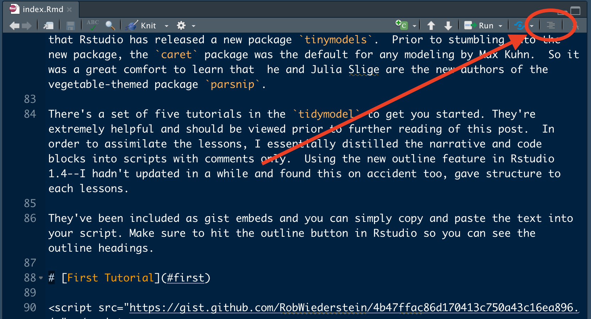

```{r load-packages, include = F}
## Load frequently used packages for blog posts
packages <- c(
      'devtools', #for session info
      'ggthemes', #for plots
      'blogdown',
      'tidyverse',
      'tidymodels'
)
lapply(packages, function(x) {
  if (!requireNamespace(x)) install.packages(x)
  library(x, character.only = TRUE)
})
```

```{r set-chunk-options, include = F}
## Do not break chunk line
## Do not use spaces or periods "." or underscores "_"
## set options for knitr
knitr::opts_chunk$set(
  comment = '',
  fig.width = 6,
  fig.asp = .8,
  fig.align="center",
  message=F,
  error=F,
  warning=F,
  tidy=T,
  comment='',
  cache=T,
  dev='svg',
  echo=F
)
```

```{r set-ggplot-theme-defaults, include = F}
#from ggthemes
library(ggplot2); theme_set(ggthemes::theme_fivethirtyeight())
```

```{r define-color-palette, include = F, eval = T}
# color blind friendly palette from http://www.cookbook-r.com/Graphs/Colors_(ggplot2)/
cbPalette <- c("#E69F00", "#56B4E9", "#009E73", "#F0E442", "#0072B2", "#D55E00", "#CC79A7", "#000000")
```

```{r write-package-bib, echo = F}
# write packages used to bib in current directory
knitr::write_bib(.packages(), "./packages.bib")
```


# [Overview](#overview)

It's been a while since I'd done any modeling so, quite on accident, I'd discovered that Rstudio was promoting a new package called `tidymodels`.  Prior to stumbling into the new package, the `caret` package, by Max Kuhn,  was the default for any modeling that I did.  So it was a great comfort to learn that he released an updated, vegetable-themed package `parsnip`. 

There's a set of five tutorials in the `tidymodel` to get you started. They're extremely helpful and should be viewed prior to further reading of this post.  In order to absorb the lessons, I essentially distilled the narrative and code blocks into scripts with comments only.  Using the new outline feature in Rstudio 1.4 (I hadn't updated Rstudio in a while) the new commenting paradigm gave structure to each lesson.  

They've been included as gist embeds so the text can be copied and pasted into your script. Make sure to hit the outline button in Rstudio so you can see the outline headings.

```{r outline-feature, out.width="90%", fig.cap="Show document outline button in Rstudio"}

```


# [First Tutorial](#first)

<script src="https://gist.github.com/RobWiederstein/4b47ffac86d170413c750a43c16ea896.js"></script>

# [Second Tutorial](#second)

<script src="https://gist.github.com/RobWiederstein/bb21985f3998041aeeea7dc2044df1f0.js"></script>

# [Third Tutorial](#third)

<script src="https://gist.github.com/RobWiederstein/8def57b19749f3ee28d926d37407f220.js"></script>

# [Fourth Tutorial](#fourth)

<script src="https://gist.github.com/RobWiederstein/66443eef38a24776327ff994fed375df.js"></script>

# [Fifth Tutorial](#fifth)

<script src="https://gist.github.com/RobWiederstein/a85731e45d6a88cf3496c25b55cf97e4.js"></script>

# [Conclusion](#conclusion)

Everybody learns in their own way.  Tutorials are really helpful and the `tidymodels` tutorials are great.  After finishing those up, I hope to spend some time with the book, Tidy Modeling in R, and then do some more examples.  No matter how many examples I try, I don't ever feel comfortable modeling data. By converting the narrative format into R scripts it should make it easier to copy and paste and step through the code on your own.  Enjoy.

# [Acknowledgements](#acknowledge)

This blog post was made possible thanks to:

-  [Rstudio](https://www.rstudio.com)

- [Tidy Modeling with R](https://www.tmwr.org)

-  [Tidymodels: tidy machine learning in R](http://www.rebeccabarter.com/blog/2020-03-25_machine_learning/) by Rebecca Barter

# [References](#reference)

<div id="refs"></div>

# [Disclaimer](#disclaimer)

The views, analysis and conclusions presented within this paper represent the author’s alone and not of any other person, organization or government entity. While I have made every reasonable effort to ensure that the information in this article was correct, it will nonetheless contain errors, inaccuracies and inconsistencies. It is a working paper subject to revision without notice as additional information becomes available. Any liability is disclaimed as to any party for any loss, damage, or disruption caused by errors or omissions, whether such errors or omissions result from negligence, accident, or any other cause. The author(s) received no financial support for the research, authorship, and/or publication of this article.

# [Reproducibility](#reproduce)

```{r reproducibility, echo = FALSE}
# system & package info
options(width = 120)
session_info()
```
