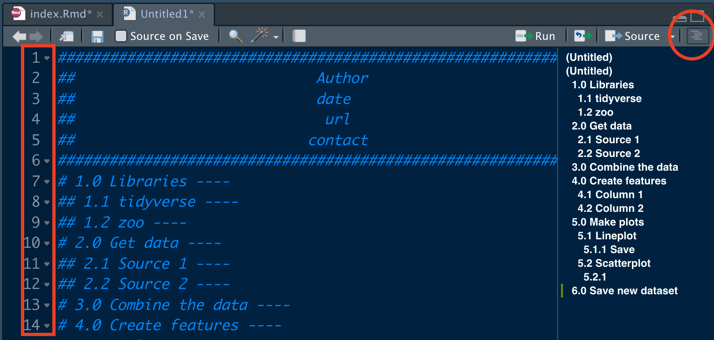

```{r load-packages, include = F}
## Load frequently used packages for blog posts
packages <- c(
      'devtools', #for session info
      'ggthemes', #for plots
      'blogdown',
      'bannerCommenter'
)
lapply(packages, function(x) {
  if (!requireNamespace(x)) install.packages(x)
  library(x, character.only = TRUE)
})
```

```{r set-chunk-options, include = F}
## Do not break chunk line
## Do not use spaces or periods "." or underscores "_"
## set options for knitr
knitr::opts_chunk$set(
  comment = '',
  fig.width = 6,
  fig.asp = .8,
  fig.align="center",
  message=F,
  error=F,
  warning=F,
  tidy=T,
  comment='',
  cache=T,
  dev='svg',
  echo=F
)
```

```{r set-ggplot-theme-defaults, include = F}
#from ggthemes
library(ggplot2); theme_set(ggthemes::theme_fivethirtyeight())
```

```{r define-color-palette, include = F, eval = T}
# color blind friendly palette from http://www.cookbook-r.com/Graphs/Colors_(ggplot2)/
cbPalette <- c("#E69F00", "#56B4E9", "#009E73", "#F0E442", "#0072B2", "#D55E00", "#CC79A7", "#000000")
```

```{r write-package-bib, echo = F}
# write packages used to bib in current directory
knitr::write_bib(.packages(), "./packages.bib")
```

# [Overview](#overview)

When I first started writing code, I might get to line 40 and be really confused about what I was doing and how the code worked.  Worse, when you went back to make changes, you had to relearn the code.  The pros repeat it ad infinitum:  comment your work.  Here's a way to take your commenting to the next level.

# [Background](#background)

Commenting is accomplished by starting a line with `#`.  A series of lines can be commented by opening the "Code" tab and selecting "Comment/Uncomment Lines".  The hot-keys for the action are shift-control-C. From [YaRrr! The Pirate's Guide to R](https://bookdown.org/ndphillips/YaRrr/a-brief-style-guide-commenting-and-spacing.html), the author states:

>I cannot stress enough how important it is to comment your code! Trust me, even if you don’t plan on sharing your code with anyone else, keep in mind that your future self will be reading it in the future.

Beginning in Rstudio version 1.4, commenting can be heirarchal like any other `Rmarkdown` document where the number of `#` sets the level of the outline.  Then, you can open RStudio's document outline pane.  The line must be followed by four consecutive dashes like this `----`.  

Additionally, an `R` package called `bannerCommenter` can also add some panache to your scripts.[@R-bannerCommenter] The package was written by Bill Venables who with B.D. Ripley wrote one of the preeminent textbooks ["Modern Applied Statistics with S"](https://www.amazon.com/Modern-Applied-Statistics-Computing/dp/0387954570).

# [An Example](#example)

My workflow pipeline almost always follows the outline below:

```{r, echo=T, eval = F}
#################################################################
##                            Author                           ##
##                            date                             ##
##                             url                             ##
##                           contact                           ##
#################################################################
# 1.0 Libraries ----
## 1.1 tidyverse ----
## 1.2 zoo ----
# 2.0 Get data ----
## 2.1 Source 1 ----
## 2.2 Source 2 ----
# 3.0 Combine the data ----
# 4.0 Create features ----
## 4.1 Column 1 ----
## 4.2 Column 2 ----
# 5.0 Make plots ----
## 5.1 Lineplot ----
### 5.1.1 Save ----
## 5.2 Scatterplot ----
### 5.2.1 ----
# 6.0 Save new dataset----
```


# [Workspace](#workspace)

```{r workspace-screenshot, out.width="100%", fig.cap='Notice the down  arrows beside the line numbers and the button for the outline pane.'}

```

The code above was copied and pasted into RStudio's editor pane and the outline button activated. The outline feature gives a clear map as to the progress of the program.


# [Conclusion](#conclusion)

Commenting your code has three primary benefits. First, it makes it more readable and understandable.  Second, Rstudio's outline pane organizes the different parts and presents them in a heirarchal fashion.  Third, the arrows can be used to collapse the code between comment lines.  Lastly, `bannerCommenter` can be used in conjunction with outline to bring attention to key features. And if you fail to do it, you're going to end up with a box of jumbled legos.

# [Acknowledgements](#acknowledge)

This blog post was made possible thanks to:

- Jonathan McPherson's blog post: [RStudio v1.4 Preview:  The Little Things](https://blog.rstudio.com/2020/12/02/rstudio-v1-4-preview-little-things/)

- [YaRrr! The Pirate's Guide to R](https://bookdown.org/ndphillips/YaRrr/a-brief-style-guide-commenting-and-spacing.html)

# [References](#reference)

<div id="refs"></div>

# [Disclaimer](#disclaimer)

The views, analysis and conclusions presented within this paper represent the author’s alone and not of any other person, organization or government entity. While I have made every reasonable effort to ensure that the information in this article was correct, it will nonetheless contain errors, inaccuracies and inconsistencies. It is a working paper subject to revision without notice as additional information becomes available. Any liability is disclaimed as to any party for any loss, damage, or disruption caused by errors or omissions, whether such errors or omissions result from negligence, accident, or any other cause. The author(s) received no financial support for the research, authorship, and/or publication of this article.

# [Reproducibility](#reproduce)

```{r reproducibility, echo = FALSE}
# system & package info
options(width = 120)
session_info()
```
