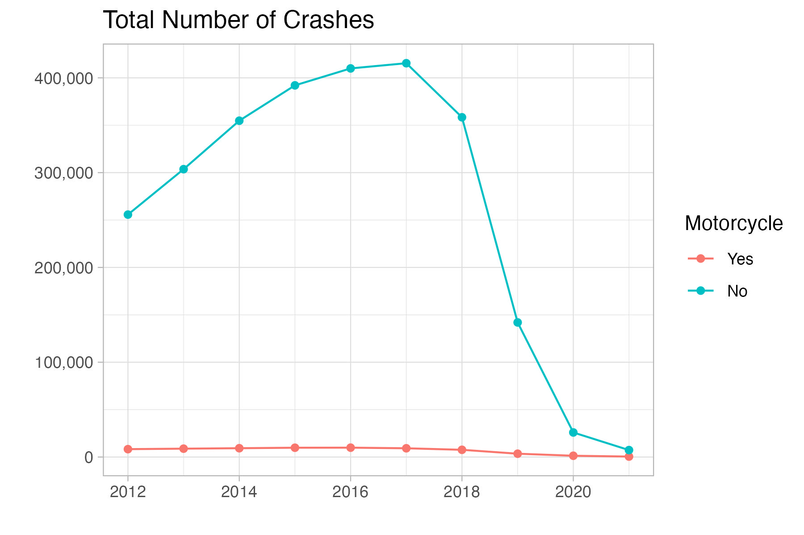
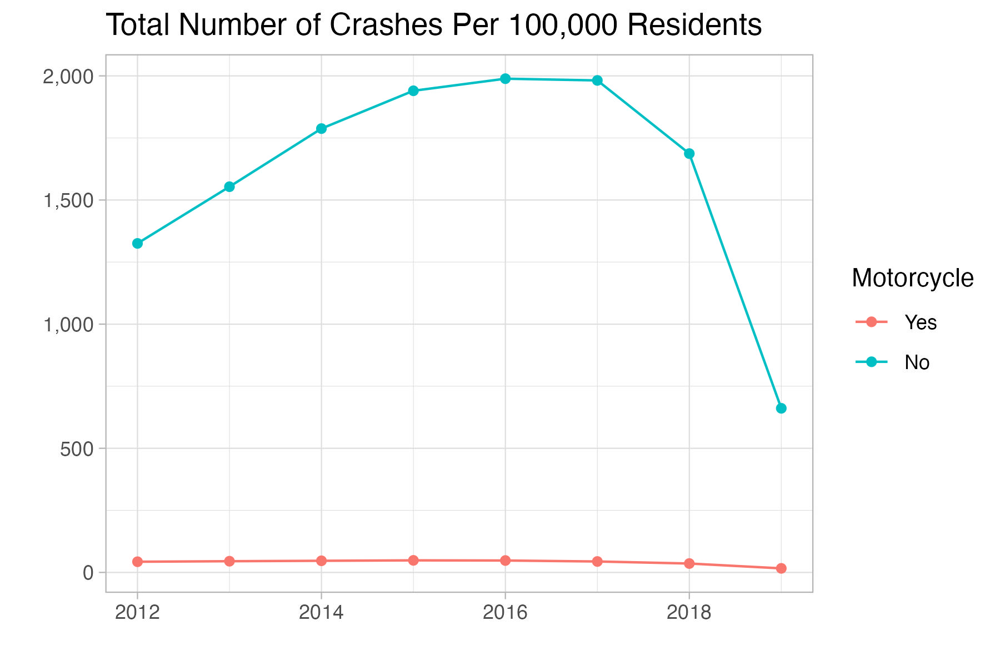
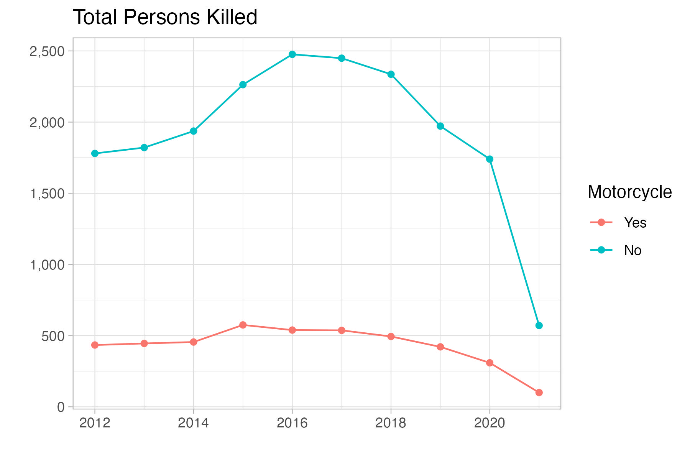
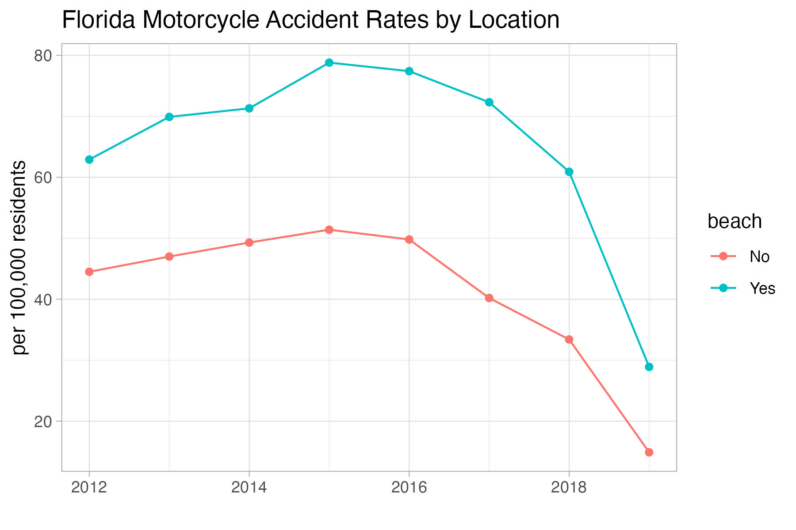

```{r load-packages, include = F}
## Load frequently used packages for blog posts
packages <- c(
      'devtools', #for session info
      'ggthemes', #for plots
      'blogdown',
      'kableExtra'
)
lapply(packages, function(x) {
  if (!requireNamespace(x)) install.packages(x)
  library(x, character.only = TRUE)
})
```


```{r set-chunk-options, include = F}
## Do not break chunk line
## Do not use spaces or periods "." or underscores "_"
## set options for knitr
knitr::opts_chunk$set(
  comment = '',
  fig.width = 6,
  fig.asp = .8,
  fig.align="center",
  message=F,
  error=F,
  warning=F,
  tidy=T,
  comment='',
  cache=T,
  dev='svg',
  echo=F
)
```

```{r set-ggplot-theme-defaults, include = F}
#from ggthemes
library(ggplot2); theme_set(ggthemes::theme_fivethirtyeight())
```

```{r define-color-palette, include = F, eval = T}
# color blind friendly palette from http://www.cookbook-r.com/Graphs/Colors_(ggplot2)/
cbPalette <- c("#E69F00", "#56B4E9", "#009E73", "#F0E442", "#0072B2", "#D55E00", "#CC79A7", "#000000")
```

```{r write-package-bib, echo = F}
# write packages used to bib in current directory
knitr::write_bib(.packages(), "./packages.bib")
```

```{r load-data, cache=T, include = F}
file <- "https://dl.dropbox.com/s/0muu0tyly6p603f/2021-08-20-fl_city_motorcycle_crashes_total.csv?dl=0"
mc_crashes_tot <- readr::read_csv(file = file)
file <- "https://dl.dropbox.com/s/3fvn3epy2by442f/2021-08-20-fl_city_motorcycle_crashes_per_100k.csv?dl=0"
mc_crashes_pc <- readr::read_csv(file = file)
```


# [Overview](#overview)

Visitors to Florida beaches often need transporation upon arrival. Many options are available and they can be seen when exiting airport and ferry terminals. Tourist destinations can be crowded places, particularly when traveling during a peak season like Spring Break.    Rental cars are expensive and parking can be scarce at a crowded beach or island.  Mopeds seem like a decent alternative given their cheap cost and easy maneuvering.  But what are the safety considerations? Some internet searches revealed Florida police departments have raised concerns about moped accidents in the past. Before renting a moped or motorcycle, one should consider their safety.

# [Background](#background)

The safety of different kind of vehicles are constantly being evaluated by researchers.  And there are a variety of products available for rental or purchase.  The possibilities include things like hover boards and scooters.[@nationalhighwaytrafficsafetyadministrationTrafficSafetyFacts2021]

The National Conference of State Legislatures (NCSL) recently published an [article](https://www.ncsl.org/research/transportation/motorcycle-safety-overview.aspx) about the safety of motorcycles and the National Highway and Traffic Safety Administration (NHTSA) prepared a "Traffic Safety Facts" [datasheet](https://crashstats.nhtsa.dot.gov/Api/Public/ViewPublication/813112). The highlights include:

- 4,985 motorcyclists were killed in crashes in 2018;

-  71% of motorcyclists used a helmet while on surfaced streets in 2018;

- 14% of traffic fatalities were motorcyclists;

- Annual motorcyclist deaths has gradually decreased since its peak in 2016;

- 84,000 motorcyclists were injured in 2019;

- 9 times the fatality rate for motorcyclists vs. light trucks; and

- 591 motorcyclists were killed in Florida in 2019, 52% of them were not wearing a helmet.


# [Data and model](#data)

Florida has an open data [portal](https://gis-fdot.opendata.arcgis.com). There, a [dataset](https://gis-fdot.opendata.arcgis.com/datasets/fdot::motorcycle-moped-crashes/about) regarding motorcycle and moped "crashes" is maintained. The data were collected beginning in 2012 through 2021.  The 2019 data are suspect in that crashes notably declined and the cause is unknown.


# [Results](#results)

## Total Number of Crashes in Florida

```{r total-number-crashes, out.width="95%"}

```

## Total Frequency of Crashes Per 100,000 Residents

```{r total-crashes-per-100k, out.width="95%"}

```

## Total Persons Killed

```{r total-fatalities, out.width="95%"}

```

## Top 100 Florida Cities for Motorcycle Crashes in 2019

```{r top-100-fl-cities-mc-crashes-total}
library(DT)
datatable(mc_crashes_tot)
```

## Top 100 Florida Cities for Motorcycle Crashes Per 100k Residents

```{r top-100-fl-cities-mc-crashes-pc}
library(DT)
datatable(mc_crashes_pc)
```

## Motorcycle Accident Rate by Location

```{r accident-rate-by-location, out.width="95%"}

```

# [Conclusion](#conclusion)

Total motor vehicle crashes as reported on the long form accident report peaked at 400,000+ in 2017.  Total motor vehicle crashes per 100,000 residents also peaked at 2,000 in 2016-17. While motorcycle accidents make up a small part of overall accidents, they represent a large portion of fatalities. Motorcycle fatalities have represented between 15% and 20% of the total.

Cities are often a center of traffic. The motorvehicle crashes were coded by `city_code`, filtered to `in_town` and `motorcycle_involved`.  When motorcycle crashes were totaled by city in 2019, Jacksonville was the leader with 6,180 accidents.  When scaled by population and including only cities greater than 20,000, Panama City was the top site with 98.1 motorcycle crashes per 100,000 residents.

Given that so many of the top cities had "beach" in their name, a new feature was created called `beach` and was coded based on whether the city name included the word "beach".  For example, Miami Beach and Daytona Beach would have been included. The idea was that the grouping variable was a proxy for location and tourism.  The graph revealed that cities that had "beach' in their name were the site of more motorcycle accidents when scaled by population.

The results of the analysis have some challenges.  First and foremost, it is unclear why accident reports have declined so significantly and leads one to speculate that a change in reporting criteria may have changed over the period examined.  Second, most of the research examined used a different metric in computing an accident rate.  Motorcycle registrations and miles driven were more prevalent in the literature; however, those data weren't available at the city level so population was used instead.

All of this is to say:  Think twice before renting a moped on your next Florida beach vacation.

# [Acknowledgements](#acknowledge)

This blog post was made possible thanks to:

- The Florida Department of Transportation

# [References](#reference)

<div id="refs"></div>

# [Disclaimer](#disclaimer)

The views, analysis and conclusions presented within this paper represent the author’s alone and not of any other person, organization or government entity. While I have made every reasonable effort to ensure that the information in this article was correct, it will nonetheless contain errors, inaccuracies and inconsistencies. It is a working paper subject to revision without notice as additional information becomes available. Any liability is disclaimed as to any party for any loss, damage, or disruption caused by errors or omissions, whether such errors or omissions result from negligence, accident, or any other cause. The author(s) received no financial support for the research, authorship, and/or publication of this article.

# [Reproducibility](#reproduce)

```{r reproducibility, echo = FALSE}
# system & package info
options(width = 120)
session_info()
```
