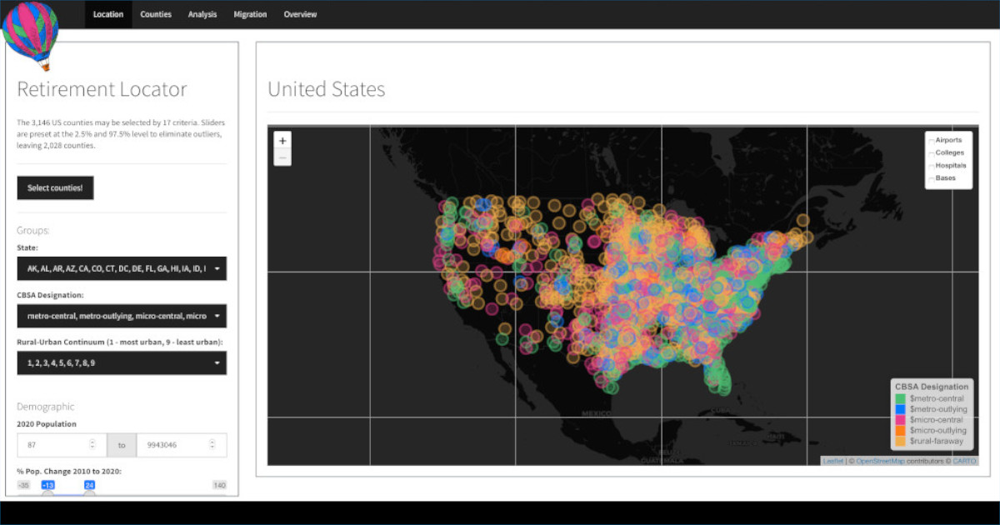

```{r load-packages, include = F}
## Load frequently used packages for blog posts
packages <- c(
      'devtools', #for session info
      'ggthemes', #for plots
      'blogdown'
      
)
lapply(packages, function(x) {
  if (!requireNamespace(x)) install.packages(x)
  library(x, character.only = TRUE)
})
```

```{r set-chunk-options, include = F}
## Do not break chunk line
## Do not use spaces or periods "." or underscores "_"
## set options for knitr
knitr::opts_chunk$set(
  comment = '',
  fig.width = 6,
  fig.asp = .8,
  fig.align="center",
  message=F,
  error=F,
  warning=F,
  tidy=T,
  comment='',
  cache=T,
  dev='svg',
  echo=F
)
```

```{r set-ggplot-theme-defaults, include = F}
#from ggthemes
library(ggplot2); theme_set(ggthemes::theme_fivethirtyeight())
```

```{r define-color-palette, include = F, eval = T}
# color blind friendly palette from http://www.cookbook-r.com/Graphs/Colors_(ggplot2)/
cbPalette <- c("#E69F00", "#56B4E9", "#009E73", "#F0E442", "#0072B2", "#D55E00", "#CC79A7", "#000000")
```

```{r write-package-bib, echo = F}
# write packages used to bib in current directory
knitr::write_bib(.packages(), "./packages.bib")
```


# [Overview](#overview)

If you could retire anywhere in the United States, where would you go?  It's an important and worthwhile question for those wanting to enjoy their final years and it's linked to what each of us values. The dashboard includes a wide variety of factors including health, economic, weather and housing. A total of seventeen different criteria are included to help winnow the US 3142 counties down to a reasonable amount.

For my spouse and me, we were looking for a larger community with access to healthcare and a decent sized airport for more flexibility in travel.  Additionally, we were hoping to find someplace without snow and ice, but it didn't have to be in Florida.  We also we're hoping to relocate within a 12 hour drive from family.  The Southeast states like Florida, Georgia, South Carolina and North Carolina were the focus of our search.

There's a lot to experiment with in the dashboard and I hope you enjoy it!

# [Dashboard](#dashboard)

<h4 align='center'><a href='https://rob-wiederstein.shinyapps.io/retirementdash/'></a>
<a href='https://rob-wiederstein.shinyapps.io/retirementdash'>Retirement
Locator Dashboard</a>
<h4>

# [Acknowledgements](#acknowledge)

This blog post was made possible thanks to:

Colin Fay, one of the co-authors, of `golem`.

# [References](#reference)

<div id="refs"></div>

# [Disclaimer](#disclaimer)

The views, analysis and conclusions presented within this paper represent the author’s alone and not of any other person, organization or government entity. While I have made every reasonable effort to ensure that the information in this article was correct, it will nonetheless contain errors, inaccuracies and inconsistencies. It is a working paper subject to revision without notice as additional information becomes available. Any liability is disclaimed as to any party for any loss, damage, or disruption caused by errors or omissions, whether such errors or omissions result from negligence, accident, or any other cause. The author(s) received no financial support for the research, authorship, and/or publication of this article.

# [Reproducibility](#reproduce)

```{r reproducibility, echo = FALSE}
# system & package info
options(width = 120)
session_info()
```
