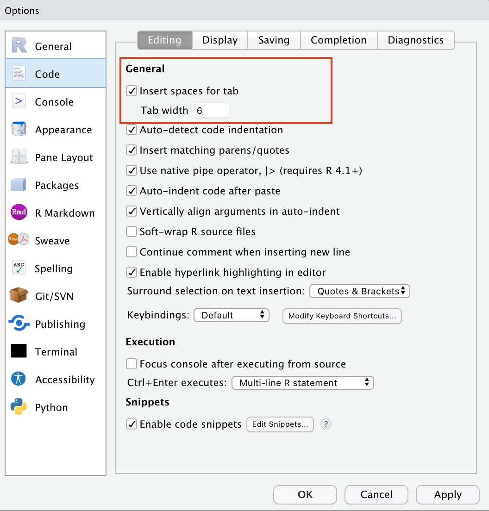
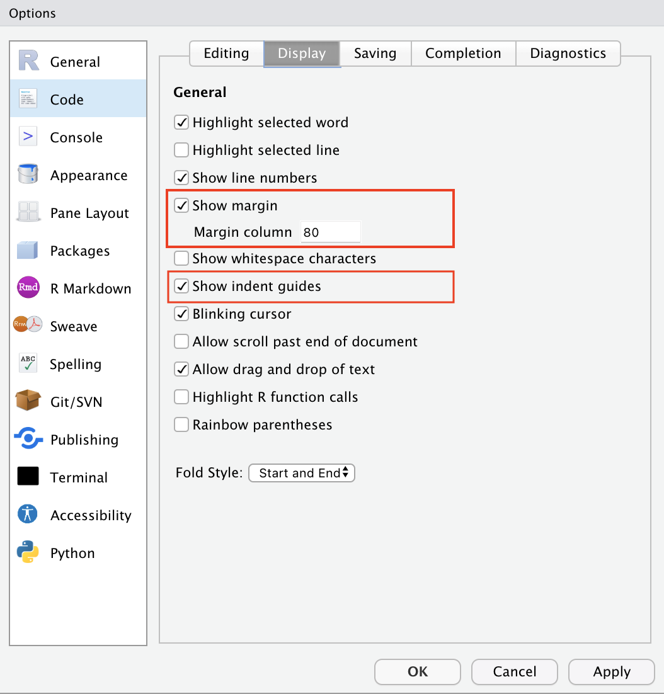
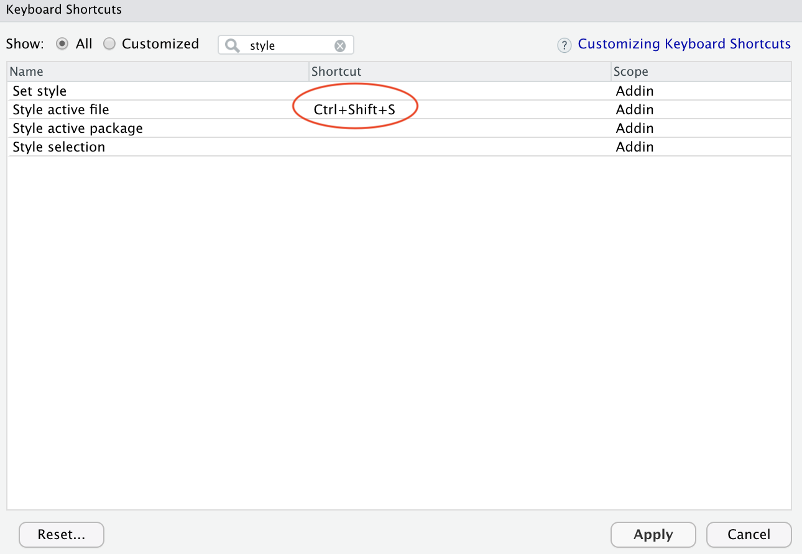

```{r load-packages, cache = F, include = F}
## Load frequently used packages for blog posts
packages <- c(
      'devtools', #for session info
      'ggthemes', #for plots
      'blogdown',
      'styler',
      'grkstyle',
      'tidyverse'
)
lapply(packages, function(x) {
  if (!requireNamespace(x)) install.packages(x)
  library(x, character.only = TRUE)
})
```

```{r set-chunk-options, include = F}
## Do not break chunk line
## Do not use spaces or periods "." or underscores "_"
## set options for knitr
knitr::opts_chunk$set(
  comment = '',
  fig.width = 6,
  fig.asp = .8,
  fig.align="center",
  message=F,
  error=F,
  warning=F,
  tidy=F,
  comment='',
  cache=T,
  dev='svg',
  echo=F
)
```

```{r write-package-bib, echo = F}
# write packages used to bib in current directory
knitr::write_bib(.packages(), "./packages.bib")
```

# [Overview](#overview)

As so eloquently stated in the tidyverse style guide, "Good coding style is like correct punctuation: you can manage without it, butitsuremakesthingseasiertoread." This post will (1) explain the consensus around styling R code, (2) teach how to use the `styler` and `grkstyle` packages, (4) show how to create a keyboard shortcut, and (5) develop a GitHub workflow for styling `R` code.

# [Background](#background)

Inconsistent styling can result in confusion and delayed comprehension. It may further limit a program's reuse, maintainability, and open-source collaboration.[@yenComputationalAnalysisDynamics2019] At least two packages are popular in styling `R` code. This post discusses the `styler` package.  (Another popular package is the `formatR` package by Yihui Xie and its website can be found [here](https://yihui.org/formatr/)).

There are at least three different style guides for programming in R:  [Google's R Style Guide](https://google.github.io/styleguide/Rguide.html), the [Tidyverse Style Guide](https://style.tidyverse.org/), and [Bioconductor Coding Style Guide](http://bioconductor.org/developers/how-to/coding-style/).[@yenComputationalAnalysisDynamics2019]

In 2019, three researchers released a paper that examined how `R` code was styled.  Their analysis included 20 years of CRAN packages and over 94 million lines of code.  They made the following consensus-based recommendations:

>
-  Use lower Camel (lowerCamel) or snake case (snake_case)
-  Use <- to assign, don’t use =
-  Add a space after commas
-  Use TRUE/FALSE, don’t use T/F
-  Put open curly bracket on the same line then a newline 
-  Use double quotation marks for strings
-  Add spaces around infix operators (i.e. =, +, -, <-)
-  Don’t terminate lines with a semicolon
-  Don’t explicitly type integers (i.e. 1L) 
-  Put closed curly bracket on a separate line
-  Don’t use the tab to indent
>[@yenComputationalAnalysisDynamics2019]

# [`styler`](#styler)

The `styler` package in R is designed to style R code. [@R-styler]. You can start by installing the package and loading it into the namespace.

```{r load-pkg, eval=FALSE, echo = T, include=TRUE}
#install package
install.packages("styler")
library(styler)
```

The package [overview](https://styler.r-lib.org/index.html) details its main functions: `style_pkg()`, `style_file()` and `style_text()`. These functions are added to the "Addins" menu in Rstudio.  More information at `vignette(package = "styler")`.

## Unstyled

```{r styler-unstyled, eval = F, echo = T}
#example - spaces missing
readr::read_csv('./my_table.csv',col_names=c('a','b'))
```

## Styled

```{r styler-styled, eval = T, echo = T}
#example
style_text("readr::read_csv('./my_table.csv',col_names=c('a','b'))")
```
The tidyverse style guide is a sensible default for writing R code.

```{r example-tidyverse-style, echo = T}
# example tidyverse style
styler::style_text("call( 1)", style = tidyverse_style, scope = "spaces")

```

## Indentation

Space indentation is two spaces for tidyverse style.  Indentation is related to line length.  After all, a line that has multiple indentations leaves less space for the actual code.  Most style guides and linters,  like `lintr`, recommend a maximum line length of 80 characters.[@yenComputationalAnalysisDynamics2019]  Indentation and a line length margin can be set in Rstudio.

For identation, go to  Rstudio > Preferences > Code > Editing.

```{r indentation-screenshot, fig.cap="Indentation set to 6 spaces.  Note that the \"insert spaces for tab\" is checked as recommended by the study above."}


```

For line-length settings, go to Rstudio > Preferences > Code > Display.

```{r line-length-screenshot, fig.cap="Margin setting at 80.  Indentation guides can also be a helpful option."}

```


In production, a two-space indentation can be problematic when writing deeply nested code.  The small contrast can make it difficult for a programmer to see code flow and matching brackets/parenthesis. Indentation is a personal preference and should be set to maximize productivity. (My preference is an indentation of 6 spaces in production and then for it to be restyled consistent with tidyverse style guide of 2 when pushed to GitHub).

Indentation within the `styleR` package is via the command:

```{r styler-indent-formats, echo=T}
library(styler)
string_to_format <-
"dataset |> dplyr::group_by(some_variable) |> dplyr::summarise(
    mean(mean_some_variable=mean(some_variable)))"
styler::style_text(string_to_format, style = tidyverse_style, indent_by = 6)
```


# [`grkstyle`](#grkstyle)

Some may like even further refinement and can supplement `styler` with `grkstyle`. The `readme.md` in its repo contains the following example:

## Unstyled

```{r grkstyle-unstyled, eval = F, echo = T}
do_something_very_complicated(something = "that", requires = many,
                              arguments = "some of which may be long")
```

## Styled

```{r grkstyle-styled, eval = F, echo = T}
do_something_very_complicated(
  something = "that",
  requires = many,
  arguments = "some of which may be long"
) 
```

For those who want the configuration to be the default, you can add a line in the `.Rprofile` file like:

```{r grkstyle-addition, eval = FALSE, echo=TRUE}
#https://github.com/gadenbuie/grkstyle
options(styler.addins_style_transformer = "grkstyle::grk_style_transformer(indent_by = 6)")
```


# [Keyboard Shortcut](#keyboard-shortcut)

Rstudio publishes a helpful "how-to-modify-a-keyboard-shortcut" [article](https://support.rstudio.com/hc/en-us/articles/206382178-Customizing-Keyboard-Shortcuts-in-the-RStudio-IDE). Go to Tools > Keyboard Shortcuts Help to see all of the shortcuts.  (There's a lot!)  You can create a shortcut for any Addins. The "Addins" are at the bottom of the list.

Go to Tools > Modify Keyboard Shortcuts.  Scroll to the shortcut entitled "style active file". Click on the shortcut column and enter a memorable key combination.

```{r rstudio-keyboard-shortcut, fig.cap="Choose memorable key combination.  Here, I used \"s\" to remind me of the word \"style\"."}

```


# [GitHub Workflow](#GitHub-workflow)

You can also style your code upon a push to GitHub.  A library of GitHub workflows for `R` code is maintained at [https://github.com/r-lib/actions/tree/v2](https://github.com/r-lib/actions/tree/v2).  There is a workflow [example](https://github.com/r-lib/actions/blob/v2/examples/style.yaml) for styling your code with `styler`. You can also find other examples by searching for `path:.github/workflows styler`.

# [Conclusion](#conclusion)

Styling your code consistently is the key to programming effectively. While you don't have to follow a style guide, they contain helpful standards and accepted norms that allow others to quickly understand your program and potentially collaborate.  The `styler` and `grkstyle` packages are helpful in that they can be quickly set up to follow the tidyverse style.  A keyboard shortcut can further speed your coding.  Should you decide to set up a GitHub workflow, additional resources are available.

# [Acknowledgements](#acknowledge)

This blog post was made possible thanks to:

-  [The `styler` package](https://styler.r-lib.org/index.html)
-  [The `grkstyle` package](https://github.com/gadenbuie/grkstyle)
-  [Rstudio Community](https://community.rstudio.com)
-  [Rstudio](https://www.rstudio.com)
-  [GitHub Actions for the R language](https://github.com/r-lib/actions)
-  [R tip: RStudio Addins and Keyboard Shortcuts](https://www.youtube.com/watch?v=zAtf9NkSOUg)

# [References](#reference)

<div id="refs"></div>

# [Disclaimer](#disclaimer)

The views, analysis, and conclusions presented within this paper represent the authors alone and not of any other person, organization, or government entity. While I have made every reasonable effort to ensure that the information in this article was correct, it will nonetheless contain errors, inaccuracies, and inconsistencies. It is a working paper subject to revision without notice as additional information becomes available. Any liability is disclaimed as to any party for any loss, damage, or disruption caused by errors or omissions, whether such errors or omissions result from negligence, accident, or any other cause. The author(s) received no financial support for the research, authorship, and/or publication of this article.

# [Reproducibility](#reproduce)

```{r reproducibility, echo = FALSE}
# system & package info
options(width = 120)
session_info()
```
