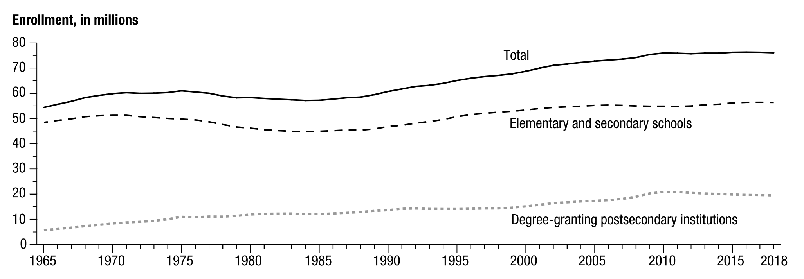
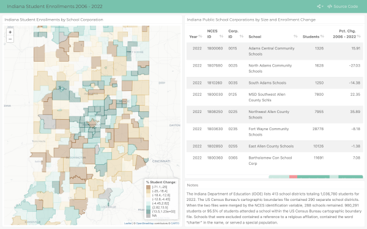

```{r load-packages, cache=F, include = F}
## Load frequently used packages for blog posts
packages <- c(
      'devtools', #for session info
      'ggthemes', #for plots
      'blogdown',
      'kableExtra',
      'dplyr',
      'ggplot2'
)
lapply(packages, function(x) {
  if (!requireNamespace(x)) install.packages(x)
  library(x, character.only = TRUE)
})
```


```{r set-chunk-options, include = F}
## Do not break chunk line
## Do not use spaces or periods "." or underscores "_"
## set options for knitr
knitr::opts_chunk$set(
  comment = '',
  fig.width = 6,
  fig.asp = .8,
  fig.align="center",
  message=F,
  error=F,
  warning=F,
  tidy=T,
  comment='',
  cache=T,
  dev='svg',
  echo=F
)
```


```{r write-package-bib, echo = F}
# write packages used to bib in current directory
knitr::write_bib(.packages(), "./packages.bib")
```


```{r load-data, cache=T, include=F, echo=F}
enrollments <- readRDS("./in_student_enrollments_2006_2022.rds")
public_schools <- readRDS("./uscb_in_unsd.rds")
enrollments$public <- "no"
table(enrollments$nces_id == public_schools)
```

# [Overview](#overview)

This post examines Indiana Student Enrollments from 2006 through 2022.

# [Background](#background)

The National Center for Education Statistics (NCES) described national trends as growing through the 1950s and 1960s as a result of the "baby boom" after World War 2, declining from 1971 through 1984, increasing once again from 1985 throught 2006. Enrollments again declined between 2006 through 2011 and started growing again after 2011.  The NCES predicts that enrollment changes would be relatively small through 2029.[@debreyDigestEducationStatistics2021]

```{r nces-enrollment-chart, out.width="100%", fig.cap="U.S. Department of Education, National Center for Education Statistics. (2021). Digest of Education Statistics, 2019 (NCES 2021-009), Chapter 1."}

```

# [Indiana Total Enrollment](#indiana_tot_enrollment)

```{r indiana_total_entrollment}
library(ggplot2)
library(ggthemes)
library(dplyr)
enrollments |> 
  group_by(year) |> 
  filter(nces_id %in% public_schools) |> 
  summarize(in_total_students = sum(tot_students, na.rm = T)) |> 
  ggplot() +
  aes(year, in_total_students) +
  geom_line() +
  geom_point() +
  scale_y_continuous(
    name = "",
    limits = c(9e5, 1.2e6),
    breaks = c(9e5, 1e6, 1.1e6, 1.2e6),
    labels = c("0.9m", "1.0m", "1.1m", "1.2m")) +
  scale_x_continuous(
    name = ""
  ) +
  labs(
    title = "Indiana Public School Enrollment",
    subtitle = "2006 - 2022"
  ) +
  ggthemes::theme_fivethirtyeight()
  
```

# Top 10 Indiana School Corporations by Enrollment Change 2006 to 2022

```{r enrollment-change-top}
enrollments |> 
  dplyr::filter(year %in% c(2006, 2022)) |> 
  tidyr::pivot_wider(
    names_from = year, 
    values_from = tot_students,
    names_glue = "{.value}_{year}",
) |> 
  dplyr::mutate(pct_change = (tot_students_2022 - tot_students_2006) / tot_students_2006) |> 
  dplyr::mutate(pct_change = (pct_change * 100) |> round(1)) |> 
  rename(students_2006 = tot_students_2006,
         students_2022 = tot_students_2022) |> 
  select(-nces_id) |> 
  dplyr::arrange(desc(pct_change)) |> 
  slice_head(n = 10) |> 
  kableExtra::kable("html") |> 
  kable_styling(full_width = T,
                bootstrap_options = c("striped", "hover", "condensed")) 
```
# Bottom 10 Indiana School Corporations by Enrollment Change 2006 to 2022

```{r enrollment-change-bottom}
enrollments |> 
  dplyr::filter(year %in% c(2006, 2022)) |> 
  tidyr::pivot_wider(
    names_from = year, 
    values_from = tot_students,
    names_glue = "{.value}_{year}",
) |> 
  dplyr::mutate(pct_change = (tot_students_2022 - tot_students_2006) / tot_students_2006) |> 
  dplyr::mutate(pct_change = (pct_change * 100) |> round(1)) |> 
  rename(students_2006 = tot_students_2006,
         students_2022 = tot_students_2022) |> 
  select(-nces_id) |> 
  dplyr::arrange(pct_change) |> 
  slice_head(n = 10) |> 
  kableExtra::kable("html") |> 
  kable_styling(full_width = T,
                bootstrap_options = c("striped", "hover", "condensed")) 
```


# [Indiana Student Enrollment Dashboard](#dashboard)

<a href="https://robwiederstein.github.io/in_enrollments/"></a>

# [Data and model](#data)

(What data did you use, where did you get it?)

# [Results](#results)

# [Conclusion](#conclusion)

# [Acknowledgements](#acknowledge)

This blog post was made possible thanks to:

[Indiana Department of Education](https://www.in.gov/doe/)

# [References](#reference)

<div id="refs"></div>

# [Disclaimer](#disclaimer)

The views, analysis and conclusions presented within this paper represent the author’s alone and not of any other person, organization or government entity. While I have made every reasonable effort to ensure that the information in this article was correct, it will nonetheless contain errors, inaccuracies and inconsistencies. It is a working paper subject to revision without notice as additional information becomes available. Any liability is disclaimed as to any party for any loss, damage, or disruption caused by errors or omissions, whether such errors or omissions result from negligence, accident, or any other cause. The author(s) received no financial support for the research, authorship, and/or publication of this article.

# [Reproducibility](#reproduce)

```{r reproducibility, echo = FALSE}
# system & package info
options(width = 120)
session_info()
```
