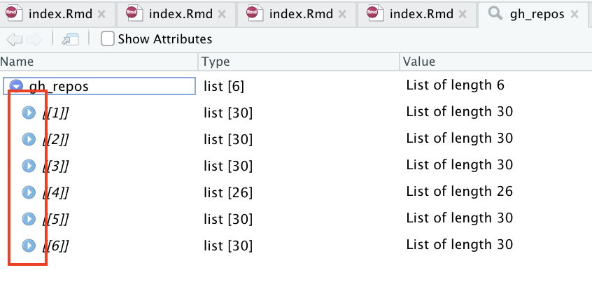
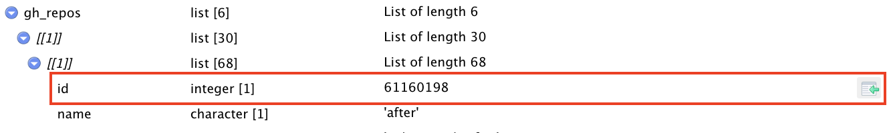
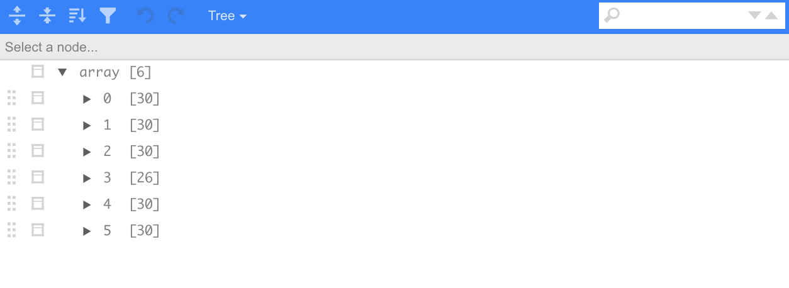

```{r load-packages, include = F}
## Load frequently used packages for blog posts
packages <- c(
      'devtools', #for session info
      'ggthemes', #for plots
      'blogdown',
      'repurrrsive',
      'listviewer'
)
lapply(packages, function(x) {
  if (!requireNamespace(x)) install.packages(x)
  library(x, character.only = TRUE)
})
```

```{r set-chunk-options, include = F}
## Do not break chunk line
## Do not use spaces or periods "." or underscores "_"
## set options for knitr
knitr::opts_chunk$set(
  comment = '',
  fig.width = 6,
  fig.asp = .8,
  fig.align="center",
  message=F,
  error=F,
  warning=F,
  tidy=T,
  comment='',
  cache=T,
  dev='svg',
  echo=F
)
```

```{r write-package-bib, echo = F}
# write packages used to bib in current directory
knitr::write_bib(.packages(), "./packages.bib")
```

# [Overview](#overview)

Professor Bryan's full quote on list inspection is actually that "[l]ist inspection is very important and also fairly miserable. Before you can apply a function to every element of a list, you’d better understand the list!" Originally, I didn't think this post was necessary and then I ran into some garguantuan lists and also discovered some nice features in the Rstudio development environment.  

Additionally Professor Bryan also committed to a tutorial to inspecting lists [here](https://jennybc.github.io/purrr-tutorial/ls00_inspect-explore.html) which suggest that the topic is important. For the duration, we'll be trying out the functions using the `gh_repos` list in the `repurrrsive`package. In the past lists have made me miserable because you can't see what your're working with in the environment window, a window that we'll talk about below.

# [Basics](#basics)

A StackOverflow [question](https://stackoverflow.com/questions/32618369/is-there-a-way-to-view-a-list) was asked about how to view a list. The following functions were gleaned from the question. Traditional commands to inspect an object work on a list like `str()`, `head()`, and `summary()`.

```{r view-list, echo=TRUE}
library(repurrrsive)
# load
data("gh_repos")
# check
is.list(gh_repos)
```

```{r gh-repos-str, echo=TRUE, eval=FALSE}
#evaluation omitted due to length
str(gh_repos); head(gh_repos); summary(gh_repos)
```


# [Rstudio Tools](#rstudio-tools)

The Rstudio environment offers a number of helpful tools. In the course of writing this, I discovered a very helpful feature.

```{r str-screenshot, fig.cap="A large list.  The red arrow on the left points to the blue drop down to see the list.  The red arrow on the right shows the magnifying glass to inspect the list."}
knitr::include_graphics("str-environment.png")
```

```{r inspection-window, fig.cap = "After clicking on the magnifying glass, a viewer window will open.  The red rectangle shows the blue dropdown boxes for further inspection of the lists."}

```

```{r inspection-window-arrow, fig.cap = "Clicking the green arrow will show the list elements index.  Here it is \"gh_repos[[1]][[1]][[\"id\"]]\""}

```


# [listviewer](#listviewer)

Additionally, the package `listviewer` can assist with navigating lists though its functionality is similar to the Rstudio environment.

```{r listviewer, echo=T, eval=F}
library(listviewer)
jsonedit(gh_repos)
```

```{r listviewer-ui, fig.cap="User interface for the `listviewer` package"}

```


# [Conclusion](#conclusion)

Being able to manipulate and transform lists effectively requires a working knowledge of its contents.  Function commands like `str()` can be helpful, but be sure to employ Rstudio's native GUI functionalities as well.  They can be a big productivity boost.

# [Acknowledgements](#acknowledge)

This blog post was made possible thanks to:

-  [Jenny Bryan - Explore the example lists: Wes Anderson, Game of Thrones, GitHub](https://jennybc.github.io/purrr-tutorial/ls00_inspect-explore.html)

-  [Tom Mock - Extracting JSON data from websites and public APIs with R](https://themockup.blog/posts/2020-12-13-extracting-json-from-websites-and-public-apis-with-r/)

# [References](#reference)

<div id="refs"></div>

# [Disclaimer](#disclaimer)

The views, analysis and conclusions presented within this paper represent the author’s alone and not of any other person, organization or government entity. While I have made every reasonable effort to ensure that the information in this article was correct, it will nonetheless contain errors, inaccuracies and inconsistencies. It is a working paper subject to revision without notice as additional information becomes available. Any liability is disclaimed as to any party for any loss, damage, or disruption caused by errors or omissions, whether such errors or omissions result from negligence, accident, or any other cause. The author(s) received no financial support for the research, authorship, and/or publication of this article.

# [Reproducibility](#reproduce)

```{r reproducibility, echo = FALSE}
# system & package info
options(width = 120)
session_info()
```
