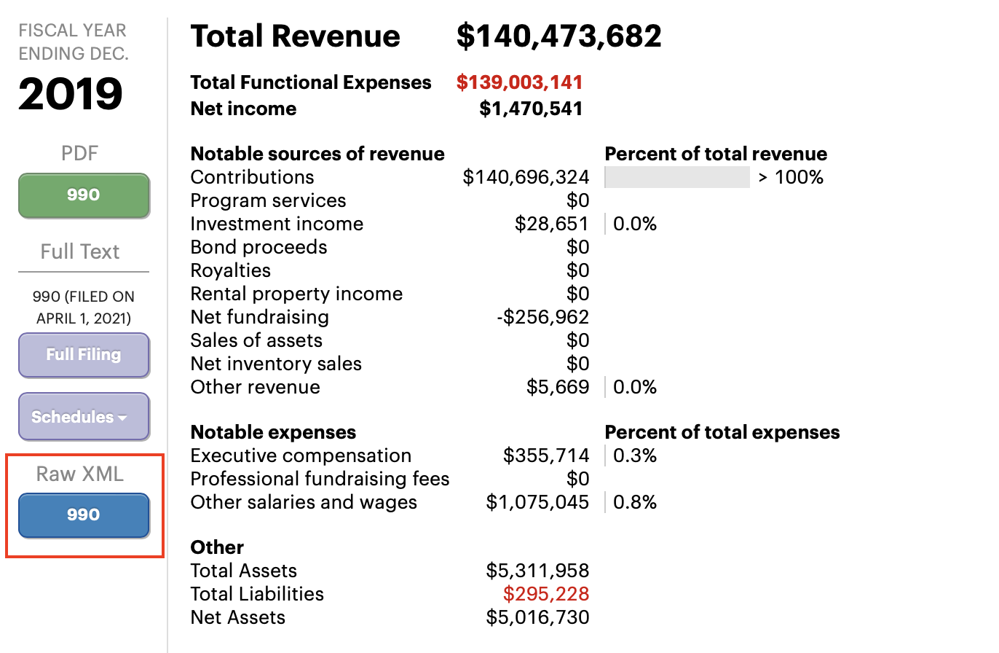
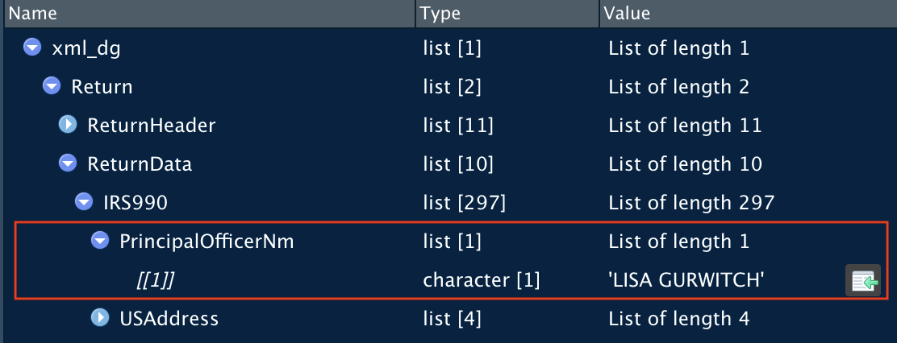

```{r load-packages, include = F}
## Load frequently used packages for blog posts
packages <- c(
      'devtools', #for session info
      'ggthemes', #for plots
      'blogdown',
      'tidyr',
      'purrr',
      'xml2',
      'tibble',
      'glue',
      'dplyr'
)
lapply(packages, function(x) {
  if (!requireNamespace(x)) install.packages(x)
  library(x, character.only = TRUE)
})
```

```{r set-chunk-options, include = F}
## Do not break chunk line
## Do not use spaces or periods "." or underscores "_"
## set options for knitr
knitr::opts_chunk$set(
  comment = '',
  fig.width = 6,
  fig.asp = .8,
  fig.align="center",
  message=F,
  error=F,
  warning=F,
  tidy=F,
  comment='',
  cache=T,
  dev='svg',
  echo=F
)
```

```{r write-package-bib, echo = F}
# write packages used to bib in current directory
knitr::write_bib(.packages(), "./packages.bib")
```

# [Overview](#overview)

As a way to summarize the previous lessons, this post will take an IRS 990 and convert it from an xml list to a tabular form.  The "990" is the IRS form that not-for-profit corporations file annually.  The list was downloaded from Pro Publica's "[Nonprofit Explorer](https://projects.propublica.org/nonprofits/)" and the organization is "[Delivering Good, Inc](https://www.delivering-good.org)" an organization that distributes goods and merchandise to those in need. 

# [Getting Data](#getting-data)

From the Pro Publica Nonprofit Explorer page, the link for the xml source can be obtained.

```{r propublica-screenshot}

```


```{r get-tax-data, echo=T, cache=T}
delivering_good_990 <- glue::glue(
    "https://s3.amazonaws.com/irs-form-990/202033219349317233_public.xml",
    "?_ga=2.16730738.538037686.1650110873-1696376179.1650110873"
)
# 'dg' = delivering good
xml_dg <- delivering_good_990 |> read_xml() |> as_list()
```

# [Inspect List](#inspect-list)

We'll inspect the list using the native graphical user interface in Rstudio and the `str()` command.

## Rstudio

The return data is within two branches: the "ReturnHeader" and the "ReturnData." The information within the header is comprised of metadata regarding the return, which will prove useful if multiple returns are retrieved.  

The other branch is the return data.  Note that a number of the items of the list contain the word "schedule".  In tax practice, schedules are often interim worksheets and the values are then carried forward to the face sheet.  Here, the face sheet is the "IRS990" and the schedules are of lesser interest.

```{r inspect-list-990, fig.cap="The Rstudio window that allows for the inspection of a list."}

knitr::include_graphics("./list-inspect-irs-990.png")
```

## `str()`

When working with large lists, the user should target parts of the list or limit its display. Otherwise, the console will be garbled. First, let's look for the Employer Identification Number ("EIN") a unique identifier for taxpayers by targeting a single item.

```{r list-inspect-ein}
str(xml_dg$Return$ReturnHeader$Filer$EIN)
```

Next, we'll target part of the list and limit console output by level and length.

```{r list-inspect-str}

str(
  xml_dg$Return$ReturnHeader,
  max.level = 1,
  list.len = 5
  )
```

# [Rectangle preparer address](#rectangle-preparer-address)

This effort took me an hour or better.  There was a lot of trial and error but my efficiency improved as I became more familiar with the functions.  I tended to rely on the `unnest_auto()` function to start and then switch that function for the one it recommended.  The goal was to get the tibble to no longer have list-columns. Don't get discouraged!

```{r rectangle-preparer, echo=TRUE}
# insert into tibble
dt <- tibble(xml_dg = xml_dg)
# wrangle!
    dt |> 
    unnest_wider(xml_dg) |> 
    select(ReturnHeader) |> 
    unnest_wider(ReturnHeader) |> 
    unnest_wider(PreparerFirmGrp) |> 
    select(1:5) |> 
    unnest_wider(PreparerFirmName) |> 
    unnest_wider(PreparerUSAddress) |> 
    unnest(cols = everything()) |> 
    unnest(cols = everything())
```

# [Build tibble](#build-tibble)

The IRS 990 return contains 297+ pieces of data for just one section of the list.  Just winnowing it down to some key pieces of information is helpful. Here, a simple tibble was built using list references from the `base` package.  Again, the Rstudio interface was very helpful and I copied and pasted the table  together using the green arrow.

```{r build-tibble-inspector}

```


```{r build-tibble, echo=TRUE}
#990 get some info
tibble(
    principal_officer = xml_dg[["Return"]][["ReturnData"]][["IRS990"]][["PrincipalOfficerNm"]][[1]],
    address_1 = xml_dg[["Return"]][["ReturnData"]][["IRS990"]][["USAddress"]][["AddressLine1Txt"]][[1]],
    city = xml_dg[["Return"]][["ReturnData"]][["IRS990"]][["USAddress"]][["CityNm"]][[1]],
    state = xml_dg[["Return"]][["ReturnData"]][["IRS990"]][["USAddress"]][["StateAbbreviationCd"]][[1]],
    zip = xml_dg[["Return"]][["ReturnData"]][["IRS990"]][["USAddress"]][["ZIPCd"]][[1]],
    website = xml_dg[["Return"]][["ReturnData"]][["IRS990"]][["WebsiteAddressTxt"]][[1]],
    total_employees = xml_dg[["Return"]][["ReturnData"]][["IRS990"]][["TotalEmployeeCnt"]][[1]],
    gross_receipts = xml_dg[["Return"]][["ReturnData"]][["IRS990"]][["GrossReceiptsAmt"]][[1]],
    contributions = xml_dg[["Return"]][["ReturnData"]][["IRS990"]][["CYContributionsGrantsAmt"]][[1]]
)
```

# [Chairperson](#chair-person)

The 990 includes a listing of the top 5 highest employees, board officers and board members. This was accomplished and then filtered to just the chair to save vertical space.

```{r chair, echo=TRUE}
# Executives, Officers & Board members 
xml_return <- xml_dg[["Return"]][["ReturnData"]][["IRS990"]]
xml_return |> 
    enframe() |> 
    dplyr::filter(name == "Form990PartVIISectionAGrp") |> 
    unnest_wider(value) |> 
    unnest(cols = everything()) |> 
    select(-name) |> 
    unnest(cols = everything())|> 
    filter(TitleTxt == "CHAIR")
```

# [990 Data](#990-data)

```{r 990-data, echo=TRUE}
return <- tibble(dg = xml_dg)
return |> 
    unnest_wider(dg) |> 
    select(ReturnData) |> 
    unnest_wider(ReturnData, names_sep = "_") |> 
    select(ReturnData_IRS990) |> 
    unnest_wider(ReturnData_IRS990, names_sep = "_") |> 
    select_if(~map(.x, length) == 1) |> 
    unnest(cols = everything()) |> 
    unnest(cols = everything())
```

# [Taxpayer Address](#taxpayer-address)

```{r taxpayer-address, echo=TRUE}
#address
xml_return <- xml_dg[["Return"]][["ReturnData"]][["IRS990"]][["USAddress"]]
xml_return |> 
    enframe() |> 
    unnest(value) |> 
    pivot_wider(names_from = name, values_from = value) |> 
    mutate(across(everything(), ~unlist(.))) |> 
    setNames(c("address", "city", "state", "zip")) |> 
    mutate(name = "Doing Good, Inc.") |> 
    select(name, everything())
```

# [Conclusion](#conclusion)

Having devoted some effort to learn more about lists, I hope that I can tackle the data format with greater creativity and speed.  Truthfully though, I'm simultaneously hoping there will be a ".csv" format offered too.  Thanks for reading and thanks to all of those that share their knowledge about lists in R!

# [Acknowledgements](#acknowledge)

This blog post was made possible thanks to:

- [Pro Publica Nonprofit Explorer](https://projects.propublica.org/nonprofits/)

# [References](#reference)

<div id="refs"></div>

# [Disclaimer](#disclaimer)

The views, analysis and conclusions presented within this paper represent the author’s alone and not of any other person, organization or government entity. While I have made every reasonable effort to ensure that the information in this article was correct, it will nonetheless contain errors, inaccuracies and inconsistencies. It is a working paper subject to revision without notice as additional information becomes available. Any liability is disclaimed as to any party for any loss, damage, or disruption caused by errors or omissions, whether such errors or omissions result from negligence, accident, or any other cause. The author(s) received no financial support for the research, authorship, and/or publication of this article.

# [Reproducibility](#reproduce)

```{r reproducibility, echo = FALSE}
# system & package info
options(width = 120)
session_info()
```
