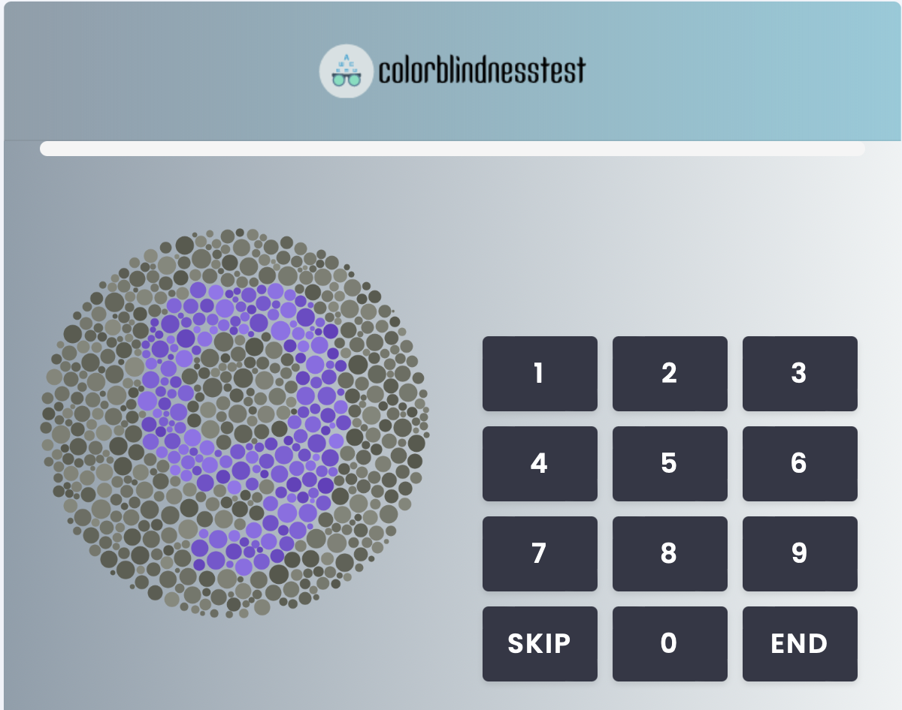

```{r load-packages, include = F}
## Load frequently used packages for blog posts
packages <- c(
    "devtools", # for session info
    "ggthemes", # for plots
    "blogdown",
    "RColorBrewer",
    "colorspace",
    "tibble"
)
lapply(packages, function(x) {
    if (!requireNamespace(x)) install.packages(x)
    library(x, character.only = TRUE)
})
```

```{r set-chunk-options, include = F}
## Do not break chunk line
## Do not use spaces or periods "." or underscores "_"
## set options for knitr
knitr::opts_chunk$set(
    comment = "",
    fig.width = 6,
    fig.asp = .8,
    fig.align = "center",
    message = F,
    error = F,
    warning = F,
    tidy = T,
    comment = "",
    cache = T,
    dev = "svg",
    echo = F
)
```

```{r set-ggplot-theme-defaults, include = F}
# from ggthemes
library(ggplot2)
theme_set(ggthemes::theme_fivethirtyeight())
```

```{r define-color-palette, include = F, eval = T}
# color blind friendly palette from http://www.cookbook-r.com/Graphs/Colors_(ggplot2)/
cbPalette <- c("#E69F00", "#56B4E9", "#009E73", "#F0E442", "#0072B2", "#D55E00", "#CC79A7", "#000000")
```

```{r write-package-bib, echo = F}
# write packages used to bib in current directory
knitr::write_bib(.packages(), "./packages.bib")
```

# [Overview](#overview)

Colors are hard.  Beginners have two choices.  They can rely on their intuition or a preselected palette from one of R's many packages.[@smart2020] The overwhelming consensus is that those lacking design experience should "instead draw from preconstructed ramps." [@smart2020] The good news is that "automatically generated color ramps" can perform at least as well as designer ramps in many circumstances. [@smart2020] Fortunately, R has many options available.  

Some basic design principles should be kept at the forefront.  An appropriate color selection should accomplish three things. First, the colors should not be unappealing. [@colorspace2009a]  Large areas of highly saturated colors should be avoided as viewers quickly tire and it can cause after-image effects.[@colorspace2009a] Second, the colors should "cooperate" with each other, meaning that any one color should both be appealing by itself and when viewed with the others.  [@colorspace2009a]  Third, "the colors should work everywhere". [@colorspace2009a] The colors should be distinguishable regardless of how they are displayed.  The plot should convey the same meaning if it's shown on a projector, a computer screen or a facsimile.

You can find help if you know where to look. `?grDevices::hcl.colors` or `?grDevices::palette` are great places to start. For brevity, the post will only address a palette of five categorical/qualitative color choices from the `grDevices`, `RColorBrewer` and `colorspace` packages. The post concludes by recommending the `colorspace` package as an excellent starting point for most analysts.

# [Terms](#terms)

In reviewing discussions about color, the following terms are helpful to know:

## General

- **Color palette** is a collection of colors.

- **Color ramp** is a synonym for a collection or palette of colors.

- **Color space** is a specific organization of colors.

## Color Blindness

- **Deuteranomaly** is a type of color blindness from the defectiveness of green cone cells.

- **Protanomaly** is a type of color blindness from the defectiveness of red cone cells.

- **Tritanomaly** is a type of colorblindness from the defectiveness of blue cone cells.

## Color Spaces

- **HSV** is an acronym for "hue-saturation-value" and is a simple transformation of the RGB palette. HSV palletes are disfavored.

- **HCL** is an acronym for "hue-chroma-luminance". HCL palettes are preferred because they account for human color perception.

- **RGB** is an acronym for "red-green-blue".

## Palette Types

- **Qualitative** palettes are used for categorical data "where no particular ordering of catgories is available and every color should receive the same perceptual weight."

- **Sequential** palettes are used for "coding ordered/numeric information where colors go from high to low or vice versa."

- **Diverging** palettes are "designed for coding numeric information around a central neutral value."  Their use shows contrasts between two extremes.


# [Hexadecimal Notation](#hexadecimal)

Colors are often described in their hexadecimal equivalent, often with a leading "#".  A hex triplet is a six-digit, three-byte hexadecimal number ranging from 00 to FF or 0 to 255 in decimal notation.  The color intensity ranges from 0 (least intense) to 255 (most intense). A hexadecimal color is specified with #RRGGBB. RR (red), GG (green) and BB (blue) are hexadecimal integers between 00 and FF. The number of potential colors are `r 16^6 |> format(big.mark = ",")`. R uses hexadecimal notation for color. White, for example, is "#FFFFFF".  R also uses names for `r length(colors())` colors like "olivedrab2."

# [Conversion](#conversion)

R translates color naming strategies into hexadecimal notation. Hexadecimal notation can contain an additional two digits for specifying transparency.

## [RGB](#RGB)

`rgb` (red-blue-green) converts colors in the red, green and blue primaries to hexadecimal. A transparency argument can be set as well with the "alpha" argument. The specification refers to the "sRGB" where "s" represents "standard RGB" and is based on IEC standard 61966.  (Disfavored).

```{r r-g-b-conversion, echo=T}
# usage rgb(r, g, b, maxColorValue=255, alpha=255)
rgb(red = 0, green = 1, blue = 0, maxColorValue = 200, alpha = 50)
```

## [HSV](#HSV)

`hsv` (hue-saturation-value) creates a vector of hexadecimal values from hue, saturation, and value. It is a simple transformation of the RGB space. (Disfavored).

```{r h-s-v-conversion, echo=T}
# usage hsv(h = 1, s = 1, v = 1, alpha)
hsv(.5, .5, .5)
```

## [HCL](#HCL)

`hcl` (hue-chroma-luminance) creates hexadecimal values from the hue, chroma, and luminance and is derived from human color perception. (Preferred).

```{r h-c-l-conversion, echo=T}
# usage hcl(h = 0, c = 35, l = 85, alpha, fixup = TRUE)
hcl(h = 0, c = 35, l = 85)
```


Avoid the `rainbow` palette. Instead, use a palette from `hcl.colors()`.

# [Color Packages](#color-packages)

There are many packages in R that can provide a color palette.  A partial list includes: `RColorBrewer`, `viridis`, `rcartocolor`, `wesanderson`, and `scico`.  Other packages like `pals` and `paletteer` combine the palettes from the different packages into a "unified interface."

Here, three packages will be used to generate palettes: `grDevices`, `RColorBrewer` and `colorspace`.

## [grDevices](#colorRamps)

The `grDevices` package contains several palettes.

```{r graphic-devices, fig.cap = "The hcl.colors palette was omitted because grDevices incorporates it from the colorspace package."}
grD <-
    dplyr::bind_rows(
        tibble(
            x = 1:5,
            y = .5,
            color = grDevices::cm.colors(5),
            palette = "cm.colors"
        ),
        tibble(
            x = 1:5,
            y = .5,
            color = grDevices::topo.colors(5),
            palette = "topo.colors"
        ),
        tibble(
            x = 1:5,
            y = .5,
            color = grDevices::terrain.colors(5),
            palette = "terrain.colors"
        ),
        tibble(
            x = 1:5,
            y = .5,
            color = grDevices::heat.colors(5),
            palette = "heat.colors"
        ),
        tibble(
            x = 1:5,
            y = .5,
            color = grDevices::rainbow(5),
            palette = "rainbow"
        )
    )
grD |>
    ggplot() +
    aes(x, y, fill = color) +
    geom_tile() +
    geom_text(data = grD, label = grD$color, color = "white") +
    facet_grid(vars(palette)) +
    theme_void() +
    theme(legend.position = "none")
```

## RColorBrewer

`RColorBrewer` was my "go-to" color package for many years.  The package is easy to use and the many palettes can be seen with the command `display.brewer.all()`.

```{r rcolorbrewer}
RCB <-
    dplyr::bind_rows(
        tibble(
            x = 1:5,
            y = .5,
            color = brewer.pal(5, "Accent"),
            palette = "Accent"
        ),
        tibble(
            x = 1:5,
            y = .5,
            color = brewer.pal(5, "Dark2"),
            palette = "Dark2"
        ),
        tibble(
            x = 1:5,
            y = .5,
            color = brewer.pal(5, "Paired"),
            palette = "Paired"
        ),
        tibble(
            x = 1:5,
            y = .5,
            color = brewer.pal(5, "Pastel1"),
            palette = "Pastel1"
        ),
        tibble(
            x = 1:5,
            y = .5,
            color = brewer.pal(5, "Pastel2"),
            palette = "Pastel2"
        ),
        tibble(
            x = 1:5,
            y = .5,
            color = brewer.pal(5, "Set1"),
            palette = "Set1"
        ),
        tibble(
            x = 1:5,
            y = .5,
            color = brewer.pal(5, "Set2"),
            palette = "Set2"
        ),
        tibble(
            x = 1:5,
            y = .5,
            color = brewer.pal(5, "Set3"),
            palette = "Set3"
        )
    )
RCB |>
    ggplot() +
    aes(x, y, fill = color) +
    geom_tile() +
    geom_text(data = RCB, label = RCB$color, color = "white") +
    facet_grid(vars(palette)) +
    theme_void() +
    theme(legend.position = "none")

```

## [colorspace](#palettes)

The "[C]olorspace package can derive general and adaptable strategies for color palettes; manipulate individual colors and color palettes; and assess and visualize the properties of color palettes (beyond simple color swatches)."[@zeileis2019] Like other packages, `colorspace` provides qualitative, sequential and diverging palettes.

The authors of `colorspace` have provided a suite of tools to assist in palette selection.  To start, you can run the command `hcl_palettes(plot = TRUE)` and see the different color selections. 

Remember that the "HCL" space is "particularly useful for specifying individual colors and color palettes as its three axes match those of the human visual system very well".[@zeileis2019] A vector of HCL colors can be generated by specifying the (1) kind of palette desired, (2) the number of colors and (3) the name of the palette:

```{r colorspace-commands, eval=F, echo=T}
colorspace::qualitative_hcl(3, "Set3")
colorspace::sequential_hcl(4, "Blues3")
colorspace::diverge_hcl(5, "Tropic")
```

For additional palettes, run `hcl_palettes()`.

```{r colorspace-palettes}
cs <-
    dplyr::bind_rows(
        tibble(
            x = 1:5,
            y = .5,
            color = qualitative_hcl(5, palette = "Pastel1"),
            palette = "Pastel1"
        ),
       tibble(
            x = 1:5,
            y = .5,
            color = qualitative_hcl(5, palette = "Dark2"),
            palette = "Dark2"
        ),
        tibble(
            x = 1:5,
            y = .5,
            color = qualitative_hcl(5, palette = "Dark3"),
            palette = "Dark3"
        ),
        tibble(
            x = 1:5,
            y = .5,
            color = qualitative_hcl(5, palette = "Set2"),
            palette = "Set2"
        ),
        tibble::tibble(
            x = 1:5,
            y = .5,
            color = qualitative_hcl(5, palette = "Set3"),
            palette = "Set3"
        ),
        tibble(
            x = 1:5,
            y = .5,
            color = qualitative_hcl(5, palette = "Warm"),
            palette = "Warm"
        )
    )

cs |>
    ggplot() +
    aes(x, y, fill = color) +
    geom_tile() +
    geom_text(data = cs, label = cs$color, color = "white") +
    facet_grid(vars(palette)) +
    theme_void() +
    theme(legend.position = "none")

```

# [Sample Plots](#plots)

```{r sample-plots}
plot_iris <- function(color, title) {
    iris |>
        ggplot() +
        aes(Sepal.Length, Petal.Length, group = Species, color = Species) +
        geom_point() +
        geom_rangeframe() +
        scale_color_manual(values = color) +
        theme_tufte() +
        scale_x_continuous(name = "") +
        scale_y_continuous(name = "") +
        theme(legend.position = "none") +
        labs(title = title)
}
p1 <- plot_iris(
    color = RColorBrewer::brewer.pal(3, "Dark2"),
    title = "RColor Brewer"
)
p2 <- plot_iris(
    color = hcl.colors(3, palette = "viridis"),
    title = "Viridis"
)
p3 <- plot_iris(
    color = colorspace::qualitative_hcl(3, palette = "dark2"),
    title = "Colorspace-Dark2"
)
p4 <- plot_iris(
    color = colorspace::qualitative_hcl(3, palette = "pastel1"),
    title = "Colorspace-Pastel 1"
)
p5 <- plot_iris(
    color = rainbow(3),
    title = "Rainbow"
)
p6 <- plot_iris(
    color = hcl.colors(3),
    title = "hcl.colors(3)"
)

library(patchwork)
(p1 + p2 + p3) / (p4 + p5 + p6)
```

# [Accessibility](#accessibility)

Color is helpful if the viewer can see it.  However, many people have some form of color blindness with men at greater risk.  Red–green color blindness affects up to 1 in 12 males (8%) and 1 in 200 females (0.5%). [Wikipedia, Color Blindness](https://en.wikipedia.org/wiki/Color_blindness).

[
```{r color-blind-test, out.width = "90%"}

```
](https://www.colorblindnesstest.org/ishihara-test/)

Generating palettes can accomodate color blind viewers. A graphical user interface at [https://hclwizard.org](https://hclwizard.org) shows what colorblind viewers see.

# [Conclusion](#conclusion)

Do not handpick your palette.  Instead, rely on a tried-and-true package.  Avoid fully saturated or "loud" colors. The `colorspace` package can offer a wide variety of palettes that create attractive visualizations.   

# [Acknowledgements](#acknowledge)

In addition to the cited packages and journals, this post was made imminently better thanks to:

- Melanie Frazier at the National Center for Ecological Analysis and Synthesis. Dr. Frazier prepared a color "[cheat sheet](https://www.nceas.ucsb.edu/sites/default/files/2020-04/colorPaletteCheatsheet.pdf)" that was extremely helpful. 

# [References](#reference)

<div id="refs"></div>

# [Disclaimer](#disclaimer)

The views, analysis and conclusions presented within this paper represent the author’s alone and not of any other person, organization or government entity. While I have made every reasonable effort to ensure that the information in this article was correct, it will nonetheless contain errors, inaccuracies and inconsistencies. It is a working paper subject to revision without notice as additional information becomes available. Any liability is disclaimed as to any party for any loss, damage, or disruption caused by errors or omissions, whether such errors or omissions result from negligence, accident, or any other cause. The author(s) received no financial support for the research, authorship, and/or publication of this article.

# [Reproducibility](#reproduce)

```{r reproducibility, echo = FALSE}
# system & package info
options(width = 120)
session_info()
```
