```{r load-packages, include = F}
## Load frequently used packages for blog posts
packages <- c(
      'devtools', #for session info
      'ggthemes', #for plots
      'blogdown'
)
lapply(packages, function(x) {
  if (!requireNamespace(x)) install.packages(x)
  library(x, character.only = TRUE)
})
```

```{r set-chunk-options, include = F}
## Do not break chunk line
## Do not use spaces or periods "." or underscores "_"
## set options for knitr
knitr::opts_chunk$set(
  comment = '',
  fig.width = 6,
  fig.asp = .8,
  fig.align="center",
  message=F,
  error=F,
  warning=F,
  tidy=T,
  comment='',
  cache=T,
  dev='svg',
  echo=F
)
```

```{r set-ggplot-theme-defaults, include = F}
#from ggthemes
library(ggplot2); theme_set(ggthemes::theme_fivethirtyeight())
```

```{r define-color-palette, include = F, eval = T}
# color blind friendly palette from http://www.cookbook-r.com/Graphs/Colors_(ggplot2)/
cbPalette <- c("#E69F00", "#56B4E9", "#009E73", "#F0E442", "#0072B2", "#D55E00", "#CC79A7", "#000000")
```

```{r write-package-bib, echo = F}
# write packages used to bib in current directory
knitr::write_bib(.packages(), "./packages.bib")
```

# [Download](#download)

Go to Zotero's [website](https://www.zotero.org) and download the lastest edition.

```{r zotero-download, out.width="100%"}

```

# [Choose by Computer Type](#choose)

Choose the download for your computer. (My computer is a Mac).

```{r zotero-computer, out.width = "100%"}
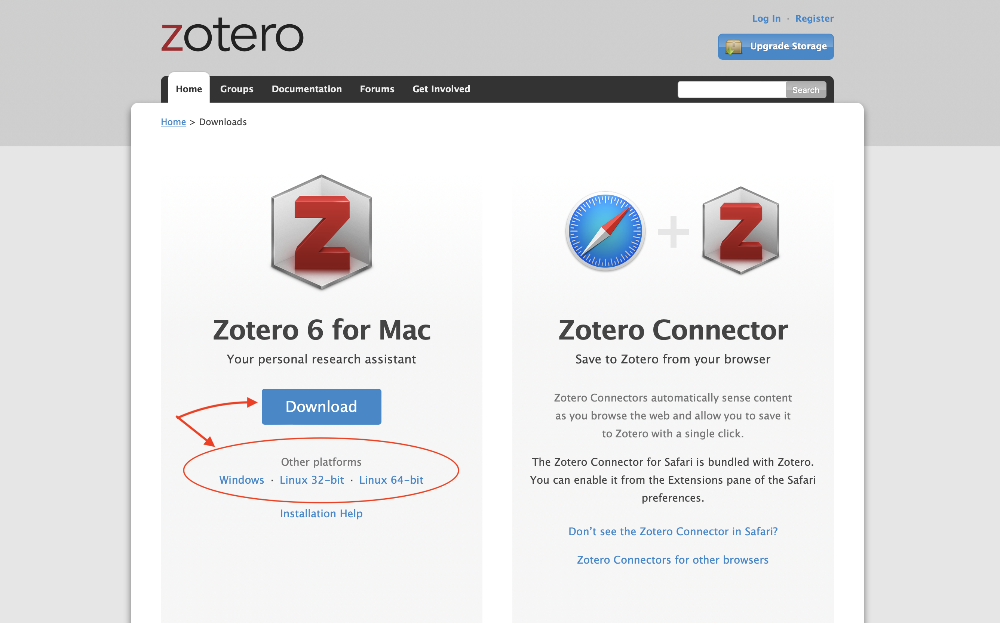
```

# [Choose Connector](#choose-connector)

Choose a connector.  A Zotero connector will make your life easy.  The "connector" is a shortcut accessible via your browser window. Connectors are available for Safari, Chrome, Firefox and Edge.  (My browser of choice is Chrome).

```{r zotero-connector, out.width = "100%"}
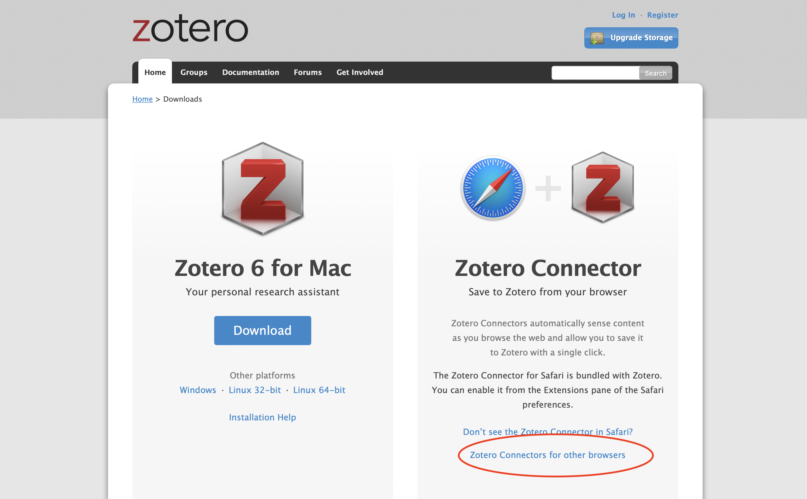
```

# [Download Plugins](#download-plugins)

Plugins are third-party extensions for Zotero. Go to the plugins [page](https://www.zotero.org/support/plugins).  For LaTeX, install the Better BibTeX plugin. The [repository](https://github.com/retorquere/zotero-better-bibtex) comes with extensive [documentation](https://retorque.re/zotero-better-bibtex/).

```{r better-bibtex-plugin, out.width = "100%"}
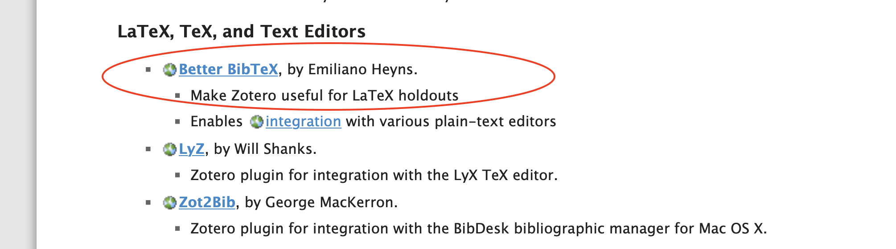
```

For those who use Word, choose the plugin for word processors.

```{r word-plugin, out.width = "100%"}
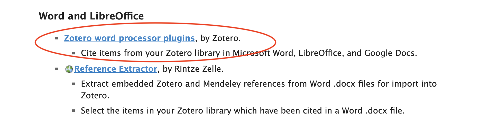
```

# [Launch Zotero](#launch)

Launch the Zotero Application.  The window should be empty with a tab for "My Library". (You won't see the "Open Workspace" tab).

```{r zotero-app, out.width = "100%"}
knitr::include_app("./zotero-app.png")
```

# [Create Collection](#create-collection)

Create a collection/folder.  Let's call it "00_game_theory".

```{r create-collection, out.width = "100%"}
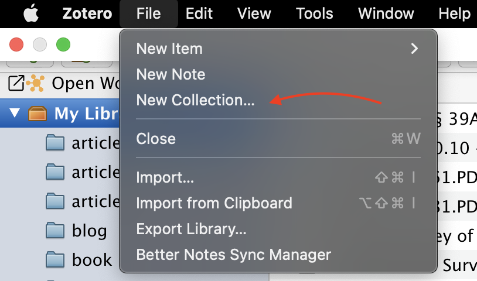
```

# [Retrieve PDF](#retrieve)

Go to the most [downloaded paper](https://papers.ssrn.com/sol3/papers.cfm?abstract_id=1968579) on SSRN (Social Science Research Network). Add it to the Zotero library collection "00_game_theory" using the Zotero Connector extension.  In Chrome, I added the Zotero Connector to the extension bar because I use it often.

```{r zotero-add-paper, out.width="100%"}
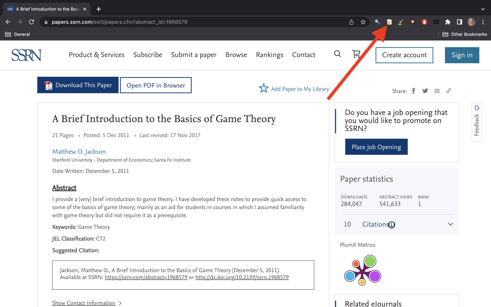
```

Highlight the collection of choice and click "Done".

```{r click-done, out.width = "100%"}
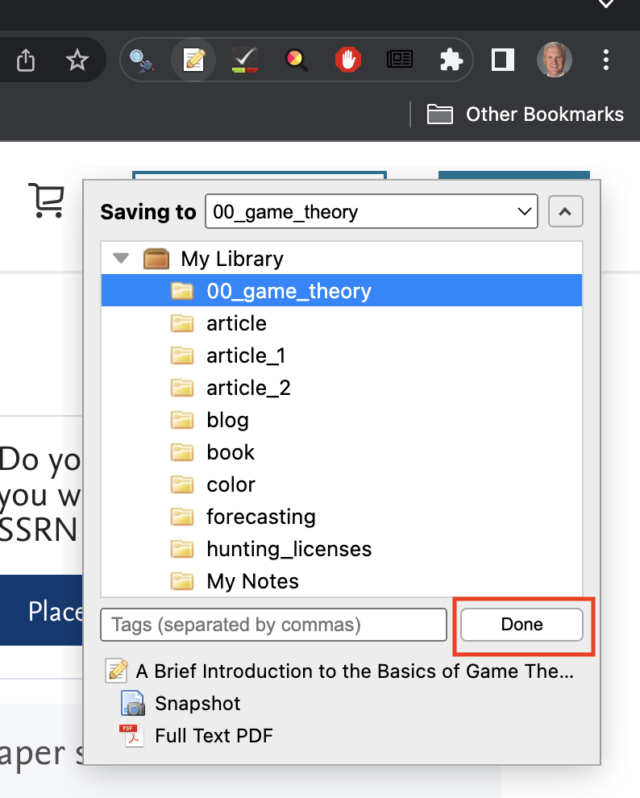
```


# [Sanity-Check](#sanity-check)

Open the Zotero window again and see if the connector added the paper to the intended collection.

```{r sanity-check, out.width = "100%"}
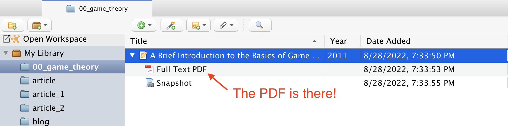
```

# [Open PDF](#open-pdf)

Double click on the PDF. Highlight a portion of the text.

```{r annotate-pdf, out.width="100%"}
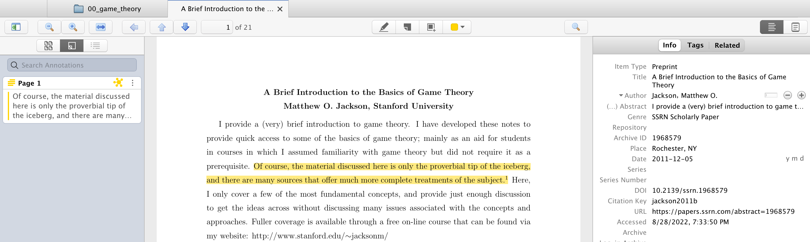
```

# [Extract Annotation](#extract-annotation)

The crucial step is to extract the annotation such that you create an index of significant quotes.  Also, you want to be able to find and cite them in your research.

```{r add-annotation, out.width="100%"}
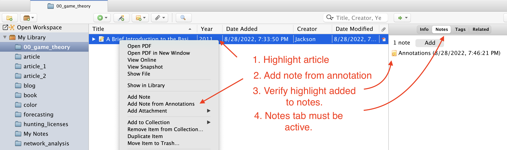
```

# [Export Collection](#export-collection)

```{r export-collection, out.width = "100%"}
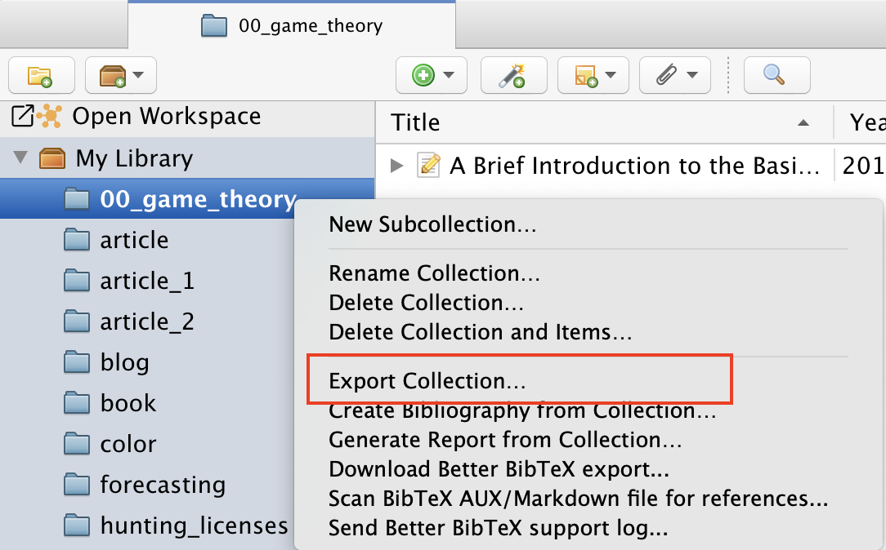
```

# [Export Format](#export-format)

Export them using the better BibTeX format.  That's why we retrieved the plugin to begin the tutorial.

```{r export-format, out.width = "100%"}
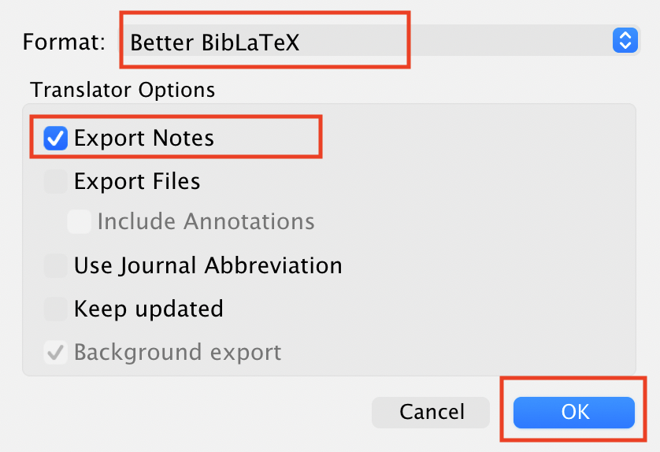
```

# [Check Format](#check-format)

Check the format.  Typically, the `00_game_theory.bib` file should be exported to the root directory of your working folder. Notice the annotation is included.  This is an extremely powerful tool.  The fields contained within the `.bib` file are accessible in many other applications.  The bibliography will be formed by selecting the different fields like `author`, `title`, `date` and journal.  It's always worth checking the export to make sure it's generating a reasonable output.

```{r bib-export, out.width="100%"}
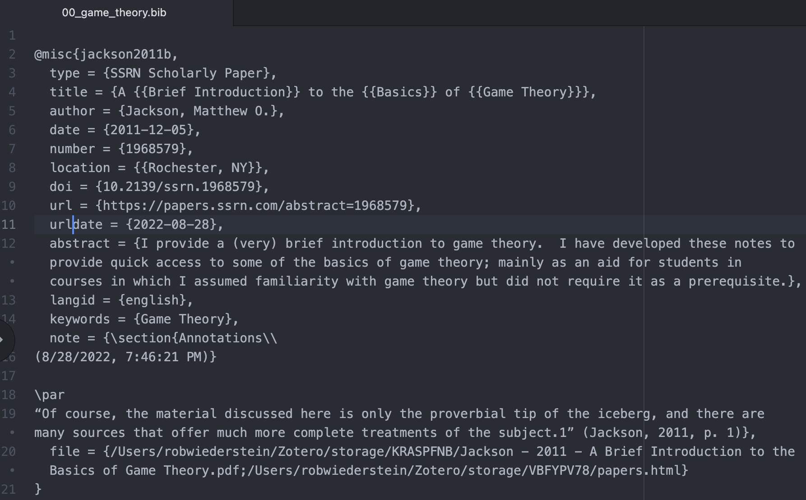
```

# [Conclusion](#conclusion)

That concludes the basic introduction to Zotero. This is just a glimpse of the potential that awaits authors willing to devote just a little time to it.  Additional tools and plugins have taken Zotero's potential even further.  However, you have to know the basics first.

# [Acknowledgements](#acknowledge)

This blog post was made possible thanks to:

- Zotero
- better BibTeX

# [References](#reference)

<div id="refs"></div>

# [Disclaimer](#disclaimer)

The views, analysis and conclusions presented within this paper represent the author’s alone and not of any other person, organization or government entity. While I have made every reasonable effort to ensure that the information in this article was correct, it will nonetheless contain errors, inaccuracies and inconsistencies. It is a working paper subject to revision without notice as additional information becomes available. Any liability is disclaimed as to any party for any loss, damage, or disruption caused by errors or omissions, whether such errors or omissions result from negligence, accident, or any other cause. The author(s) received no financial support for the research, authorship, and/or publication of this article.

# [Reproducibility](#reproduce)

```{r reproducibility, echo = FALSE}
# system & package info
options(width = 120)
session_info()
```
