```{r load-packages, include = F}
## Load frequently used packages for blog posts
packages <- c(
      'devtools', #for session info
      'ggthemes', #for plots
      'blogdown',
      'citr',
      'rmarkdown'
)
lapply(packages, function(x) {
  if (!requireNamespace(x)) install.packages(x)
  library(x, character.only = TRUE)
})
```

```{r set-chunk-options, include = F}
## Do not break chunk line
## Do not use spaces or periods "." or underscores "_"
## set options for knitr
knitr::opts_chunk$set(
  comment = '',
  fig.width = 6,
  fig.asp = .8,
  fig.align="center",
  message=F,
  error=F,
  warning=F,
  tidy=T,
  comment='',
  cache=T,
  dev='svg',
  echo=F
)
```

```{r set-ggplot-theme-defaults, include = F}
#from ggthemes
library(ggplot2); theme_set(ggthemes::theme_fivethirtyeight())
```

```{r define-color-palette, include = F, eval = T}
# color blind friendly palette from http://www.cookbook-r.com/Graphs/Colors_(ggplot2)/
cbPalette <- c("#E69F00", "#56B4E9", "#009E73", "#F0E442", "#0072B2", "#D55E00", "#CC79A7", "#000000")
```

```{r write-package-bib, echo = F}
# write packages used to bib in current directory
knitr::write_bib(.packages(), "./packages.bib")
```

# [Overview](#overview)

You can use Rmarkdown to generate LaTeK documents and Zotero to track your citations.  You need a working download of Zotero along with the add-in "Better Bibtex for Zotero".  I use the IDE Rstudio for R.  You'll need to install the "citr" and "rmarkdown" packages. Once you have these prerequisites, this post explains a possible workflow. I'd recommend and largely followed the ["R Markdown Cookbook"](https://bookdown.org/yihui/rmarkdown-cookbook/) for inserting a bibliography.


# [Create Rmarkdown document](#create-doc)

```{r create-rmarkdown-doc}
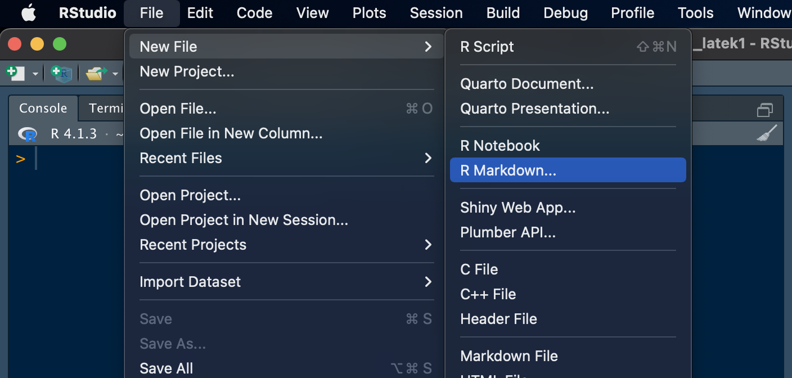
```

# [Set Output](#set-output)

```{r set-output}
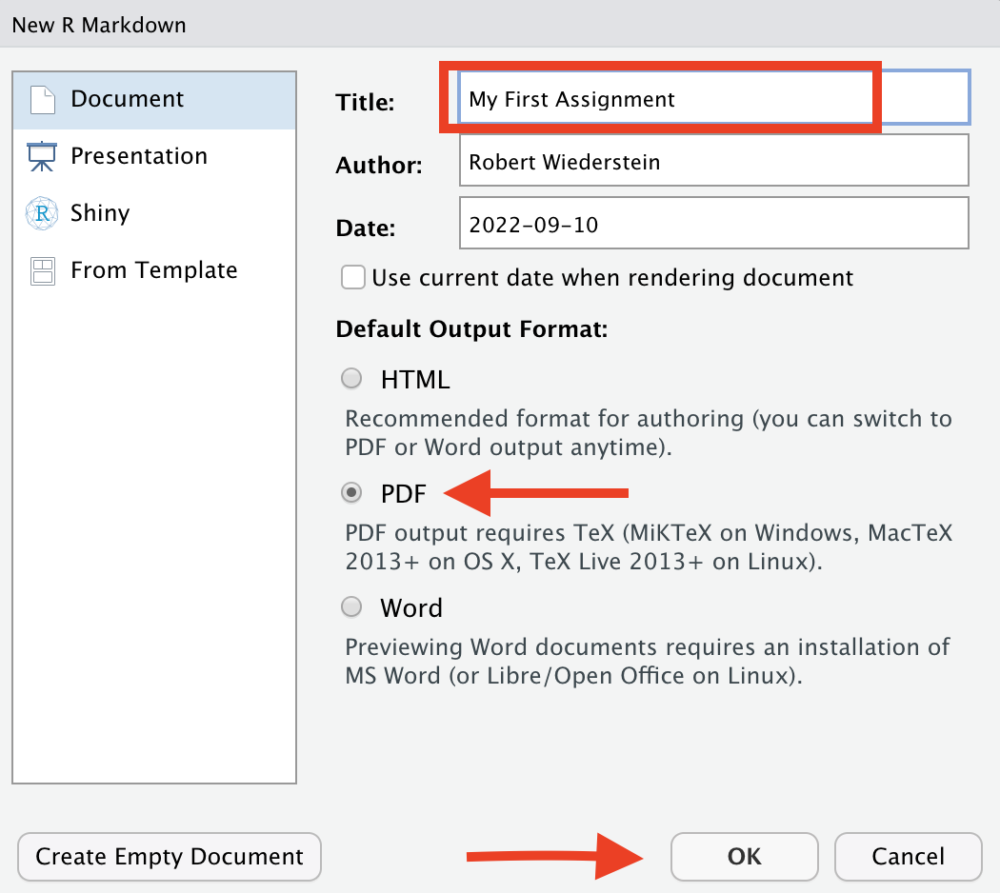
```

# [Insert YAML](#insert-yaml)

```{r insert-yaml}
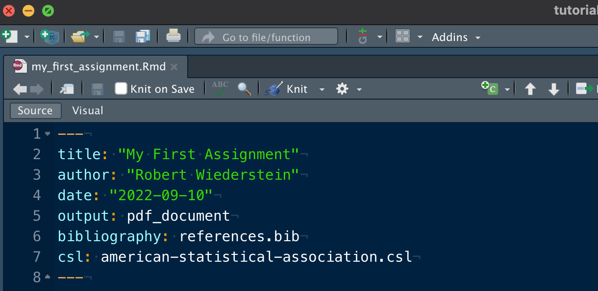
```

# [Insert Markdown](#insert-md)

```{r insert-md}
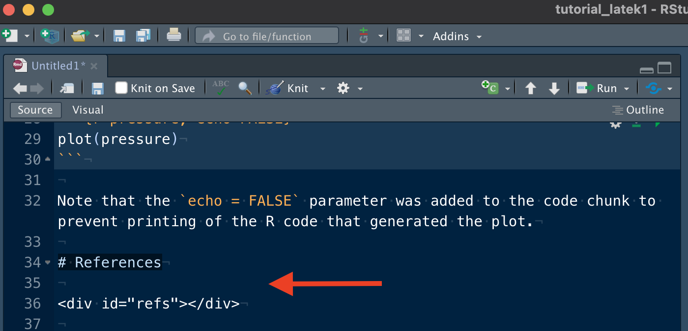
```

# [Export Zotero Collection](#export-zotero)

```{r export-zotero}
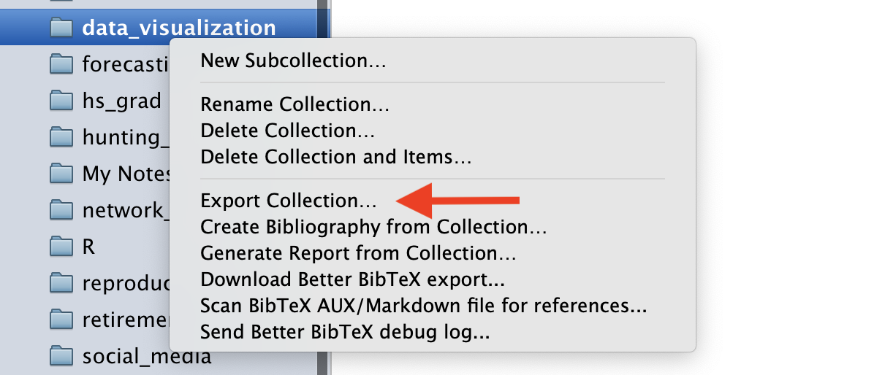
```

# [Export Biblatex Format](#export-biblatex)

```{r export-biblatex}
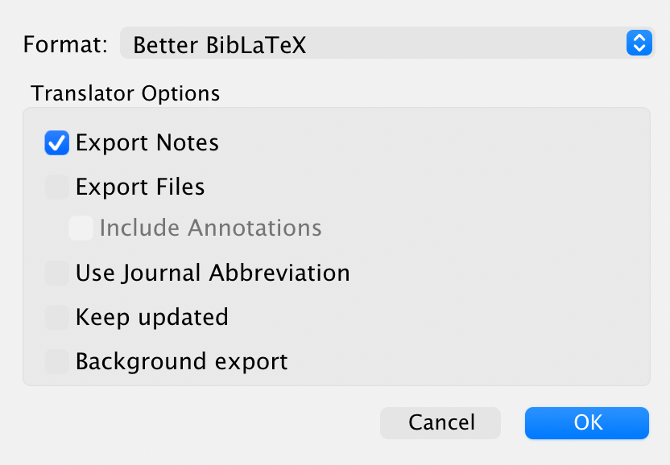
```

# [Download Zotero Style](#download-style)

```{r download-zotero-style}
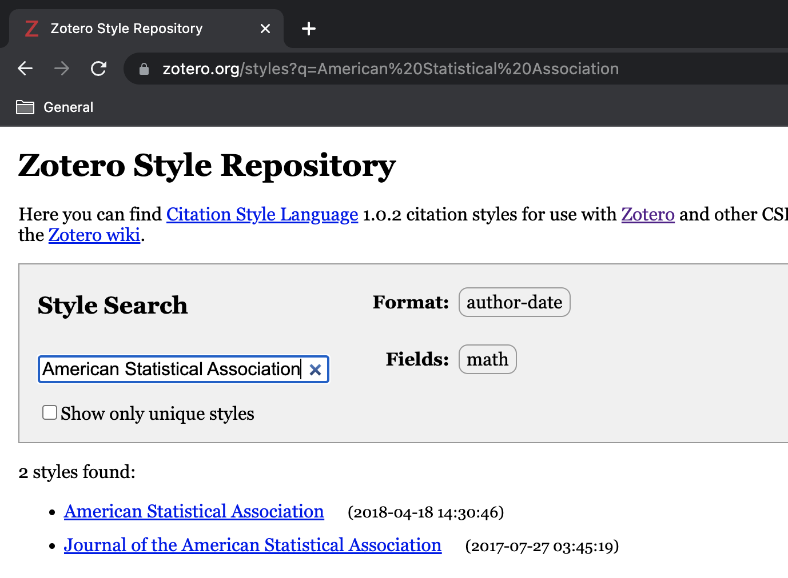
```

# [Save `.csl` and `.bib` to root](#save-csl)

```{r save-to-root}
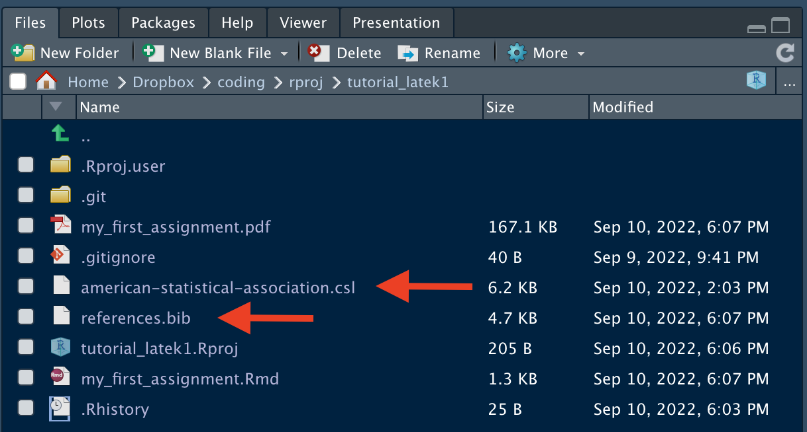
```

# [Trigger citr menu](#include-citation)

```{r citr-menu}
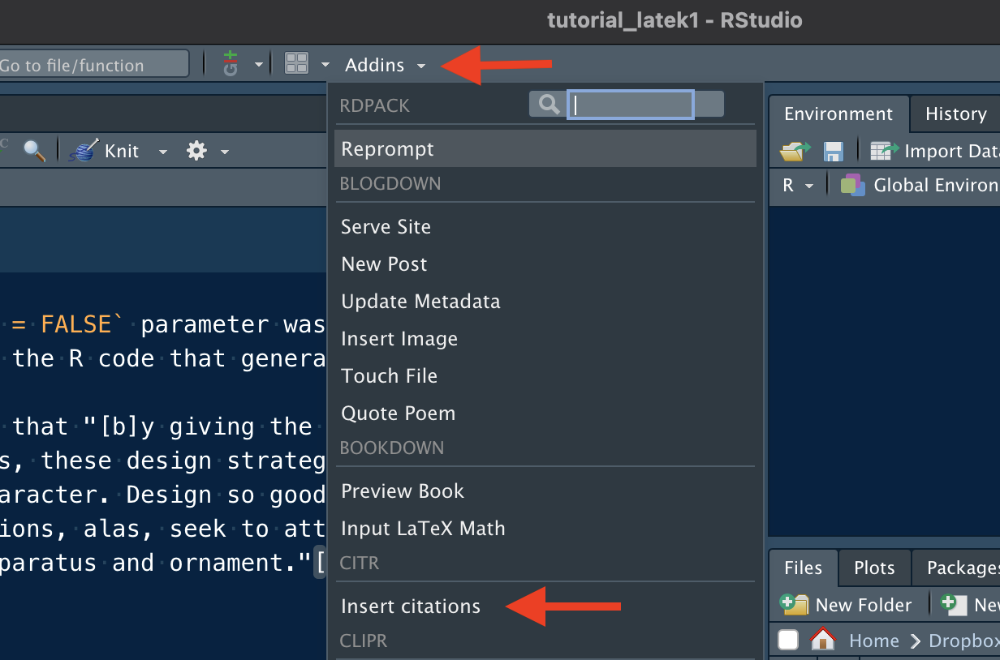
```

# [Insert Citation](#insert-citation)

```{r insert-citation}
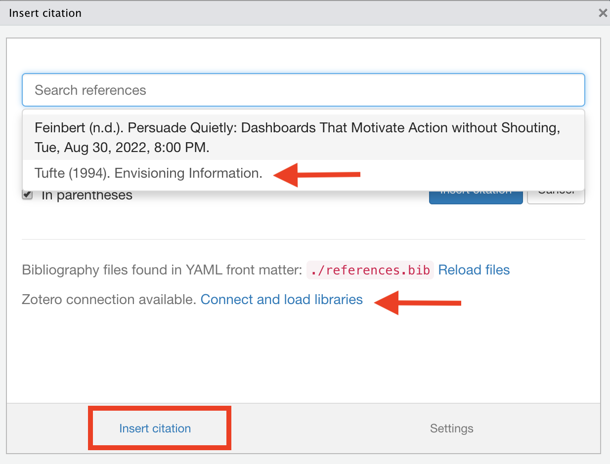
```

# [Document](#document)

```{r document}
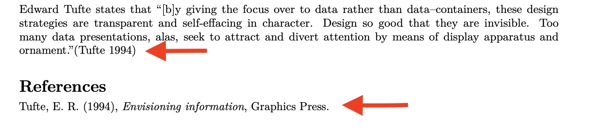
```


# [Conclusion](#conclusion)

The post describes a workflow where journal articles can be annotated/highlighted in Zotero and then inserted into Rmarkdown documents.  Once the documents are "knit," a PDF is created using LaTeK typography.

# [References](#reference)

<div id="refs"></div>

# [Disclaimer](#disclaimer)

The views, analysis and conclusions presented within this paper represent the author’s alone and not of any other person, organization or government entity. While I have made every reasonable effort to ensure that the information in this article was correct, it will nonetheless contain errors, inaccuracies and inconsistencies. It is a working paper subject to revision without notice as additional information becomes available. Any liability is disclaimed as to any party for any loss, damage, or disruption caused by errors or omissions, whether such errors or omissions result from negligence, accident, or any other cause. The author(s) received no financial support for the research, authorship, and/or publication of this article.

# [Reproducibility](#reproduce)

```{r reproducibility, echo = FALSE}
# system & package info
options(width = 120)
session_info()
```
