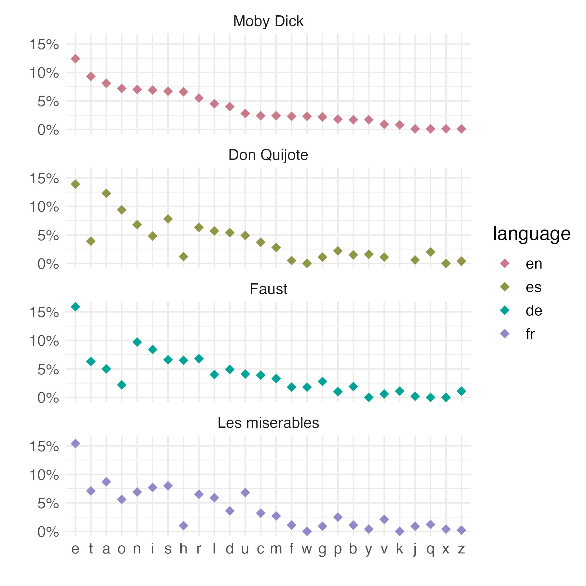

```{r load-packages, include = F}
## Load frequently used packages for blog posts
packages <- c(
      'devtools', #for session info
      'ggthemes', #for plots
      'blogdown',
      'dplyr',
      'tidytext',
      'ggplot2',
      'colorspace',
      'tidytext'
)
lapply(packages, function(x) {
  if (!requireNamespace(x)) install.packages(x)
  library(x, character.only = TRUE)
})
```

```{r set-chunk-options, include = F}
## Do not break chunk line
## Do not use spaces or periods "." or underscores "_"
## set options for knitr
knitr::opts_chunk$set(
  comment = '',
  fig.width = 6,
  fig.asp = .8,
  fig.align="center",
  message=F,
  error=F,
  warning=F,
  tidy=T,
  comment='',
  cache=F,
  dev='svg',
  echo=F
)
```

```{r set-ggplot-theme-defaults, include = F, eval = F}
#from ggthemes
library(ggplot2); theme_set(ggthemes::theme_fivethirtyeight())
```

```{r define-color-palette, include = F, eval = F}
# color blind friendly palette from http://www.cookbook-r.com/Graphs/Colors_(ggplot2)/
cbPalette <- c("#E69F00", "#56B4E9", "#009E73", "#F0E442", "#0072B2", "#D55E00", "#CC79A7", "#000000")
```

```{r write-package-bib, echo = F}
# write packages used to bib in current directory
knitr::write_bib(.packages(), "./packages.bib")
```


# [Overview](#overview)

Recently, I've been studying cryptography. Or, more accurately, a couple of family members have been studying it.  For inspiration, we watched "[The Imitation Game](https://en.wikipedia.org/wiki/The_Imitation_Game)," starring Benedict Cumberbatch and Keira Knightly.  It's a great movie and a celebration of one of the great intellects of the twentieth century Alan Turing.  He is widely considered the creator of the modern computer. Along with many others at Bletchley Park, he broke Germany's Enigma code accelerating the Allied victory.

# [Caesar Cipher](#caesar)

A "caesar cipher" is a simple shift of the alphabet to encode data.  If you shift the alphabet 7 spaces an "A" would become the seventh letter "G". This kind of encoding is easily broken by studying the frequency of letters within a language.  In English, "E" is the most common letter.  It represents somewhere around 12.5% of all letters.  A seven-letter shift from "E" to "L" would convert all of the "Es" to "Ls".  "L" would then be present in 12.5% of the total characters in a text.

# [Gutenbergr Package](#gutenbergr)

With the `Gutenbergr` package in R, public domain texts are freely available.   The collection is large and contains 60,000+ free eBooks in different languages.  I chose four well-known works of literature one from English (en), Spanish (es), German (de), and French (fr).  The texts are "Moby Dick" by Herman Melville, Don Quijote by Cervantes, Faust by Goethe and Les Miserables by Victor Hugo.  

These were in the original language. Only the ten most frequent letters from Moby Dick were included. There were similar distributions of the letters for the other languages.


# [Letter Frequency](#letter-frequency)

```{r load-plot, out.width="90%", cache=FALSE}

```

# [Code](#code)

```{r echo=T, eval=FALSE, tidy=TRUE}
# devtools::install_github("ropensci/gutenbergr")
library(dplyr)
library(tidytext)
library(gutenbergr)

# Moby Dick; Or, The Whale by Herman Melville - English
moby_dick <- gutenberg_download(
  gutenberg_id = 2701,
  meta_fields = c("title", "author", "language"),
  verbose = F
)

# Victor Hugo - Les misérables Tome V: Jean Valjean - French
les_miserab <- gutenberg_download(
        gutenberg_id = 17519,
        meta_fields = c("title", "author", "language"),
        verbose = F
)
# Don Quijote - Cervantes
don_quijote <- gutenberg_download(
    gutenberg_id = 2000,
    meta_fields = c("title", "author", "language"),
    verbose = F
)
# Faust - Goethe
faust <- gutenberg_download(
    gutenberg_id = 2229,
    meta_fields = c("title", "author", "language"),
    verbose = F
)
# build function
find_letter_frequency <- function(book){
  book |>
  mutate(text = iconv(text, to = 'latin1')) |>
  unnest_characters(characters, text) |>
  group_by(author, title, language, characters) |>
  summarize(n = n(), .groups = "drop") |>
  filter(grepl("[a-z]", characters)) |>
  mutate(total = sum(n)) |>
  mutate(pct = n / total) |>
  mutate(pct = round(pct * 100, 1)) |>
  arrange(desc(pct))
}
# combine
data <-
    dplyr::bind_rows(
        find_letter_frequency(book = moby_dick),
        find_letter_frequency(book = les_miserab),
        find_letter_frequency(book = don_quijote),
        find_letter_frequency(book = faust)
    )

convert_names <-
    tribble(
    ~title, ~title1,
    "Moby Dick; Or, The Whale", "Moby Dick",
    "Les misérables Tome V: Jean Valjean", "Les miserables",
    "Don Quijote", "Don Quijote",
    "Faust: Der Tragödie erster Teil", "Faust"
)
data <- dplyr::left_join(data, convert_names, by = "title") |>
    dplyr::select(-title) |>
    dplyr::rename(title = title1)

# reorder characters high --> low
characters_reordered <-
    data |>
    filter(language == "en") |>
    arrange(desc(pct)) |>
    select(characters) |>
    pull()
data$characters <- factor(data$characters, levels = characters_reordered)


# reorder plots
data$title <- factor(data$title)
data$title <- forcats::fct_relevel(data$title, "Moby Dick")
#reorder language
data$language <- factor(data$language)
data$language <- forcats::fct_relevel(data$language,
                                      c("en", "es", "de", "fr"))
#set colors
colors <- colorspace::qualitative_hcl(4, palette = "dark2")
#plot
library(ggplot2)
data |>
  ggplot() +
  aes(characters, pct, group = language, color = language) +
  geom_point(size = 3.0, shape = 18) +
  scale_color_manual(values = colors) +
  scale_y_continuous(
      limits = c(0, 16),
      breaks = c(0, 5, 10, 15),
      labels = paste0(seq(0, 15, 5), "%"),
      name = "",
      ) +
  scale_x_discrete(name = "") +
  facet_wrap(. ~ title, ncol = 1) +
  theme_minimal() +
    theme(text = element_text(size = 14))
```

# [Acknowledgements](#acknowledge)

This blog post was made possible thanks to:

- [gutenbergr package](https://docs.ropensci.org/gutenbergr/)

- [Project Gutenberg](https://www.gutenberg.org).

# [References](#reference)

<div id="refs"></div>

# [Disclaimer](#disclaimer)

The views, analysis and conclusions presented within this paper represent the author’s alone and not of any other person, organization or government entity. While I have made every reasonable effort to ensure that the information in this article was correct, it will nonetheless contain errors, inaccuracies and inconsistencies. It is a working paper subject to revision without notice as additional information becomes available. Any liability is disclaimed as to any party for any loss, damage, or disruption caused by errors or omissions, whether such errors or omissions result from negligence, accident, or any other cause. The author(s) received no financial support for the research, authorship, and/or publication of this article.

# [Reproducibility](#reproduce)

```{r reproducibility, echo = FALSE}
# system & package info
options(width = 120)
session_info()
```
