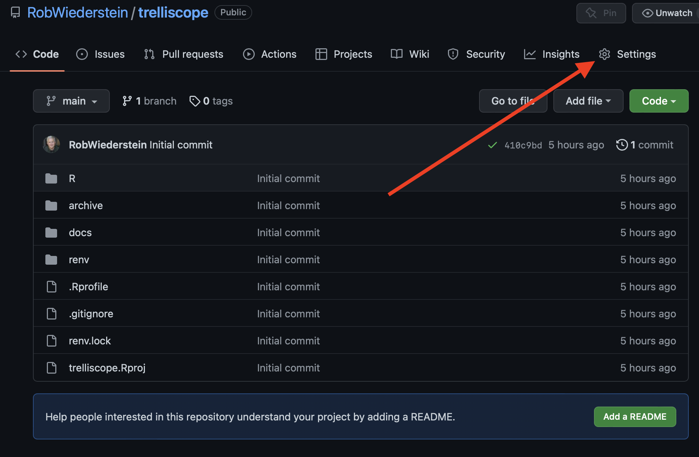
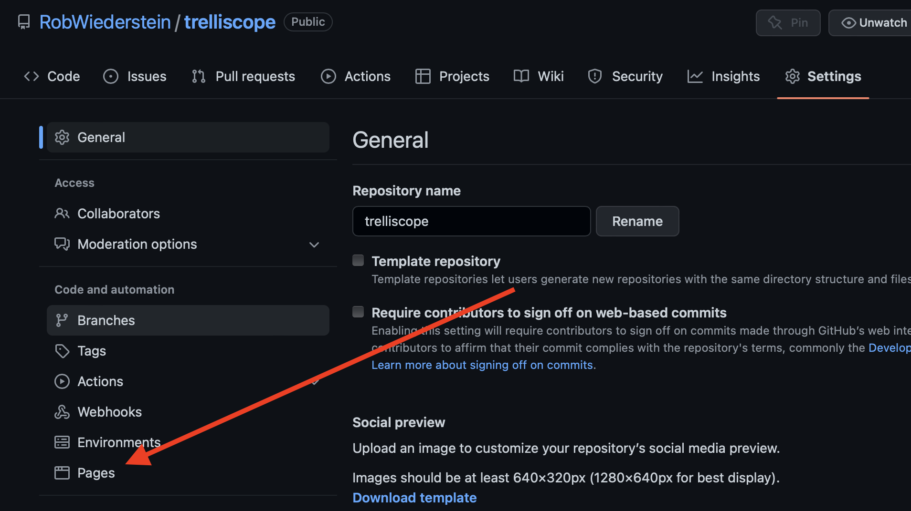
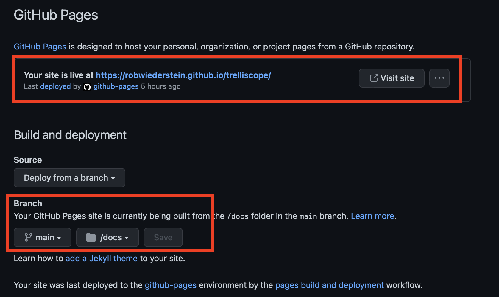

```{r load-packages, include = F}
## Load frequently used packages for blog posts
packages <- c(
      'devtools', #for session info
      'ggthemes', #for plots
      'blogdown'
)
lapply(packages, function(x) {
  if (!requireNamespace(x)) install.packages(x)
  library(x, character.only = TRUE)
})
```

```{r set-chunk-options, include = F}
## Do not break chunk line
## Do not use spaces or periods "." or underscores "_"
## set options for knitr
knitr::opts_chunk$set(
  comment = '',
  fig.width = 6,
  fig.asp = .8,
  fig.align="center",
  message=F,
  error=F,
  warning=F,
  tidy=T,
  comment='',
  cache=T,
  dev='svg',
  echo=F
)
```

```{r set-ggplot-theme-defaults, include = F}
#from ggthemes
library(ggplot2); theme_set(ggthemes::theme_fivethirtyeight())
```

```{r define-color-palette, include = F, eval = T}
# color blind friendly palette from http://www.cookbook-r.com/Graphs/Colors_(ggplot2)/
cbPalette <- c("#E69F00", "#56B4E9", "#009E73", "#F0E442", "#0072B2", "#D55E00", "#CC79A7", "#000000")
```

```{r write-package-bib, echo = F}
# write packages used to bib in current directory
knitr::write_bib(.packages(), "./packages.bib")
```

# [Overview](#overview)

I just learned about the R trelliscope package. The question was whether a trelliscope widget could be embedded into a github page.  The widget could be embedded into this blog by first creating a separate repository and then inserting an iframe on the blog post.

# [Step 1 - Create Repo](#create-repo)

The address for the repository is [here](https://github.com/RobWiederstein/trelliscope). The key is the script within the `./R` folder.

# [Step 2 - Create Trelliscope Plot](#trell-plot)

This code was taken from the "Getting Started" [page](https://hafen.github.io/trelliscopejs/articles/trelliscopejs.html) of the package's documentation.


```{r, eval=F, echo=T}
qplot(year, lifeExp, data = gapminder) +
        xlim(1948, 2011) + ylim(10, 95) + theme_bw() +
        facet_trelliscope(~ country + continent, nrow = 2, ncol = 7, width = 300)
```


# [Step 3 - Save Widget to Docs](#widget-docs)

Create a `./docs` folder.  `dir.create("./docs")` should work.  The place where I struggled was collecting and saving the widget.  The files are kept in the temporary directory.  The code was included in the issues thread of the package. (You can find it [here](https://github.com/hafen/trelliscopejs/issues/24).)

The strategy was to copy the files, libraries and directories generated from the package and place them in the docs folder.  That was accomplished with the code below:

```{r, eval=F, include=T, echo=T}
trell_files <- list.files("/tmp/gap", full.names = T)

file.copy(from = trell_files,
          to = "./docs",
          recursive = T)
```


# [Step 4 - Add Docs Folder to gh-pages](#gh-pages)

```{r, out.width="100%"}

```

```{r, out.width="100%"}

```

```{r out.width="100%"}

```

# [Step 5 - Add iframe](#add-iframe)

Find the url address where GitHub published the page and insert it into the `src` attribute.


```{html, echo=T, eval=F}
<iframe src="https://robwiederstein.github.io/trelliscope/#display=by_country_continent&nrow=2&ncol=7&arr=row&pg=1&labels=country&sort=country;asc&filter=&sidebar=&fv=" width=600, height=400 title="Trelliscope Plot"></iframe>
```

<iframe src="https://robwiederstein.github.io/trelliscope/#display=by_country_continent&nrow=2&ncol=7&arr=row&pg=1&labels=country&sort=country;asc&filter=&sidebar=&fv=" width=600, height=400 title="Trelliscope Plot"></iframe>

# [Conclusion](#conclusion)

The trelliscope package can provide insight on high-dimensional data. I'm really interested to see if it will work into a modeling workflow where the performance metrics are faceted with the different models. Something to experiment with in the future.

# [Acknowledgements](#acknowledge)

This blog post was made possible thanks to:

# [References](#reference)

<div id="refs"></div>

# [Disclaimer](#disclaimer)

The views, analysis and conclusions presented within this paper represent the author’s alone and not of any other person, organization or government entity. While I have made every reasonable effort to ensure that the information in this article was correct, it will nonetheless contain errors, inaccuracies and inconsistencies. It is a working paper subject to revision without notice as additional information becomes available. Any liability is disclaimed as to any party for any loss, damage, or disruption caused by errors or omissions, whether such errors or omissions result from negligence, accident, or any other cause. The author(s) received no financial support for the research, authorship, and/or publication of this article.

# [Reproducibility](#reproduce)

```{r reproducibility, echo = FALSE}
# system & package info
options(width = 120)
session_info()
```
