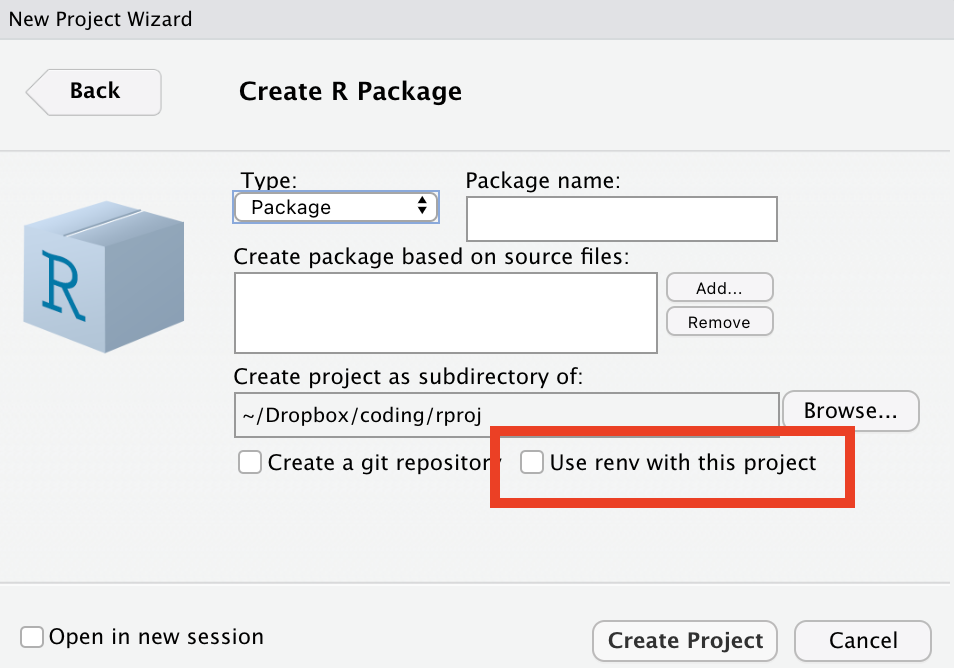

```{r load-packages, include = F}
## Load frequently used packages for blog posts
packages <- c(
      'devtools', #for session info
      'ggthemes', #for plots
      'blogdown',
      'devtools',
      'renv',
      'pak'
)
lapply(packages, function(x) {
  if (!requireNamespace(x)) install.packages(x)
  library(x, character.only = TRUE)
})
```

```{r set-chunk-options, include = F}
## Do not break chunk line
## Do not use spaces or periods "." or underscores "_"
## set options for knitr
knitr::opts_chunk$set(
  comment = '',
  fig.width = 6,
  fig.asp = .8,
  fig.align="center",
  message=F,
  error=F,
  warning=F,
  tidy=T,
  comment='',
  cache=T,
  dev='svg',
  echo=F
)
```

```{r set-ggplot-theme-defaults, include = F}
#from ggthemes
library(ggplot2); theme_set(ggthemes::theme_fivethirtyeight())
```

```{r define-color-palette, include = F, eval = T}
# color blind friendly palette from http://www.cookbook-r.com/Graphs/Colors_(ggplot2)/
cbPalette <- c("#E69F00", "#56B4E9", "#009E73", "#F0E442", "#0072B2", "#D55E00", "#CC79A7", "#000000")
```

```{r write-package-bib, echo = F}
# write packages used to bib in current directory
knitr::write_bib(.packages(), "./packages.bib")
```

# [Overview](#overview)

# What packages are installed and where?

This command shows what packages you are using and where they are installed on your system.

```{r show-packages, echo =T}
devtools::loaded_packages()[1:5, ]
```

# Package Management

- from CRAN, `install.packages(pkgs = "dplyr")`.
- Development version from GitHub, `devtools::install_github("tidyverse/dplyr")`
- attach library to search path with `library("dplyr")`.
- for paths, run `devtools::loaded_packages()`
- see list of **attached** packages `search()`.
- detach is the opposite of library.  `detach(package:dplyr)`
- verify package detached `search()`
- remove package `remove.packages("dplyr")`.
- see installed packages `installed.packages()`

# The `pak` Package

As of September 2022, Posit will probably recommend `pak` as its package installation tool,  especially, for installing packages directly from GitHub.


- `pak::pkg_install("tibble")`
- `pak::pkg_install("tidyverse/tibble")`
- `pak::pkg_deps_tree("tibble")`
- `pak::pkg_deps_explain("tibble", "rlang")`
- `pak::local_install("cli")`

# Five Package States - [R Packages](https://r-pkgs.org/structure.html)

When you create a package, you are working on its **source** code.  An R package can be in one of five states:

- **source**. Source is the thing that is on GitHub or the raw code that a developer is creating.
        
- **bundled**. A package compressed into a single file. In R, a bundled package uses the extension `.tar.gz`.
        
- **binary**.  Like a package bundle, a binary is a single file. Binaries are either Mac (extension `.tgs`) or Windows (extension `zip`). CRAN makes binaries. A developer submits a bundle and CRAN convert it to a binary.
        
- **installed**. An installed package is a binary package that was decompressed into a package library.
        
- **in-memory**. The familiar `library(package)` command puts the package in memory and on the search path.
        
# The `renv` package

The `renv` package is the successor to `packrat` and is available in Rstudio version RStudio 2022.07.2.  When choosing to create a package, a checkbox will appear that allows for `renv` to be installed. 

```{r renv-pic}

```


More information is available on the [website](https://rstudio.github.io/renv/). I'm used to just calling `library(package)` or `package::function()`.  When using `renv` you have to install it first even though it's already in your local library.

- call `renv::init()` to begin.
- install and remove packages.
- call `renv::snapshot()`.  It saves a file `renv.lock` in the root directory that contains an inventory of the packages used.

The lockfile contents look like the code below:

```{r renv-example, eval=F, echo=T, warning=F}
{
  "R": {
    "Version": "4.1.3",
    "Repositories": [
      {
        "Name": "CRAN",
        "URL": "https://cran.rstudio.com"
      }
    ]
  },
  "Packages": {
    "R6": {
      "Package": "R6",
      "Version": "2.5.1",
      "Source": "Repository",
      "Repository": "CRAN",
      "Hash": "470851b6d5d0ac559e9d01bb352b4021",
      "Requirements": []
    },
  }
}
```

# The `devtools` functions 

These are the tools from the `devtools` package that I use the most. Alot of them are available via the RStudio GUI.

-  `devtools::build()` - Build package
-  `devtools::build_rmd()` - Build a Rmarkdown files package
-  `devtools::build_site()` - Execute 'pkgdown' build_site in a package
-  `devtools::build_vignettes()` - Build package vignettes.
-  `devtools::check()` - Check a package
-  `devtools::document()` - Document a package
-  `devtools::load_all()` - Load packages
-  `devtools::spell_check()` - One I should run more!

# System Files

In building a package, I often include an rmarkdown document. The recommendation is for the document to be included in the `inst` folder. For example, the document would be included in the `inst\article\index.Rmd`.  When the package is installed, the `inst` portion is omitted, leaving `article\index.Rmd`.  Writing a function within the development version requires that it be referred to as a system file. The concept is detailed in the stackoverflow post: [How to include RMarkdown file in r package?](https://stackoverflow.com/questions/30377213/how-to-include-rmarkdown-file-in-r-package/30377598#30377598).

```{r system-file, eval=F, echo=T}
system.file("article", "index.Rmd", package = "myPackage")
```

# Sources of Confusion

In R, library means a collection of packages and packages means software tools. This convention is counter to other programming languages.
        

# [Conclusion](#conclusion)

When a developer creates his or her own package, it will in turn rely on other packages.  Those packages will often times be outside of the `base` R package.  (Although, I've seen some amazing coding where the author limits use to just functions in the `base` package.) Where a package incorporates the use of another package, it is referred to as a dependency.  These dependencies must be explicit and inventoried.  They must even include the specific versions.  `renv` can help with that process. Also, remember that as a developer, you are writing source code and it may behave differently when it is bundled and installed in a user's local library.  Happy coding! 

# [Acknowledgements](#acknowledge)

This blog post was made possible thanks to:

- [R Packages](https://r-pkgs.org)


# [References](#reference)

<div id="refs"></div>

# [Disclaimer](#disclaimer)

The views, analysis and conclusions presented within this paper represent the author’s alone and not of any other person, organization or government entity. While I have made every reasonable effort to ensure that the information in this article was correct, it will nonetheless contain errors, inaccuracies and inconsistencies. It is a working paper subject to revision without notice as additional information becomes available. Any liability is disclaimed as to any party for any loss, damage, or disruption caused by errors or omissions, whether such errors or omissions result from negligence, accident, or any other cause. The author(s) received no financial support for the research, authorship, and/or publication of this article.

# [Reproducibility](#reproduce)

```{r reproducibility, echo = FALSE}
# system & package info
options(width = 120)
session_info()
```
