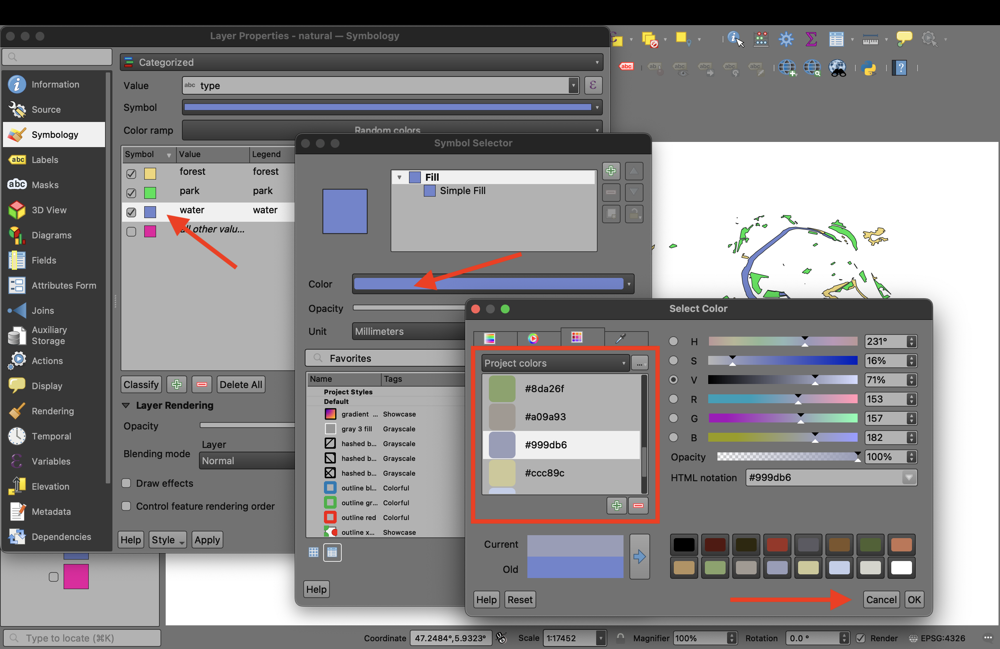

```{r load-packages, include = F}
## Load frequently used packages for blog posts
packages <- c(
      'devtools', #for session info
      'ggthemes', #for plots
      'blogdown'
)
lapply(packages, function(x) {
  if (!requireNamespace(x)) install.packages(x)
  library(x, character.only = TRUE)
})
```

```{r set-chunk-options, include = F}
## Do not break chunk line
## Do not use spaces or periods "." or underscores "_"
## set options for knitr
knitr::opts_chunk$set(
  comment = '',
  out.width = "100%",
  #fig.asp = .8,
  fig.align="center",
  message=F,
  error=F,
  warning=F,
  tidy=T,
  comment='',
  cache=T,
  dev='svg',
  echo=F
)
```

```{r write-package-bib, echo = F}
# write packages used to bib in current directory
knitr::write_bib(.packages(), "./packages.bib")
```

# [Overview](#overview)

Many, many tools are available online to generate color palettes for maps and charts.  The science of color is better understood today as a result of photography and digital display than at any other time.  Yet, history is replete with beautiful art and maps.  Monarchs and nations devoted extreme resources for exploration and conquest.  Maps were crucial in the effort.  The resulting maps were both a symbol of national power and advertisements of scientific ingenuity.  Many of these historic maps contain beautiful color schemes.  Can these maps be used to color a contemporary map of today?  The answer is a resounding "yes" and the inspiration for this effort was taken from the post "[Cartographic palettes and colour harmonies](https://wanderingcartographer.wordpress.com/2022/07/27/cartographic-palettes-and-colour-harmonies/)."

In the rest of the post, I'll give some background on Besancon and the famous Cassini family, download the map tiles that cover the Besacon-Planois area of France, discuss how to extract the colors from the old map, and recolor the map with the new palette. Our tools will be GIMP, the open-source digital image manipulation tool, and QGIS, the open-source GIS mapping tool. Both QGIS and GIMP are amazing tools, but have a steep learning curve.

# [Background](#background)

## Besancon

Besancon is long-established city in France close to Switzerland. The site was seen as an ideal place for military fortification because it sits within an oxbow of the river Doubs, meaning it is surrounded by water on three sides. The Alps also provide a natural barrier to its immediate south.  The city is the capital of the French region Bourgogne-Franch-Comte. According to wikipedia, the city population was 283,127 in 2021. In 1793, the number of inhabitants of Besancon was 25,328 according to the Cassini map online on EHESS [site](http://cassini.ehess.fr/fr/html/fiche.php?select_resultat=3928).

## The Cassini Family

Four successive generations of the Cassini family labored to produce the first national map of France: 

- Giovanni Domenico Cassini (1625 - 1712)

- Jacques Cassini (1677 - 1756)

- Cesar-Francois Cassini de Thury (1714 - 1784)

- Jean-Dominique Cassini (1748 - 1845)

**Giovanni** moved to France from Italy. With the patronage of Louis XIV, Giovanni was the founder, architect, and director of the Paris Observatory which opened in 1671. He discovered a more accurate way to determine longitude which allowed for France to be more accurately surveyed for the first time. He was the first of his family to begin working on a topographic map of France. The map was constructed by triangulation. Finally published in 1789, it was known as the _Carte de Cassini_ or the "Cassini Map". 

**Cesar-Francois** began the construction of a topographical map of France, one of the landmarks in the history of cartography.  Finished by his son and published by the Academy of Sciences from 1744 to 1793, its 180 plates are known as the Cassini map.

**Jean-Dominique** published his father's map of France which was published by the Academy of sciences in 1793. It was the first topographic map of an entire country. The map consists of 182 sheets at the same scale, allowing the sheets to be joined together to form a physical map of about 39 feet high by 38 feet wide. The map was overlayed on Google earth and reveals an accurate geographic depiction of France, particularly its roads and boundaries. [David Rumsey Map Collection](https://www.davidrumsey.com/xmaps10000.html)  

In spite of an immense amount of searching, I was unable to resolve whether the Besancon-Planoise map pictured above was part of the original Cassini map. Rather, the gist of material suggest the Besancon-Planoise was a separate publication and survey.  Looking at the whole French map, the styling is different.  

As a side note, a multinational sponsored satellite was named "Cassini-Huygens" in rememberance of Giovanni Cassini's contributions to astronomy, mathmatics and cartography. The satellite, launched in 1997, orbited Saturn until 2017 when it was steered into Saturn's atmosphere as part of its planned demise. The satellite's name was a  fitting tribute since Giovanni was the first astronomer to observe Saturn's separate rings.

# [Open Street Maps](#osm)

My first effort at downloading the Open Street Maps was using the QGIS plugin "OSMDownloader".  The download via the plugin was a large file size and created layers by geometry type.  Rather than hack a column for conditional coloring, I chose to download the tiles via [bbbike](https://extract.bbbike.org/). The change in source had the benefit of having 8 layers of data: places, points, railroads, roads, waterways, building, landuse and natural. Below is a copy of the "bbbike" tiles download window.

```{r, fig.cap = "While difficult to see, the bounding box includes Besancon, France.  The tool notifies you by email when the tiles have been downloaded.  2 to 7 minutes is a common preparation time."}
knitr::include_graphics("bbbike_osm_downloader_besancon.png")
```

# Cassini Palette

There are at least two ways to generate a color palette from the Cassini map of Besacon: Image Color Summarizer and GIMP.

## Image Color Summarizer

 The first way is to use an online tool called "Image Color Summarizer." The [Image Color Summarizer](https://mk.bcgsc.ca/color-summarizer/?) only analyzes a 200 x 200 pixel image; however, it can be downloaded and used from the command line too.  The results will sample the pixels and provide the user an average color for the number of samples chosen.  The results also include a percentage of the pixels from within the image.  The tool will provide the representative colours of the image. You can then paste the hex code into QGIS.
 
```{r, out.width = "100%", fig.cap="The image color summarizer displays the frequency of color in descending order. This can be useful in color selection later."}
knitr::include_graphics("img_color_analysis.png")
```

## GIMP

 GIMP (GNU Image Manipulation Program) is a free, open-source image editing program that can be used for a variety of tasks like image editing.  GIMP was downloaded and the Cassini map was loaded into GIMP as a layer.  The steps to generate a color palette are described below.

- First, go to `Image > Mode > Indexed` and then hit "Convert".

```{r, out.width="50%"}
knitr::include_graphics(path = "./gimp_convert_img_indx_colors.png")
```


- Second, go to `Windows > Dockable Dialogs > Colormap`. You'll see the palette generated from the image.

```{r, out.width = "80%"}
knitr::include_graphics("./gimp_cassini_color_palette.png")
```

- Third, take a screenshot of the colors.  There's some different ways to import the palette into QGIS, but the simplest way is the way I've included here. (You can also save it as a palette and then import it into QGIS.)

# QGIS

First, load the OSM tiles.

Second, load the Cassini color palette. You'll have to set a projection and then hit pan so that you can see the palette on the map. We're going to include the palette as project colors in the "Properties" menu.

```{r, out.width="100%", fig.cap="Note that the file extension is a 'png' and it was rotated 90 degrees to make it easier to work with."}
knitr::include_graphics("./qgis_cassini_palette_import.png")
```

Third, add the colors to the project properties colors. You need to understand that the colors are not added by mouse click, but by the pressing of the space bar. This was repeated 16 times.  One nice feature is that the label allows you to specify what the color will be used for.  

```{r, out.width="100%", fig.cap="It may take you a while to add the first couple of colors and become familiar with the workflow. The overall time took about 5 minutes."}
knitr::include_graphics("./qgis_add_proj_colors.png")
```

Fourth, beginning with only one layer, in the "Properties" menu, switch the symbol from "Single Symbol" to "Categorized", set the value box to "type", hit the "Classify" button and click "OK".


```{r, out.width="100%", fig.cap="Change the layer features to be colored by the value in the type column."}
knitr::include_graphics("./qgis_classify_symbols_by_type.png")
```


After inspection of the layer, double click on the layer and reopen the "Properties" menu to switch out the randomly selected colors for the Cassini palette. Double-click on the feature, doublic click on the color, select the project colors drop-down menu and choose the color that Cassini might have used.  I chose a blue, but experimented quite a bit.

```{r, out.width="100%", fig.cap="Substitute colors for Cassini Palette in the project palette."}

```

# [Results](#results)

## Before

```{r}
knitr::include_graphics("./Besancon-Planoise_Cassini_map.png")
```


## After

```{r, out.width="100%"}
knitr::include_graphics("./besancon.png")
```

# [Conclusion](#conclusion)

There were lots of styling choices that were made in coloring the open street map tiles.  I come away from the project with a great respect for the French surveyors and the Cassini family because the maps of the 1700s have stood the test of time. The accuracy is amazing. My second impression is how much development has ocurred in the Besancon area since 1780. Whereas the city of Besancon had some crimsom within the oxbow of the Doubs, now the entire area is populated with buildings. The population of just Besancon has increased 10 fold from 1793 to 2021.  Third, I loved the palette of colors, its much better than anything I could've generated and it's more creative than what might have come from an online tool.  Overall, I'll continue to explore the use of historic color palettes for the creation of contemporary maps.

# [Acknowledgements](#acknowledge)

This blog post was made possible thanks to:

Morgan Hite and his blog: [The Wandering Cartographer](https://wanderingcartographer.wordpress.com/).

# [References](#reference)

<div id="refs"></div>

# [Disclaimer](#disclaimer)

The views, analysis and conclusions presented within this paper represent the author’s alone and not of any other person, organization or government entity. While I have made every reasonable effort to ensure that the information in this article was correct, it will nonetheless contain errors, inaccuracies and inconsistencies. It is a working paper subject to revision without notice as additional information becomes available. Any liability is disclaimed as to any party for any loss, damage, or disruption caused by errors or omissions, whether such errors or omissions result from negligence, accident, or any other cause. The author(s) received no financial support for the research, authorship, and/or publication of this article.

# [Reproducibility](#reproduce)

```{r reproducibility, echo = FALSE}
# system & package info
options(width = 120)
session_info()
```
