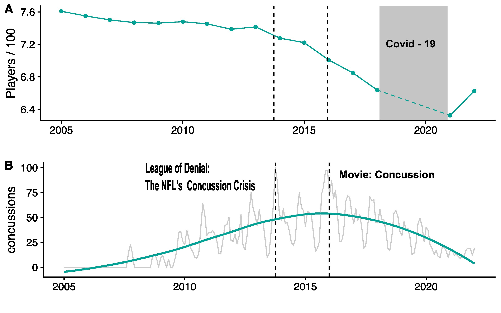
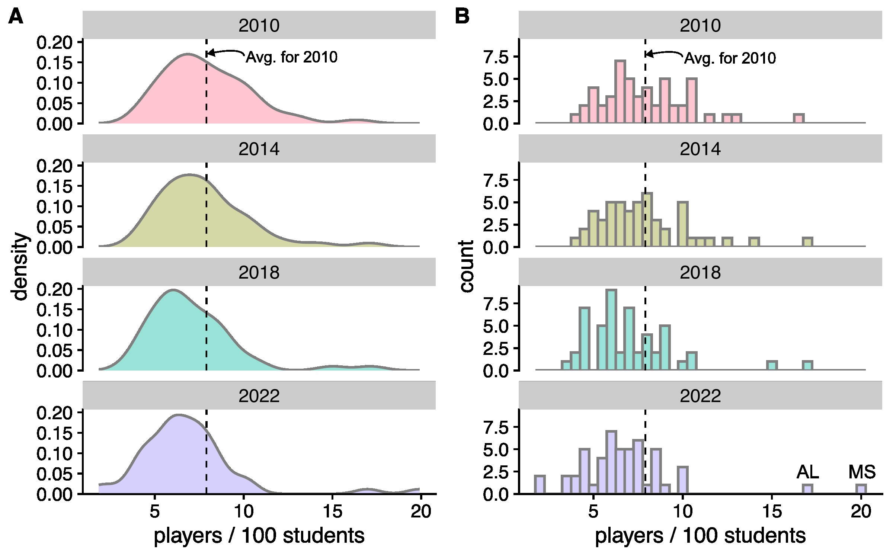
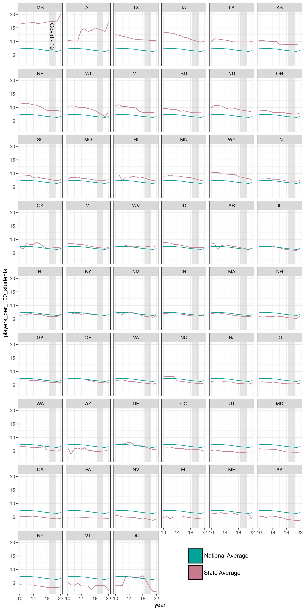
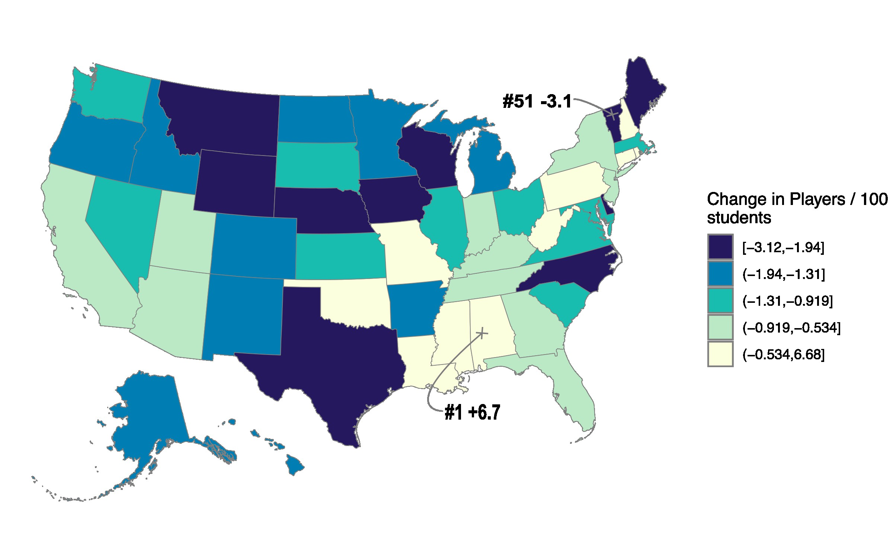

```{r load-packages, include=FALSE, cache=FALSE}
## Load frequently used packages for blog posts
packages <- c(
      'devtools', #for session info
      'ggthemes', #for plots
      'blogdown',
      'DT',
      'dplyr',
      'ggplot2',
      'tidyr',
      'colorspace',
      'tidycensus',
      'classInt'
)
lapply(packages, function(x) {
  if (!requireNamespace(x)) install.packages(x)
  library(x, character.only = TRUE)
})
```

```{r set-chunk-options, include = F}
## Do not break chunk line
## Do not use spaces or periods "." or underscores "_"
## set options for knitr
knitr::opts_chunk$set(
  comment = '',
  fig.width = 6,
  fig.asp = .8,
  fig.align="center",
  message=F,
  error=F,
  warning=F,
  tidy=T,
  comment='',
  cache=T,
  dev='svg',
  echo=F
)
```


```{r write-package-bib, echo=FALSE, cache=FALSE}
# write packages used to bib in current directory
knitr::write_bib(.packages(), "./packages.bib")
```

# [Overview](#overview)

Concerns over injuries, specifically concussions,  have caused many parents to reconsider whether their children should participate in traditional 11-player contact football. When scaled by student enrollment from the Common Core of Data by the National Center for Education Statistics, US football participation rates have been declining in male 11-Player football since 2005, but accelerated beginning in 2013. 

# [Background](#background)

Concussions used to be seen as a temporary nuisance in contact sports. "Getting your bell rung" was part and parcel of football, rugby, soccer, and ice hockey. The disorder was seen as temporary and players were encouraged to remain in the game and to play through the brain fog. Only in the last decade or so have concussions been seen as a serious health threat with long-lasting, debilitating consequences.  

The National Football League first adopted its concussion protocol in 2013 but has significantly enhanced the requirements since then. A documentary by Frontline called "League of Denial: The NFL's Concussion Crisis" premiered in 2013. As of September 26th, 2024, the video had 3.2 million views on YouTube. Released on December 25, 2015, the movie "Concussion," starring Will Smith, also raised the public's awareness of concussions and football. And recently, Brett Favre, the long-time quarterback for the Green Bay Packers, disclosed in a 2024 Congressional hearing that he was  diagnosed with Parkinson's disease, a condition sometimes associated with repeated head trauma. For a chronology of the NFL concussion litigation, see the [article](https://en.wikipedia.org/wiki/Concussions_in_American_football) on Wikipedia. The question is whether increased public awareness on the danger of concussions changed student/parent preferences in high school sports.

# [Data](#data)

The data comes from two sources: the National Federation of State High School Associations (NFHS) and the National Center for Education Statistics (NCES). 

## NFHS

The NFHS website can be found at [https://www.nfhs.org/](https://www.nfhs.org/). According to its website, the group is a "national leader and advocate for high school athletics as well as fine and performing arts programs." The membership comprises 51 members, the 50 states plus the District of Columbia. The organization is a not-for-profit that annually files IRS form 990 and has been tax-exempt since 1942. In 2023, annual revenue was listed as \$17.9 million; employees numbered 42; and net assets were \$29 million. Data may be downloaded from the NFHS Participation Statistics [page](https://members.nfhs.org/participation_statistics). The table is comprised of seven fields: year, state, sport, boys schools, girls schools, boys participation, and girls participation. Unfortunately, the most current year was for the 2018 - 2019 school year. More recent years were scraped from NFHS pdfs using Tabula.

## NCES 

The second source is the National Center for Education Statistics (NCES). The NCES data was necessary to scale the number of participants to some meaningful population. The NCES is the primary federal entity for collecting and analyzing data related to education. The NCES website for the Common Core of Data can be found [here](https://nces.ed.gov/ccd/). According to the website, the Common Core of Data (CCD) is the "Department of Education's primary database on public elementary and secondary education in the United States. CCD is a comprehensive, annual, national database of all public elementary and secondary schools and school districts." The data is primarily used to calculate graduation, completion, and dropout rates from public high schools.  The CCD is difficult data to parse as its format changes with some frequency. Enrollment data for 9th through 12th-grade students was extracted and summed for total high school enrollment by state and gender. One potential problem is that some states may define their high school cohorts differently from the ninth to the twelfth grades.

# US High School Football Participation Rates

Let's start with a summary of the participation rate for high school football grouped on the national level.  There's a rash of results returned on the internet that suggest the number of high schoolers playing football is increasing.  This may be true when looking at absolute numbers, but inaccurate when information is scaled to a relevant population.  

Here, we're using high school enrollment data.  The data clearly show that fewer high schoolers are playing football per 100 students. The trend shows a slow, meandering decline from 2005 to 2013. Then, from 2013 to 2021, the decline quickens.  There are two years of data missing from HFHS: 2019 and 2020.  A rebound looks to be in the offing for 2022.  It'll be interesting to see what happens in 2023.

```{r usFootball, out.width="100%", fig.cap="(A) U.S. Public High School Football Participation Rates 2005 to 2022 for males in 11-Player Football. Y-axis is stated in number of players per 100 students. (B) Google Trends for the term 'football concussions united states'."}

```

Research has shown that repeated head injuries can lead to long-term neurological issues, including chronic traumatic encephalopathy (CTE), a degenerative brain condition linked to memory loss, mood swings, and cognitive decline. Other neurological issues associated with concussions include depression, anxiety, dementia, sleep disorders, and motor function. The connection between CTE and concussions was first proposed by pathologist Dr. Bennet Omalu who performed autopsies on former NFL players.  Frontline, a PBS documentary series, released a documentary on October 8, 2013, entitled "League of Denial:  The NFL's Concussion Crisis."  The movie Concussion was released on December 25, 2015, starring Will Smith as Benett Omalu.  Google searches for "football concussion" reached a high around the release of the documentary and movie.  

While the chart ends in 2022, there were two more recent spikes. The first was when Tua Tagovailoa Quarterback for the Miami Dolphins received a concussion after contact with the playing field on September 29, 2022. The injury occurred during a nationally televised Thursday night game against the Buffalo Bills. The second spike in Google searches for "football concussions" occurred on September 13, 2024, and also involved Miami Quarterback Tua Tagovailoa.  The 26-year-old quarterback received what was his third concussion in the NFL.  The concussion was accompanied by tell-tale neurological injury, the clenching of his hands, and  renewed calls for his retirement.


# States High School Football Participation

The top five states by high school football participation by number of players per 100 students are Mississippi (19.9), Alabama (17.0), Texas (10.2), Iowa (10.1), and Louisiana (10.0).  The bottom five states are Washington D.C. (1.8), Vermont (2.2), New York (3.7), Alaska (3.7), and Maine (4.2).

```{r out.width="100%", fig.cap="U.S. Public High School Football Participation Rates 2022."}
knitr::include_graphics("./map_us_states_fb_players_per_student.jpg")
```


## Table

45 out of 51 states saw declines in 11-player football participation from 2010 to 2022. Six states had positive growth Alabama (+65%), Mississippi (21.7%), Rhode Island (4.2%), New Hampshire (3.0%), and Louisiana (.7%). The rest of the states had negative growth with Vermont's participation rate declining from 5.4 football players per 100 students to 2.2, a decline of 58.3%. 

```{r, cache=FALSE}
readRDS("./states_2010_vs_2022.rds") %>% 
  dplyr::select(!quintile) %>%
  dplyr::arrange(percent_change) %>% 
  DT::datatable(rownames = FALSE) %>% 
  DT::formatRound(columns = c(4:7), digits = 1)
```

## Histogram

One of the more interesting features of this dataset is the degree to which Alabama and Mississippi are outliers.  Note that not only are Alabama and Mississippi outliers but their distance from the mean seems to be increasing over time.

```{r out.width="100%", fig.cap="(A) Density Plot of U.S. Public High School Football Participation Rates. (B) Histogram of U.S. Public High School Football Participation Rates."}

```


## All States

Here are 50 states plus D.C. from 2010 to 2022.  The gray band in the middle of the chart is when the pandemic / Covid-19 closed schools.  The NFHS did not have data for 2019 and 2020. Each state is compared to the national average which is the green line and then ranked by the difference in that state's 2022 participation rate to the national average.  Thus, Mississippi and Alabama lead the faceting and the rest are in descending order.


```{r, out.width="100%", fig.cap="All 50 states plus DC high school participation rates from 2010 to 2022.", cache=FALSE}

```

## Map US Participation Rate Change

Many fewer students choose to play football in high school when compared to 2010.  One of the largest states, Texas, saw a significant decrease.  Whereas 12.5 football players per 100 students were involved in football in 2010, only 10.2 were involved in 2022. This was a rate reduction of 2.3 or 18.1% over the time period. 

```{r, out.width="100%", fig.cap="Change in Football Participation Rates \n2022 to 2010. Dark blue represents states where with the greatest reduction in players per 100 students."}

```

# [Conclusion](#conclusion)

Fewer male public high school students are choosing to play 11-player contact football in 2022 than in 2010 when scaled by enrollment.  There are likely many reasons for the decline.  Heightened public awareness of the danger of head trauma and concussions may be driving the aversion. The information here was limited because the NFHS has not published its data in machine-readable formats since 2018.  The use of an application like Tabula is both time-consuming and error-prone.  Computation of an overall penetration of high school athletics for all sports would be helpful and could shed light as to whether students are choosing different sports or forgoing athletics altogether. 

It should be noted that changing to other sports may involve physical hazard too and that these hazards are not limited to male sports.  A superficial review of other NFHS data suggests that soccer and outdoor track have become more popular whereas sports like wrestling and 11-player football declined.  No assertion is made or opinion offered as to whether a concussion in high school football results in long-term health problems.

# [Acknowledgements](#acknowledge)

This blog post was made possible thanks to:

- [National Center for Education Statistics](https://nces.ed.gov/)

- [National Federation of State High School Associations](https://www.nfhs.org/)

# [References](#reference)

<div id="refs"></div>

# [Disclaimer](#disclaimer)

The views, analysis and conclusions presented within this paper represent the author’s alone and not of any other person, organization or government entity. While I have made every reasonable effort to ensure that the information in this article was correct, it will nonetheless contain errors, inaccuracies and inconsistencies. It is a working paper subject to revision without notice as additional information becomes available. Any liability is disclaimed as to any party for any loss, damage, or disruption caused by errors or omissions, whether such errors or omissions result from negligence, accident, or any other cause. The author(s) received no financial support for the research, authorship, and/or publication of this article.

# [Reproducibility](#reproduce)

```{r reproducibility, echo = FALSE}
# system & package info
options(width = 120)
session_info()
```
