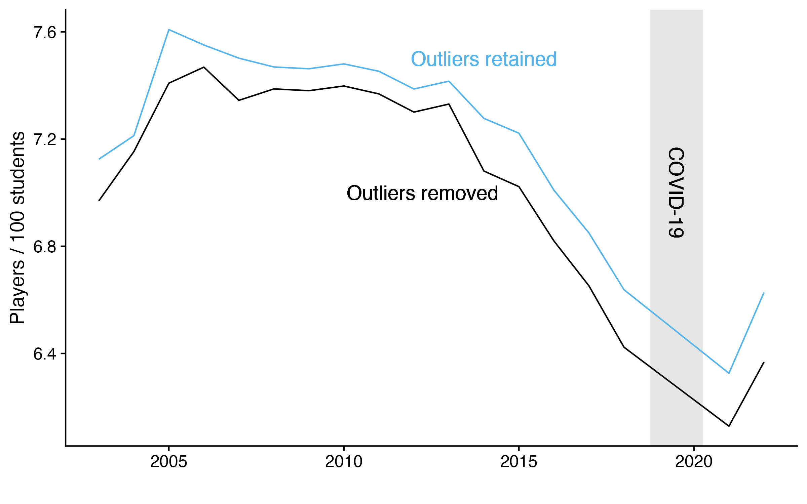

```{r load-packages, include = F}
## Load frequently used packages for blog posts
packages <- c(
      'devtools', #for session info
      'ggthemes', #for plots
      'blogdown',
      'fpp3',
      'tsibble',
      'feasts',
      'fable',
      'cowplot',
      'DT'
)
lapply(packages, function(x) {
  if (!requireNamespace(x)) install.packages(x)
  library(x, character.only = TRUE)
})
```

```{r set-chunk-options, include = F}
## Do not break chunk line
## Do not use spaces or periods "." or underscores "_"
## set options for knitr
knitr::opts_chunk$set(
  comment = '',
  fig.width = 6,
  fig.asp = .8,
  fig.align="center",
  message=F,
  error=F,
  warning=F,
  tidy=T,
  comment='',
  cache=T,
  dev='svg',
  echo=F
)
```

```{r set-ggplot-theme-defaults, include = F}
#from ggthemes
library(ggplot2); theme_set(ggthemes::theme_fivethirtyeight())
```

```{r define-color-palette, include = F, eval = T}
# color blind friendly palette from http://www.cookbook-r.com/Graphs/Colors_(ggplot2)/
cbPalette <- c("#E69F00", "#56B4E9", "#009E73", "#F0E442", "#0072B2", "#D55E00", "#CC79A7", "#000000")
```


```{r write-package-bib, echo = F}
# write packages used to bib in current directory
knitr::write_bib(.packages(), "./packages.bib")
```

# [Overview](#overview)

This is the second and final of two posts on U.S. high school football participation.  The first post, [U.S. High School Football Participation](https://robwiederstein.org/r/2024/09/28/u-s-high-school-football-participation/), provided an overview of the decline in high school football participation rates since 2005.  This post will address outliers in order to salavage some additional years for a forecast.  The forecast will use an ARIMA model and forecast  participation rates for the next five years. The forecast predicts a slight rebound in participation rates.

# [Outliers](#outliers)

Data is like water in the desert:  if you waste it, you will ultimately regret it.  Because there are relatively few observations for a forecast, it's important to keep as many as possible.  To keep 2003 through 2023, there were two key decisions in the data cleaning process:

- Outliers were identified and removed where they were not within 1.5 times the interquartile range.

- During Covid-19, the number of players was not reported by the NFHS for 2019 and 2020.  To keep the year, the number of players was interpolated between 2018 to 2021.


Below are the boxplots of the number of players per 100 students with and without outliers.  Of particular concern were the numbers being reported out of Mississippi and Alabama.  Not only were they outliers, but their distance from the mean was increasing over time.  I was particulary interested in how the outliers impacted the final year of data because it shows an increase. 


```{r, out.width="100%", fig.cap="(A) Outliers.  Y-axis is in number of players per 100 students and was limited to 30.  2005 was problematic in that North Carolina contained a value of 586. (B) Outliers Identified.  Y-axis is in number of deviations from the mean. Note the prevalence of Mississippi and Alabama as outliers.  (C) Outliers Removed.  Y-axis is reset to number of players per 100 students."}
knitr::include_graphics("./pp100_boxplots.jpg")
```

In 2022, Alabama reported a raw participation rate of 16.97 and Mississippi a rate of 19.91 which converts to a standardized Z-score of 3.36 for Alabama and 4.33 for Mississippi.  With a mean of 6.88 and a standard deviation of 3.01, the probability of observing a value greater than Alabama is one in 263 and Mississippi is one in 100,000.

```{r, out.width="100%", fig.cap="The number of players per 100 students is shown with and without outliers.  The trend line where outliers are removed is shown in black and the trend line where outliers are retained are shown in blue."}

```

# [Modeling](#modeling)

Nine models were fit to the data. Some of the model choices like "Mean" were included knowing that it was an unlikely candidate for a good fit.  Other more sophisticated models like ARIMA, ETS, and prophet were included too. The models forecast the final 5 years of the test data and were compared to the actual values.  

```{r, out.width="100%", cache=FALSE, fig.cap="Actual Data is show in black.  Models are shown in color.  The ARIMA model, shown in red, was the to performing model."}
knitr::include_graphics("./forecast_models_compared.jpg")
```

The ARIMA model was the best performing model on several different metrics. When comparing different methods applied to a single time series the mean absolute error (MAE) is "popular as it is easy to both understand and compute. A forecast method that minimises the MAE will lead to forecasts of the median, while minimising the root mean squared error (RMSE) will lead to forecasts of the mean. Consequently, the RMSE is also widely used, despite being more difficult to interpret."[@hyndman_forecasting_2021] Here, the prophet model leads all other methods when measured by either RMSE or MAE.  Two other common accuracy metrics are the mean absolute percentage error (MAPE) and mean absolute scaled error (MASE).


```{r, cache=FALSE}
library(DT)
library(dplyr)
tbl_accuracy <- readRDS("./tbl_accuracy.rds")
tbl_accuracy %>% 
  dplyr::select(.model, RMSE, MAE, MAPE, MASE) %>%
  DT::datatable(options = list(dom = 't')) %>% 
  DT::formatRound(2:5, 3)
```

# [Forecast](#forecast)

After fitting the model to the data, and then applying to the test set, the model is applied the entire dataset and forecasts the number of players per 100 students for the next five years.  The forecast predicts a continuing negative trend line though perhaps at a less steep decline. The forecasted number of players per 100 students is shown below.

```{r, out.width="100%", fig.cap="The forecasted number of players per 100 students is shown for the next five years."}
knitr::include_graphics("./football_participation_forecast.jpg")
```

# [Conclusion](#conclusion)

High school football participation rates have been in decline since 2005.  The bump up in the data from the 2022 data point was ambiguous and I thought it would be interesting to see how much influence it would have in forecasting into the future. The median forecast shows participation rates continuing to decline with a wide range of possible outcomes in the 80th and 95th confidence intervals. Some caveats about the forecast include the following: (1) it is based on 20 observations, (2) outliers were removed, and (3) missing data was interpolated for the COVID-19 period.  The forecast is provided for discussion purposes only.

# [Acknowledgements](#acknowledge)

This blog post was made possible thanks to:

- [National Center for Education Statistics](https://nces.ed.gov/)

- [National Federation of State High School Associations](https://www.nfhs.org/)

# [References](#reference)

<div id="refs"></div>

# [Disclaimer](#disclaimer)

The views, analysis and conclusions presented within this paper represent the author’s alone and not of any other person, organization or government entity. While I have made every reasonable effort to ensure that the information in this article was correct, it will nonetheless contain errors, inaccuracies and inconsistencies. It is a working paper subject to revision without notice as additional information becomes available. Any liability is disclaimed as to any party for any loss, damage, or disruption caused by errors or omissions, whether such errors or omissions result from negligence, accident, or any other cause. The author(s) received no financial support for the research, authorship, and/or publication of this article.

# [Reproducibility](#reproduce)

```{r reproducibility, echo = FALSE}
# system & package info
options(width = 120)
session_info()
```
