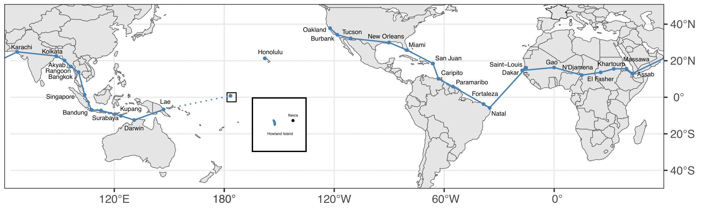

```{r load-packages, include = F, cache=FALSE}
## Load frequently used packages for blog posts
packages <- c(
      'devtools', #for session info
      'ggthemes', #for plots
      'blogdown',
      'ggplot2',
      'tidygeocoder',
      'rnaturalearth',
      'sf',
      'dplyr',
      'tidyr',
      'rvest',
      'geojsonsf',
      'knitr',
      'tibble'
)
lapply(packages, function(x) {
  if (!requireNamespace(x)) install.packages(x)
  library(x, character.only = TRUE)
})
```


```{r set-chunk-options, include = F}
## Do not break chunk line
## Do not use spaces or periods "." or underscores "_"
## set options for knitr
knitr::opts_chunk$set(
  comment = '',
  fig.width = 6,
  fig.asp = .8,
  fig.align="center",
  message=F,
  error=F,
  warning=F,
  tidy=T,
  comment='',
  cache=T,
  dev='svg',
  echo=F
)
```


```{r write-package-bib, echo = F, cache=FALSE}
# write packages used to bib in current directory
knitr::write_bib(.packages(), "./packages.bib")
```

# [Overview](#overview)

Amelia Earhart's attempt to circumnavigate the world by airplane ended in tragedy on July 2, 1937. There were 33 stops in the journey with the most dangerous being the three spanning the Pacific Ocean.  From Lae, she and her navigator Fred Noonan were to land at Howland Island.  Howland Island is approximately one kilometer wide by two kilometers long.  They never arrived. A map generated by `ggplot2` shows the trip. 

In her book *Last Flight*, Amelia Earhart noted that the trip to Howland Island was the longest hop of 2,556 miles.  The plane was stripped of as much weight as possible to maximize fuel efficiency.  Since there are no landmarks on the ocean, signals by radio wave were crucial to finding the island.  Two Coast Guard cutters were stationed along the route to aid in naviation: the Itasca and the Ontario.  The Itasca was just off the beach on the "leeward" side of the island.  Most investigators ascribe poor radio communication as the leading cause of the disappearance. In a passage that foreshadows the tragedy, Earhart writes to her husband from Lae: 

> "Fred Noonan has been unable, because of radio difficulties, to set his chronometers.  Any lack of knowledge of their fastness and slowness would defeat the accuracy of celestial navigation.  Howland is such a small spot in the Pacific that every aid to locating it must be available." [@earhart_last_2009]

# Step 1 - Build Earhart's Flight Path

The data for the project was scraped from Wikipedia; the cities/airports were updated and geocoded; and the data was saved as a `rds` file.

```{r scrape-wikipedia, eval = F, echo = T, tidy=F}
library(rvest)
library(dplyr)
library(tidyr)
library(tidygeocoder)
# get stops
read_html("https://en.wikipedia.org/wiki/Amelia_Earhart") %>% 
html_elements("table") %>% html_table() %>% .[[2]] %>% 
  rename_with(~janitor::make_clean_names(.)) %>% 
  rename(departure_city = departure_city_140,
         notes = notes_141)-> stops
# pull cities
c(stops$departure_city, stops$arrival_city) %>% 
  unique() %>% 
  as_tibble() %>% 
  rename(old_address = value)  -> locations_old
# geocode
tribble(
  ~old_address,                             ~new_address,
  "Gao, French Sudan",                  "Gao, Mali",
  "Fort-Lamy, F.E. Africa",             "N'Djamena, Chad",
  "El Fasher, Anglo-Egyptian Sudan",    "El Fasher, Sudan",
  "Khartoum, Anglo-Egyptian Sudan",     "Khartoum, Sudan",
  "Massawa, Italian East Africa",       "Massawa, Eritrea",
  "Assab, Italian East Africa",         "Assab, Eritrea",
  "Karachi, British India",             "Karachi, Pakistan",
  "Calcutta, British India",            "Kolkata, India",
  "Singapore, Straits Settlements",     "Singapore",
  "Bandoeng, Dutch East Indies",        "Bandung, Indonesia",
  "Soerabaia, Dutch East Indies",       "Surabaya, Indonesia",
  "Koepang, Dutch East Indies",         "Kupang, Indonesia"
) -> locations_new

# merge
left_join(locations_old, locations_new, by = "old_address") %>% 
mutate(address = if_else(is.na(new_address), old_address, new_address)) %>% 
select(old_address, address) -> locations

# geocode
locations %>% 
  geocode(address, method = 'osm') -> locations
# merge back to stops
left_join(stops, locations, by = c("departure_city" = "old_address")) %>%
  left_join(locations, by = c("arrival_city" = "old_address")) %>% 
  select(!c(departure_city, arrival_city)) %>%
  rename(departure_city = address.x,
         arrival_city = address.y,
         begin_lat = lat.x,
         begin_lon = long.x,
         end_lat = lat.y,
         end_lon = long.y,
         nautical_miles = nauticalmiles) %>% 
  select(date, departure_city, begin_lat, begin_lon,
         arrival_city, end_lat, end_lon, nautical_miles,
         notes) %>% 
  mutate(date = as.Date(date, format = c("%b %d, %Y"))) %>% 
  mutate(nautical_miles = gsub("\\[144\\]", "", nautical_miles),
         nautical_miles = as.integer(nautical_miles)) %>% 
  rename(status = notes) %>% 
  arrange(date) -> earhart 
earhart[["status"]][1:30] <- "arrived"
earhart[["status"]][31:33] <- "missing"
saveRDS(earhart, "./earhart.rds")
```

# Step 2 - Create `sf` objects

The next step is to create the `sf` objects for the map.  The basemap is from a GitHub repository that holds historical maps.  This particular map is from 1938, the year after Amelia Earhart's trip and shows national boundaries as they existed then.

```{r create-sf-objects, eval = F, echo = T, tidy = F}
library(dplyr)
library(ggplot2)
library(rnaturalearth)
library(sf)
library(tidyr)
library(geojsonsf)
# basemap
create_1938_basemap <- function(){
  lon_0 <- -120
  geojson_sf("./world_1938.geojson") %>% 
  rmapshaper::ms_simplify(method = "vis", keep = .25) %>%
  rename_with(~tolower(.)) %>% 
  st_break_antimeridian(., lon_0 = lon_0) %>% 
  st_transform(., paste0(st_crs(.)$proj4string, " +lon_0=", lon_0)) %>% 
  dplyr::select(name)
}
world <- create_1938_basemap()
# cities
create_cities <- function(){
  eh <- readRDS("./earhart.rds")
  eh %>% 
    select(departure_city, begin_lon, begin_lat) %>% 
    rename(city = departure_city, lon = begin_lon, lat = begin_lat) -> departures
  eh %>%
    select(arrival_city, end_lon, end_lat) %>% 
    rename(city = arrival_city, lon = end_lon, lat = end_lat) -> arrivals
  
  bind_rows(departures, arrivals) %>% 
  distinct() %>% 
  separate(city, into = c("city", "country"), sep = ", ") %>%
  st_as_sf(coords = c("lon", "lat"), crs = 4326) %>% 
  mutate(city = gsub("Howland Island", "", city)) %>% print(n = Inf)
}
cities <- create_cities() 
# create flight path
create_flight_path <- function(){
  eh <- readRDS("./earhart.rds") 
  lon_0 <- -120
  #departures
  eh %>% 
  filter(status == "arrived") %>% 
  arrange(date) %>% 
  select(date, departure_city, begin_lat, begin_lon) %>% 
  mutate(flow = "departure") %>% 
  rename(city = departure_city, lat = begin_lat, lon = begin_lon) -> departures
  # arrivals
  eh %>% 
  filter(status == "arrived") %>% 
  arrange(date) %>% 
  select(date, arrival_city, end_lat, end_lon) %>%
  mutate(flow = "arrival") %>% 
  rename(city = arrival_city, lat = end_lat, lon = end_lon) -> arrivals
  bind_rows(departures, arrivals) %>%
  arrange(date) %>% 
  select(lat, lon) %>% 
  st_as_sf(coords = c("lon", "lat"), crs = 4326) %>%
  st_combine() %>% 
  sf::st_cast("LINESTRING") %>% 
  st_break_antimeridian(., lon_0 = lon_0) %>% 
  st_transform(., paste0(st_crs(.)$proj4string, " +lon_0=", lon_0)) 
}
flight_path <- create_flight_path()
# create missing path
create_missing_path <- function(){
  eh <- readRDS("./earhart.rds") 
  lon_0 <- -120
  eh %>% 
    filter(status == "missing" & date == "1937-07-02") %>% 
    arrange(date) %>% 
    select(date, departure_city, begin_lat, begin_lon) %>% 
    mutate(flow = "departure") %>% 
    rename(city = departure_city, lat = begin_lat, lon = begin_lon) -> departures
  eh %>% 
    filter(status == "missing" & date == "1937-07-02") %>% 
    arrange(date) %>% 
    select(date, arrival_city, end_lat, end_lon) %>%
    mutate(flow = "arrival") %>% 
    rename(city = arrival_city, lat = end_lat, lon = end_lon) -> arrivals
  bind_rows(departures, arrivals) %>%
    arrange(date) %>% 
    select(lat, lon) %>% 
    st_as_sf(coords = c("lon", "lat"), crs = 4326) %>%
    st_combine() %>% 
    sf::st_cast("LINESTRING") 
} 
missing_path <- create_missing_path()
# import howland island
create_howland <- function(){
  sf::st_read(dsn = "./N00W180", layer = "N00W180") %>% 
  rename_with(~tolower(.)) %>% 
  filter(source_id == "GC10609") %>% 
  select(source_id,geometry) %>% 
  st_transform(., 4326) %>% 
  st_cast("POLYGON") %>% 
  mutate(name = "Howland Island", .before = geometry) %>% 
  select(name, geometry)
}
hi <- create_howland()
# create itasca
create_itasca <- function(){
tibble(name = "Itasca", lat = .815, lon = -176.55) %>%
  sf::st_as_sf(coords = c("lon", "lat"), crs = 4326)
}
itasca <- create_itasca()
# bounding box
create_bbox <- function(){
tribble(
  ~lat,         ~lon,        ~id,
   2.5,        -178.5,       1,
   2.5,        -173.5,       1,
  -2.5,        -173.5,       1,
  -2.5,        -178.5,       1
) %>% 
  st_as_sf(coords = c("lon", "lat"), crs = 4326) %>% 
  group_by(id) %>% 
  summarise(geometry = st_combine(geometry)) %>%
  st_cast("POLYGON")
}
bbox <- create_bbox()

```

# Step 3 - Plot the Main Map

```{r main-map, echo=TRUE, tidy=FALSE, eval=FALSE}
ggplot() +
  geom_sf(data = world) +
  geom_sf(data = bbox, col = "black", alpha = 0, lwd = .35) +
  geom_sf(data = cities, col = "steelblue", size = .75) +
  geom_sf_text(data = cities, aes(label = city),
               col = "black",
               nudge_y = 3.5,
               nudge_x = 3,
               size = 1.75) +
  geom_sf(data = flight_path, col = "steelblue") +
  geom_sf(data = missing_path, col = "steelblue", linetype = "dotted") +
  coord_sf(xlim = c(-180, 180), 
           ylim = c(-50, 51),
           expand = F,
           label_graticule = "SE") +
  scale_x_continuous(name = "", breaks = seq(-180, 180, 60)) +
  scale_y_continuous(name = "", breaks = c(-40, -20, 0, 20, 40)) +
  theme_bw() -> main
```


# Step 4 - Plot Howland Island

```{r howland-map, echo=TRUE, tidy=FALSE, eval=FALSE}
ggplot() +
  geom_sf(data = hi, col = "steelblue", fill = "steelblue") +
  geom_sf(data = itasca, col = "black", fill = "black", size = .5) +
  coord_sf(xlim = c(-176.7, -176.5), 
           ylim = c(.7, .9),
           expand = F) +
  geom_sf_text(data = hi, mapping = aes(label = name), 
                nudge_y = -.04,
                nudge_x = .02,
                size = 1.2) +
  geom_sf_text(data = itasca, mapping = aes(label = name), 
                nudge_y = .02,
                nudge_x = 0,
                size = 1.2) +
theme_void() +
theme(panel.grid.major = element_blank(), 
      panel.grid.minor = element_blank(),
      panel.background = element_rect(colour = "black", linewidth = 1)) -> howland
```

# Step 5 - Combine the Maps

```{r combine-maps, echo=TRUE, tidy=FALSE, eval=FALSE}
main +
  annotation_custom(
    grob = ggplotGrob(howland),
    xmin = -160,
    xmax = 100,
    ymin = -30,
    ymax = 0
  ) 
```


# Final Map

Ultimately, the labels were difficult to place.  There were a number of packages that were attempted like `ggrepel` but the easiest was to use `ggplot::geom_sf_text` and then export as a pdf.  The labels were then moved in Inkscape.  The final map is shown below.

```{r, out.width="100%"}

```

# Conclusion

This project proved to be a challenging effort, largely because of the number of iterations required for the map to look presentable.

# [Acknowledgements](#acknowledge)

This blog post was made possible thanks to:

- [Amelia Earhart](https://en.wikipedia.org/wiki/Amelia_Earhart)

- [historical-basemaps](https://github.com/aourednik/historical-basemaps)

- [Library of Congress, Amelia Earhart: A Resource Guide](https://guides.loc.gov/amelia-earhart)

# [References](#reference)

<div id="refs"></div>

# [Disclaimer](#disclaimer)

The views, analysis and conclusions presented within this paper represent the author’s alone and not of any other person, organization or government entity. While I have made every reasonable effort to ensure that the information in this article was correct, it will nonetheless contain errors, inaccuracies and inconsistencies. It is a working paper subject to revision without notice as additional information becomes available. Any liability is disclaimed as to any party for any loss, damage, or disruption caused by errors or omissions, whether such errors or omissions result from negligence, accident, or any other cause. The author(s) received no financial support for the research, authorship, and/or publication of this article.

# [Reproducibility](#reproduce)

```{r reproducibility, echo = FALSE}
# system & package info
options(width = 120)
session_info()
```
